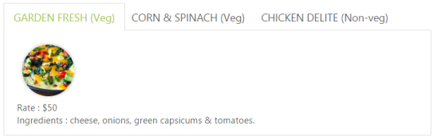

# Template Support

In the ASP.NET, you can use the <contentsection> tag to load the contents to the Tab control.



<ej:Tab ID="pizzaMenu" runat="server" Width="650px">

    <Items>

        <ej:TabItem ID="Tabitem1" Text="GARDEN FRESH (Veg)">

            <ContentSection>

                

                

                    Rate : $50

                     

                    Ingredients : cheese, onions, green capsicums & tomatoes.

                

            </ContentSection>

        </ej:TabItem>

        <ej:TabItem ID="Tabitem2" Text="CORN & SPINACH (Veg)">

           <ContentSection>

                

                

                    Rate : $70

                     

                    Ingredients : cheese, sweet corn & green capsicums.

                

           </ContentSection>

        </ej:TabItem>

        <ej:TabItem ID="Tabitem3" Text="CHICKEN DELITE (Non-veg)">

          <ContentSection>

                

                

                    Rate : $100

                     

                    Ingredients : cheese, chicken chunks, onions & pineapple chunks.

                

            </ContentSection>

        </ej:TabItem>

    </Items>

</ej:Tab>


 

