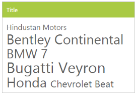
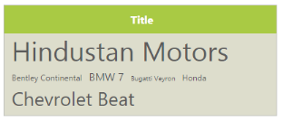

# Appearance and Styling

## Minimum and maximum Font size

The TagCloud content is set to different font sizes from minimum to maximum based on its frequency values. By default, MinFontSize is “10px” and MaxFontSize is “40px”. By using these properties, you can customize the minimum and maximum font sizes.

### Customizing font sizes of TagCloud

To configure font sizes for the TagCloud, in the ASPX page, include the following TagCloud control code example.



<ej:TagCloud ID="tagcloud" runat="server" DataTextField="text" DataUrlField="url" DataFrequencyField="frequency" MaxFontSize="20 " MinFontSize="40"></ej:TagCloud>





protected void Page_Load(object sender, EventArgs e)
{

	this.tagcloud.DataSource = new TagCloudData().GetTagCloudItems();          

}

public class TagCloudData

{

	public TagCloudData()

	{

	}

	public TagCloudData(string _text, string _url, int _frequency)

	{

		this.text = _text;

		this.url = _url;

		this.frequency = _frequency;

	}

	public string text

	{

		get;

		set;

	}

	public string url

	{

		get;

		set;

	}

	public int frequency

	{

		get;

		set;

	}

	public List<TagCloudData> GetTagCloudItems()

	{

		List<TagCloudData> data = new List<TagCloudData>();

		data.Add(new TagCloudData("Hindustan Motors", "http://www.zigwheels.com/newcars/Hindustan-Motors", 10));

		data.Add(new TagCloudData("Bentley Continental ", "http://www.zigwheels.com/newcars/Bentley/Continental", 3));

		data.Add(new TagCloudData("BMW 7", "http://www.zigwheels.com/newcars/BMW/7-Series", 4));

		data.Add(new TagCloudData("Bugatti Veyron", "http://www.zigwheels.com/newcars/Bugatti/Veyron", 2));

		data.Add(new TagCloudData("Honda", "http://www.zigwheels.com/newcars/Honda", 3));

		data.Add(new TagCloudData("Chevrolet Beat", "http://www.zigwheels.com/newcars/Chevrolet/Beat", 7));

		return data;

	}

}



The following screenshot illustrates the TagCloud control with customized font sizes.

  

## Tag format

You can set theTagCloud content display format by using Format property. By default, format is set to the cloud, that displays the content in TagCloud. The format can be set as a list that displays the content in linear format.

### Defining Cloud and List format

In the ASPX page, include the following code example to define Cloud and List format.



<ej:TagCloud ID="tagcloud" runat="server" DataTextField="text" DataUrlField="url" DataFrequencyField="frequency" Format="Cloud"></ej:TagCloud>

<ej:TagCloud ID="tagcloud" runat="server" DataTextField="text" DataUrlField="url" DataFrequencyField="frequency" Format="List"></ej:TagCloud>



The following screenshot illustrates customized formats.

## Theme

You can control the style and appearance of the TagCloud based on the CSS classes. To apply styles to the TagCloud control, refer to the files, ej.widgets.core.min.css and ej.theme.min.css. When you refer to ej.widgets.all.min.css file, it is not necessary to include the files ej.widgets.core.min.css and ej.theme.min.css in your project as ej.widgets.all.min.css is the combination of these two files. 

By default, there are 13 themes supported by the TagCloud control,

* default-theme
* flat-azure-dark
* fat-lime
* flat-lime-dark
* flat-saffron
* flat-saffron-dark
* gradient-azure
* gradient-azure-dark
* gradient-lime
* gradient-lime-dark
* gradient-saffron
* gradient-saffron-dark
* bootstrap-theme

## CSS Class

You can use the CSS class to customize the TagCloud appearance. Any of the CSS properties can be used to modify the look and feel of the TagCloud based on the requirement. Define a CSS class as per the requirement and assign the class name to the CssClass property.

### Configure TagCloud by using CSS class

To configure the CSS class for the TagCloud, include the following TagCloud control code example in the ASPX page.



<ej:TagCloud ID="tagcloud" runat="server" DataTextField="text" DataUrlField="url" DataFrequencyField="frequency" CssClass="customcss"></ej:TagCloud>





protected void Page_Load(object sender, EventArgs e)

{

	this.tagcloud.DataSource = new TagCloudData().GetTagCloudItems();           

}

public class TagCloudData

{

	public TagCloudData()

	{

	}

	public TagCloudData(string _text, string _url, int _frequency)

	{

		this.text = _text;

		this.url = _url;

		this.frequency = _frequency;

	}

	public string text

	{

		get;

		set;

	}

	public string url

	{

		get;

		set;

	}

	public int frequency

	{

		get;

		set;

	}

	public List<TagCloudData> GetTagCloudItems()

	{

		List<TagCloudData> data = new List<TagCloudData>();

		data.Add(new TagCloudData("Hindustan Motors", "http://www.zigwheels.com/newcars/Hindustan-Motors", 10));

		data.Add(new TagCloudData("Bentley Continental ", "http://www.zigwheels.com/newcars/Bentley/Continental", 3));

		data.Add(new TagCloudData("BMW 7", "http://www.zigwheels.com/newcars/BMW/7-Series", 4));

		data.Add(new TagCloudData("Bugatti Veyron", "http://www.zigwheels.com/newcars/Bugatti/Veyron", 2));

		data.Add(new TagCloudData("Honda", "http://www.zigwheels.com/newcars/Honda", 3));

		data.Add(new TagCloudData("Chevrolet Beat", "http://www.zigwheels.com/newcars/Chevrolet/Beat", 7));

		return data;

	 }

}



Define the CSS class for customizing the TagCloud control.



.CustomCss

{

	background-color: #DDC;

	width: 400px;

}

.CustomCss .e-header.e-title {

	text-align: center;

	font-weight: bold;

}



The following screenshot illustrates the TagCloud with customized CSS class.

 

