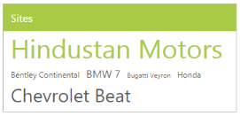

# Title Customization

## Show title

The TagCloud items are displayed with a Title element, by default. To hide the title, you can use the ShowTitle property that is set to true, by default.

### How to disable title in the TagCloud

In the ASPX page, include the following TagCloud control code example.



<ej:TagCloud ID="tagcloud" runat="server" DataTextField="text" DataUrlField="url" DataFrequencyField="frequency" ShowTitle="false">

    </ej:TagCloud>





protected void Page_Load(object sender, EventArgs e)

{

	this.tagcloud.DataSource = new TagCloudData().GetTagCloudItems();           

}

public class TagCloudData

{

	public TagCloudData()

	{

	}

	public TagCloudData(string _text, string _url, int _frequency)

	{

		this.text = _text;

		this.url = _url;

		this.frequency = _frequency;

	}

	public string text

	{

		get;

		set;

	}

	public string url

	{

		get;

		set;

	}

	public int frequency

	{

		get;

		set;

	}

	public List<TagCloudData> GetTagCloudItems()

	{

		List<TagCloudData> data = new List<TagCloudData>();

		data.Add(new TagCloudData("Hindustan Motors", "http://www.zigwheels.com/newcars/Hindustan-Motors", 10));

		data.Add(new TagCloudData("Bentley Continental ", "http://www.zigwheels.com/newcars/Bentley/Continental", 3));

		data.Add(new TagCloudData("BMW 7", "http://www.zigwheels.com/newcars/BMW/7-Series", 4));

		data.Add(new TagCloudData("Bugatti Veyron", "http://www.zigwheels.com/newcars/Bugatti/Veyron", 2));

		data.Add(new TagCloudData("Honda", "http://www.zigwheels.com/newcars/Honda", 3));

		data.Add(new TagCloudData("Chevrolet Beat", "http://www.zigwheels.com/newcars/Chevrolet/Beat", 7));

		return data;

	 }

}     



The following screenshot illustrates the TagCloud control when the title is disabled.

  

## Title text

TagCloud control allows you to set a custom title text by using the TitleText property. By default, the TitleText property is set to string value, Title.

### Defining title text for TagCloud

To configure TitleText for a TagCloud, in the ASPX page, include the following TagCloud control code example.



<ej:TagCloud ID="tagcloud" runat="server" DataTextField="text" DataUrlField="url" DataFrequencyField="frequency" Title="Sites">

</ej:TagCloud>





protected void Page_Load(object sender, EventArgs e)

{

	this.tagcloud.DataSource = new TagCloudData().GetTagCloudItems();

}

public class TagCloudData

{

	public TagCloudData()

	{

	}

	public TagCloudData(string _text, string _url, int _frequency)

	{

		this.text = _text;

		this.url = _url;

		this.frequency = _frequency;

	}

	public string text

	{

		get;

		set;

	}

	public string url

	{

		get;

		set;

	}

	public int frequency

	{

		get;

		set;

	}

	public List<TagCloudData> GetTagCloudItems()

	{

		List<TagCloudData> data = new List<TagCloudData>();

		data.Add(new TagCloudData("Hindustan Motors", "http://www.zigwheels.com/newcars/Hindustan-Motors", 10));

		data.Add(new TagCloudData("Bentley Continental ", "http://www.zigwheels.com/newcars/Bentley/Continental", 3));

		data.Add(new TagCloudData("BMW 7", "http://www.zigwheels.com/newcars/BMW/7-Series", 4));

		data.Add(new TagCloudData("Bugatti Veyron", "http://www.zigwheels.com/newcars/Bugatti/Veyron", 2));

		data.Add(new TagCloudData("Honda", "http://www.zigwheels.com/newcars/Honda", 3));

		data.Add(new TagCloudData("Chevrolet Beat", "http://www.zigwheels.com/newcars/Chevrolet/Beat", 7));

		return data;

	 }

}     



The following screenshot illustrates the TagCloud control with customized title text.

 

## Title image

TagCloud control provides TitleImage to set an image for the title. You can set the desired image URL to the TitleImage property.

### Defining title text for TagCloud

To configure TitleImage, in the ASPX page, include the following TagCloud control code example.



<ej:TagCloud ID="tagcloud" runat="server" DataTextField="text" DataUrlField="url" DataFrequencyField="frequency" TitleImage="http://js.syncfusion.com/demos/web/images/waitingpopup/js_logo.png">

</ej:TagCloud>





protected void Page_Load(object sender, EventArgs e)

{

	this.tagcloud.DataSource = new TagCloudData().GetTagCloudItems();           

}

public class TagCloudData

{

	public TagCloudData()

	{

	}

	public TagCloudData(string _text, string _url, int _frequency)

	{

		this.text = _text;

		this.url = _url;

		this.frequency = _frequency;

	}

	public string text

	{

		get;

		set;

	}

	public string url

	{

		get;

		set;

	}

	public int frequency

	{

		get;

		set;

	}

	public List<TagCloudData> GetTagCloudItems()

	{

		List<TagCloudData> data = new List<TagCloudData>();

		data.Add(new TagCloudData("Hindustan Motors", "http://www.zigwheels.com/newcars/Hindustan-Motors", 10));

		data.Add(new TagCloudData("Bentley Continental ", "http://www.zigwheels.com/newcars/Bentley/Continental", 3));

		data.Add(new TagCloudData("BMW 7", "http://www.zigwheels.com/newcars/BMW/7-Series", 4));

		data.Add(new TagCloudData("Bugatti Veyron", "http://www.zigwheels.com/newcars/Bugatti/Veyron", 2));

		data.Add(new TagCloudData("Honda", "http://www.zigwheels.com/newcars/Honda", 3));

		data.Add(new TagCloudData("Chevrolet Beat", "http://www.zigwheels.com/newcars/Chevrolet/Beat", 7));

		return data;

	 }

}          



By using the CSS class, you can resize the image content as follows.





The following screenshot illustrates the TagCloud control with customized title image.

 

