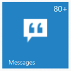

# Configure Badge

The badge property handles badge specific functionalities like enable or disable the badge and setting badge value for Tile.

The “badge-enabled” attribute enables or disables the badge for a Tile. The Tile renders with hidden badge when it is set to false.

The “badge-value” attribute is used to set the badge value to a Tile. By default, the Value is set to 1 on initialization. The “badge-text” attribute is used to set the text instead of number for Tile badge. The “badge-maxValue” attribute is used to set the maximum badge value to a Tile. When you set the badge value greater than “badge-maxValue”, it shows maximum value in badge with plus symbol. The “badge-minValue” attribute is used to set the minimum badge value to a Tile. When you set the badge value less than “badge-minValue”, it shows minimum value in badge.

Refer to the following code examples.



         <ej:Tile runat="server" ImagePosition="Center" ImageUrl="../Content/themes/images/tile/windows/messages.png" TileSize="Medium" text="Messages"> 
             <BadgeTile Enabled="true" Value="10" MinValue="5" MaxValue="20" />
         </ej:Tile> 



 

