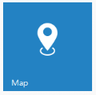

# Getting Started

This section explains briefly on how to create a Tile control in your application.

## Create your first Tile in JavaScript

 

### Create Tile Widget

The following steps guide you to add group of Tiles for creating a home page that displays all the available applications.

Create an HTML file and paste the following template for web layout.



<!DOCTYPE html>

<html>

    <head>

        <!-- style sheet for default theme(flat azure) -->

        <link href="[http://cdn.syncfusion.com/13.1.0.21/js/web/flat-azure/ej.web.all.min.css](http://cdn.syncfusion.com/13.1.0.21/js/web/flat-azure/ej.web.all.min.css)" rel="stylesheet" />

        <!--scripts-->

        

        

        <script src="[http://cdn.syncfusion.com/13.1.0.21/js/web/ej.web.all.min.js](http://cdn.syncfusion.com/13.1.0.21/js/web/ej.web.all.min.js)"</script>

    </head>

    <body>

     	<!— Adding Tile Control here -->

    </body>

</html>



Initialize ejTile as in the following code example and specify the tile text, size and image URL.



<ej:Tile runat="server" ImageUrl="../Content/images/tile/windows/map.png" TileSize="Medium" Text="People"></ej:Tile>



Run the above code to render the following output. 

 

In this scenario, a home page is designed by using tile for easy navigation. Therefore, you require many different sizes of tiles aligned in a grid-like manner. To align the tiles automatically, define the necessary tile elements inside the wrapper element that contains a ‘column’ class. You can define all columns elements under the wrapper element with ‘group’ class to make ‘n’ number of tiles as a grouped tile.

Refer to the following code example.



         

            

                <ej:Tile ID="tile1" runat="server" ImagePosition="Fill" TileSize="Medium" ImageUrl="../Content/themes/images/Tile/people_1.png" Text="People"></ej:Tile>
                

                    <ej:Tile ID="tile2" runat="server" ImagePosition="Center" TileSize="Small" ImageUrl="../Content/themes/images/Tile/alerts.png"></ej:Tile>
                    <ej:Tile ID="tile3" runat="server" ImagePosition="Center" TileSize="Small" ImageUrl="../Content/themes/images/Tile/bing.png"></ej:Tile>
                    <ej:Tile ID="tile4" runat="server" TileSize="Small" ImageUrl="../Content/themes/images/Tile/camera.png"></ej:Tile>
                    <ej:Tile ID="tile5" runat="server" ImagePosition="Center" TileSize="Small" ImageUrl="../Content/images/Tile/messages.png"></ej:Tile>
                

                <ej:Tile ID="tile6" runat="server" ImagePosition="Center" TileSize="Medium" ImageUrl="../Content/themes/images/Tile/games.png" Text="Play"></ej:Tile>
                <ej:Tile ID="tile7" runat="server" TileSize="Medium" ImageUrl="../Content/themes/images/Tile/map.png" Text="Maps"></ej:Tile>
            

            

                <ej:Tile ID="tile9" runat="server" ImagePosition="Fill" TileSize="Medium" ImageUrl="../Content/themes/images/Tile/people_2.png" Text="People"></ej:Tile>
                <ej:Tile ID="tile10" runat="server" ImagePosition="Center" TileSize="Medium" ImageUrl="../Content/themes/images/Tile/pictures.png" Text="Photo"></ej:Tile>
                <ej:Tile ID="tile11" runat="server" ImagePosition="Center" TileSize="Wide" ImageUrl="../Content/themes/images/Tile/weather.png" Text="Weather"></ej:Tile>
            

        



Run the above code to render the following output.

