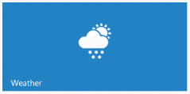
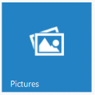

# Image Configuration

The “imagePosition” attribute is used to adjust the position of Tile image at the center on initialization. The possible values for the “imageposition” are as follows

1. center
2. topcenter
3. bottomcenter
4. rightcenter
5. leftcenter
6. topleft
7. bottomright
8. bottomleft 
9. fill

The “imageUrl” attribute is used to set the background image for Tile, where the image is given in the path specified by “imageUrl” attribute.

Refer to the following code examples.



   
         <ej:Tile runat="server" ImagePosition="Center" ImageUrl="../Content/themes/images/tile/weather.png" TileSize="Medium" Text="Weather"></ej:Tile>



 

You can give images for each tile through CSS classes by using the imageClass attribute. You can define your desired styles in the specified class.

Refer to the following code examples.



   
         <ej:Tile runat="server" ImagePosition="Center" ImageClass="pictures" TileSize="Medium" Text="People"></ej:Tile>

    



 

