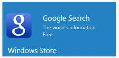

# Template Support

The “imageTemplateId” attribute is used to customize the image of Tile with template feature by setting the id. 

Refer to the following code examples.



     <ej:Tile runat="server"  ImageTemplateId="imageTemplate" TileSize="Wide" >  </ej:Tile>    
 
          

            

            
 

            

                Google Search 

                The world’s information 

                Free
            
    
        



 

