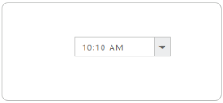
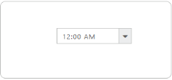
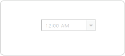
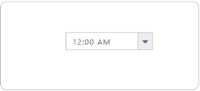
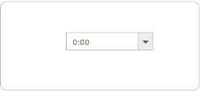
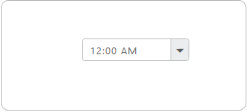

# Behavior Settings

## Set value of the TimePicker Control

You can use **Value property** to set default time for the TimePicker.

The following step explains how to set the default value of the TimePicker.

In the ASPX page, include the following TimePicker control code example.



<ej:TimePicker ID="time" Value="10:10 AM" runat="server"></ej:TimePicker>



Run the above code to render the following output.

  

## Enable/Disable TimePicker Control

TimePicker control provides you an option to enable /disable the control. You can disable the TimePicker by setting the **Enabled property** value to false.

The following step explains you to enable/disable property in the TimePicker control.

In the ASPX page, include the following TimePicker control code example.



<ej:TimePicker ID="Timepick" Enabled="true" runat="server"></ej:TimePicker>



Run the above code to render the following output.

<table>
<tr>
<td>
{{ '' | markdownify }}
</td><td>
{{ '' | markdownify }}
</td></tr>
</table>

## Restrict editing

TimePicker control provides **ReadOnly property** to disable editing in the control. Therefore, you can only read the value that is set to the TimePicker and cannot modify it. The value property allows you to set the default value for the TimePicker control when it is created.

### Configure TimePicker textbox to restrict editing

The following step allows you to disable editing value in the TimePicker.

In the ASPX page, include the following TimePicker control code example.



<ej:TimePicker ID="time" ReadOnly="true" runat="server"></ej:TimePicker>



The following screenshot illustrates aTimePicker textbox configured to restrict editing.

 

## Localization

Localization is a language support based on the culture in the TimePicker. You can achieve Localization by using Locale property in the TimePicker.

EJWEB TimePicker has been provided with built-in localization support, so that it can adapt based on culture specific locale defined for it. 

More than 350 culture specific files are available to localize the time. To know more about EJ globalize support, please refer the below link      
 [http://help.syncfusion.com/js/localization](http://help.syncfusion.com/js/localization) 

N> All the culture-specific script files are available within the below specified location, once you have installed Essential Studio in your machine, therefore it is not necessary to download these files explicitly.

<table>
<tr>
<td>

    (installed location)\Syncfusion\Essential Studio\{{ site.releaseversion }}\JavaScript\assets\scripts\i18n

    For example, If you have installed the Essential Studio package within C:\Program Files (x86), then navigate to the below location, 
    C:\Program Files (x86)\Syncfusion\Essential Studio\{{ site.releaseversion }}\JavaScript\assets\scripts\i18n

</td></tr>
</table>

You can dynamically change the language based on their culture.

## Enable Localization Support

The following step explains you how to enable Localization property for the TimePicker.

In the ASPX page, include the following TimePicker control and configure the Locale property.



<ej:TimePicker ID="time" Locale="zh-CN" runat="server"></ej:TimePicker>



Run the above code to render the following output.

 

## Rounded Corner

You can customize the shape of the TimePicker control from regular rectangular shape to rounded rectangle shape by using the **ShowRoundedCorner property** set to false by default.

### Configure Rounded corner to TimePicker Text box

In the ASPX page, include the following TimePicker control code example to enable the rounded corner.



<ej:TimePicker ID="time" ShowRoundedCorner="true" runat="server"> </ej:TimePicker>



The following screenshot illustrates a TimePicker when ShowRoundedCorner is set to true.

 

