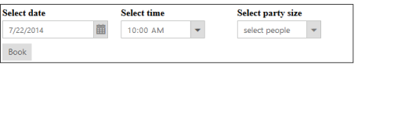
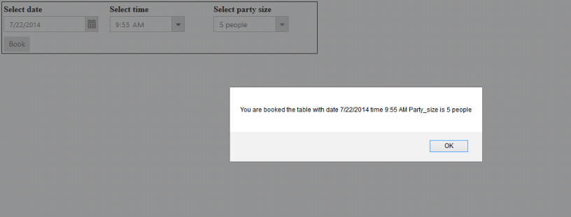
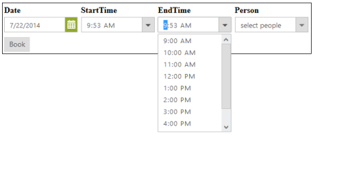

# Getting Started

This section explains briefly how to create a TimePicker in your application with ASP.NET.

## Create your first TimePicker in ASP.NET

The Essential ASP.NET TimePicker provides support to display a TimePicker in your web page and allows you to pick a time from the given TimePicker. Here, you can learn how to customize two dates and TimePickers in a real-time hotel table booking application. 

The following screenshot illustrates the functionality of a TimePicker with a time range of morning to evening. You can select a time to book a table, from a period of 9.00 AM to 6.00 PM for the current day. This avoids selecting a time prior to the morning.

 

### Create a TimePicker 

You can create an ASP.NET Web Forms Project and add necessary assemblies and scripts with the help of the given [ASP.NET Web Forms-Getting Started](https://help.syncfusion.com/aspnet/getting-started) Documentation.

Add the following code to the corresponding ASPX page to render the TimePicker.



    <table>
        <tr>
            <td class="table-data">
                Select date
            </td>
            <td class="table-data">
                Select time
            </td>
            <td class="table-data">
                Select party size
            </td>
        </tr>
        <tr>
            <td class="table-data">
                
                    <ej:DatePicker ID="DatePicker" runat="server" />
                
            </td>
            <td class="table-data">
                
                    <ej:TimePicker ID="TimePicker" runat="server" />
                
            </td>
            <td class="table-data">
                
                    <ej:DropDownList name="party_size" ID="DropDownList" SelectedItemIndex="0" runat="server">
                        <Items>
                            <ej:DropDownListItem Text="select people">
                            </ej:DropDownListItem>
                            <ej:DropDownListItem Text="5 people">
                            </ej:DropDownListItem>
                            <ej:DropDownListItem Text="10 people">
                            </ej:DropDownListItem>
                            <ej:DropDownListItem Text="15 people">
                            </ej:DropDownListItem>
                            <ej:DropDownListItem Text="20 people">
                            </ej:DropDownListItem>
                        </Items>
                    </ej:DropDownList>
                
            </td>
        </tr>
        <tr>
            <td class="table-data">
                <ej:Button ID="Book" Type="Button" Text="Book" ClientSideOnClick="acknowledge" runat="server">
                </ej:Button>
            </td>
        </tr>
    </table>



Add the following styles to show the TimePicker control.



.e-table-data
{
	width: 200px;
	font-weight: bold;
}
.inner-datepicker
{
	display: inline-block;
}



The following screenshot displays the TimePicker control.

 

### Set the Min and Max Values

In a real-time hotel table booking scenario, the booking is open only for a limited time and limited number of days. You have to select a time and date from the given range. This is achieved by using the properties **MinTime** and **MaxTime**, **MinDate** and **MaxDate**. By this way, times ranging between MinTime and MaxTime, MinDate and MaxDate are enabled in the TimePicker.



protected void Page_Load(object sender, EventArgs e)
{
	DatePicker.MinDate = DateTime.Now.ToString();
	DatePicker.MaxDate = DateTime.Now.AddDays(30).ToString();
	TimePicker.MinTime = "9:00:00";
	TimePicker.MaxTime = "18:00:00";
}



The above code example displays the following output.

 

### Set Time Interval

You can select the Time in the TimePicker with the interval of one hour. You need to set the property Interval as 60.

The following code example shows how to set Time interval.



<ej:TimePicker ID="TimePicker1" runat="server" Interval="60" />



Run the above code to achieve the desired result. You can select the date and time in the TimePicker within the given range of one hour interval. This scenario is illustrated in the following screenshot.

 

### Display the Acknowledgment Message

The acknowledgment message is displayed when you click the Book button.

The following code example shows how to display the acknowledgment message.





The following screenshot displays the acknowledgment message.

 

### Create Two TimePickers

You can select the Start time in the first TimePicker and then the End time in the second TimePicker. The validation process is done after the selection of Start time and the changes are reflected in the End time selection TimePicker. You can manipulate this process in the Select event of Start Time selection TimePicker. 

Add input element to render Two TimePickers.



<table>
        <tr>
            <td class="table-data">
                Select Date
            </td>
            <td class="table-data">
                Select start time
            </td>
            <td class="table-data">
                Select end time
            </td>
            <td class="table-data">
                Select party size
            </td>
        </tr>
        <tr>
            <td class="table-data">
                
                    <ej:DatePicker ID="DatePicker" runat="server" />
                
            </td>
            <td class="table-data">
                
                    <ej:TimePicker ID="TimePicker" ClientSideOnSelect="selectedStartTime" MinTime="9:00:00"
                        MaxTime="18:00:00" Interval="60" runat="server" />
                
            </td>
            <td class="table-data">
                
                    <ej:TimePicker ID="TimePickerEnd" MinTime="9:00:00" MaxTime="18:00:00" Interval="60"
                        runat="server" />
                
            </td>
            <td class="table-data">
               
                    <ej:DropDownList name="party_size" ID="DropDownList" SelectedItemIndex="0" runat="server">
                        <Items>
                            <ej:DropDownListItem Text="select people">
                            </ej:DropDownListItem>
                            <ej:DropDownListItem Text="5 people">
                            </ej:DropDownListItem>
                            <ej:DropDownListItem Text="10 people">
                            </ej:DropDownListItem>
                            <ej:DropDownListItem Text="15 people">
                            </ej:DropDownListItem>
                            <ej:DropDownListItem Text="20 people">
                            </ej:DropDownListItem>
                        </Items>
                    </ej:DropDownList>
               
            </td>
        </tr>
        <tr>
            <td class="table-data">
                <ej:Button ID="Book" Type="Button" Text="Book" ClientSideOnClick="acknowledge" runat="server">
               </ej:Button>
            </td>
            <td>
            </td>
            <td class="table-data">
            </td>
            <td class="table-data">
            </td>
        </tr>
   </table>



Display the acknowledge message by using following script.





Run the above code to achieve the desired result. By selecting the Start Time in the first TimePicker, you can select the End Time within the given range. This restricts you from selecting false time. This scenario is illustrated in the following screenshot.

 

You can also add additional functionalities such as localization and time formats to the TimePicker. 

