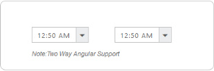

# Integration

## AngularJS Support

TimePicker control is availed with two types of AngularJS supports namely, 

* One way binding
* Two way binding 

One way binding refers to the process of applying scope values to all the available properties of the TimePicker control where the changes made in the control are not reflected or triggered in turn to the scope collection. This kind of binding applies to all the properties of the TimePicker control.

Two-way binding supports both the processes – it applies the scope values to the TimePicker properties as well as the changes made in the control are also reflected back and triggered within the AngularJS scope change function.

Apply the plugin property assigning to the TimePicker control element through the directive that starts with a letter “e-“.

To know more details about AngularJS binding, refer to the following link location,

<http://help.syncfusion.com/js/angularjs>

The following code example depicts you the way to bind data to the TimePicker control through AngularJS support.



 <html ng-app="TimeCtrl">
    <head>
        <title>Essential Studio for JavaScript : Timepicker AngularJS</title>
        <meta name="viewport" content="width=device-width, initial-scale=1.0" charset="utf-8" />
        <link href="[http://cdn.syncfusion.com/{{site.releaseversion}} /js/web/flat-azure/ej.web.all.min.css](http://cdn.syncfusion.com/13.1.0.21/js/web/flat-azure/ej.web.all.min.css)" rel="stylesheet" />
        <!--scripts-->
        
        
        
        
        
        
        
    </head>
    <body ng-controller="TimePickerCtrl">
        

            

                

                    

                        

                            <input id="time" type="text" ej-timepicker e-value="timeValue" />
                            <h6>Note:Two Way AngularJS Support</h6>
                        

                        

                            <input id="timectrl" type="text" ej-timepicker e-value="timeValue" e-interval="10" />
                        

                    

                

            

        

        
        
    </body>
</html>



Run the above code to render the following output.

 

## KnockoutJS Support

KnockoutJS support allows you to bind the ASPX elements against any of the available data model.

Two types of KnockoutJS binding are supported,

* One-way binding
* Two-way binding

One way binding refers to the process of applying observable values to all the available properties of the TimePicker control, where the changes made in the control are not reflected and triggered in turn to the observable collection. This kind of binding applies to all the properties of the TimePicker control.

Two-way binding supports both the processes – it applies the observable values to the TimePicker control properties as well as the changes made in the TimePicker control are also reflected back and triggered within the observable collections. 

For more information about the KnockoutJS binding, refer to the following link location,

<http://help.syncfusion.com/js/knockoutjs>

The following example depicts the way to bind data to the TimePicker control through the KnockoutJS support that enables and populates data to the TimePicker control based on the value set to another TimePicker control.



<html>
<head>
    <title>Essential Studio for JavaScript : Timepicker KnockoutJS</title>
    <meta name="viewport" content="width=device-width, initial-scale=1.0" charset="utf-8"  />
    <!-- Style sheet for default theme (flat azure) -->
    <link href=" [http://cdn.syncfusion.com/{{site.releaseversion}} /js/web/flat-azure/ej.web.all.min.css](http://cdn.syncfusion.com/13.1.0.21/js/web/flat-azure/ej.web.all.min.css)" rel="stylesheet" />
    <!--scripts-->
    
    
    
        
    
    
    
</head>
    <!--Adds custom scripts here -->
</head>
<body>
    
      
            
                
                
                                  
                    

                        

                             <label style="width: 130px;">Select Show Time </label>
                             <input id="time" type="text" data-bind="ejTimePicker:{value:timeValue }"/>
                        

                     
                    
                

                

                   

                      

                         
Time Value

                         

                             <input type="text" id="timeValue" class="input ejinputtext" value="" data-bind="value: timeValue" />
                         

                         
Selected time

                         

                            <input type="button" class="e-btn inputBtn" id="getTime" value="Get Time" />
   				         

                      
		
                  

           

       

    

    
 </body>
</html>



Run the above code to render the following output.

 

