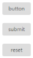

# Button types

Toggle Button is used as normal click able button, for submitting form data, and resetting the form data to its initial value. According to the usage of button, you can render the Toggle Button in the following three types by using the Type property.

<table>
<tr>
<th>
Button</th><td>
The button is a click able button.</td></tr>
<tr>
<th>
Submit</th><td>
The button is a submit button (submits form-data).</td></tr>
<tr>
<th>
Reset    </th><td>
The button is a reset button (resets the form-data to its initial values).</td></tr>
</table>
In the ASPX page, add the following button elements to configure the Toggle Button.



<ej:ToggleButton ID="ToggleButton" runat="server" Size="Mini" ShowRoundedCorner="true"

    DefaultText="button" ActiveText="done" Type="Button">

</ej:ToggleButton>

 

<ej:ToggleButton ID="Submit_ToggleButton" runat="server" Size="Mini" ShowRoundedCorner="true" DefaultText="submit" ActiveText="done" Type="Submit">

</ej:ToggleButton>

 

<ej:ToggleButton ID="Reset_ToggleButton" runat="server" Size="Mini" ShowRoundedCorner="true" DefaultText="reset" ActiveText="done" Type="Reset">

</ej:ToggleButton>



Run the above code to render the following output.

 