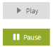
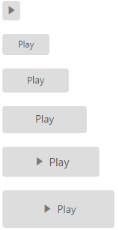
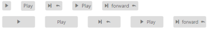
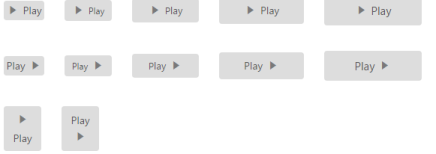

# Easy Customization

The Toggle Button allows you to perform the toggle option by using checked and unchecked state. You can also provide image with text or image alone for a Toggle Button by using the properties of ToggleButton. The Toggle Button control displays images by using the sprite CSS and Image Position properties.

Toggle Button is used in all applications. Toggle Button size, content, and content location varies according to each application. The following section contains some customizable options for the Toggle Button. 

## Toggle State

Toggle Button has two states, off and on, in a switch. By default, you can set any state initially and then you can move from one state to another by clicking the Toggle Button. These two states are Default and Active. ToggleState property is used to set the state of Toggle Button as default state or active state.

The following steps explains about rendering the Toggle Button with different toggle state.

In the ASPX page, add the following button elements to configure the Toggle Button.



<ej:ToggleButton ID="Default_ToggleButton" runat="server" Size="Small" DefaultText="Play" ActiveText="Pause" ContentType="TextAndImage" DefaultPrefixIcon="e-icon e-mediaplay" ActivePrefixIcon="e-icon e-mediapause" ToggleState="false">

</ej:ToggleButton>

 

<ej:ToggleButton ID="Active_ToggleButton" runat="server" Size="Small" DefaultText="Play" ActiveText="Pause" ContentType="TextAndImage" DefaultPrefixIcon="e-icon e-mediaplay" ActivePrefixIcon="e-icon e-mediapause" ToggleState="true">

</ej:ToggleButton>



Run the above code to render the following output.

  

## Toggle state with icons

### Prefix and Suffix Icons

You can add prefix and suffix icons to the Toggle Button. Location of Icon is customized easily by using the following mentioned option. This is applicable for the content type’s ImageOnly, TextAndImage, ImageTextImage and ImageBoth.

Toggle Button control also supports the Built-in icon libraries. The ej.widgets.core.min CSS contains the definition of important icons used in Toggle Buttons. You can use these Built-in icons by mentioning the icon class name as value in the DefaultPrefixIcon, DefaultSuffixIcon, ActivePrefixIcon,and ActiveSuffixIcon properties. You can use any font icon defined in the ej.widgets.core.min CSS. It avoids the complexity of specifying icon by using sprite image and CSS.

For example, the following mentioned Built-in CSS classes are used to show the font icons used by media player.

* e-mediaback
* e-mediaforward
* e-medianext
* e-mediaprev
* e-mediaeject
* e-mediaclose
* e-mediapause
* e-mediaplay

#### Prefix Icon

It inserts the icon at the start of the Toggle Button. After this prefix icon, you can use text or suffix icon.

#### Suffix Icon

It inserts the icon at the end of the Toggle Button. Before this suffix icon, you can use text or prefix icon.

You can also set icons in different locations (prefix, suffix) and in different states (default, active) by using the options provided. The following properties are defined for merging the options to add text, icon with different positions and in toggle states.

<table>
<tr>
<th>
Properties</th><th>
Description </th></tr>
<tr>
<td>
ActiveText</td><td>
Specifies the text of the Toggle Button in active state.</td></tr>
<tr>
<td>
ActivePrefixIcon</td><td>
Specifies the prefix icon of the Toggle Button in active state.</td></tr>
<tr>
<td>
ActiveSuffixIcon</td><td>
Specifies the suffix icon of the Toggle Button in active state.</td></tr>
<tr>
<td>
DefaultText</td><td>
Specifies the text of the Toggle Button in default state.</td></tr>
<tr>
<td>
DefaultPrefixIcon</td><td>
Specifies the prefix icon of the Toggle Button in default state.</td></tr>
<tr>
<td>
DefaultSuffixIcon</td><td>
Specifies the suffix icon of the Toggle Button in default state.</td></tr>
</table>

The following steps explain the rendering of the Toggle Button with the above mentioned customization properties.

In the ASPX page, add the following button elements to configure the Toggle Button.



<ej:ToggleButton ID="ToggleButton_IconsAndStates" runat="server" DefaultText="forward"

ActiveText="backward" ShowRoundedCorner="true" ContentType="ImageTextImage" DefaultPrefixIcon="e-icon e-mediaforward

" ActivePrefixIcon="e-icon e-mediaback " DefaultSuffixIcon="e-icon e-undo " ActiveSuffixIcon="e-icon e-redo">

</ej:ToggleButton>



Run the above code to render the following output.

 

## Toggle Button size

You can render the Toggle Button in different sizes. You can use some predefined size options for rendering a Toggle Button easily. Each size option has different height and width. It mainly avoids the complexity in rendering Toggle Button with complex CSS class. You can mention the Size of the Toggle Button by using the following five predefined size options. 

<table>
<tr>
<th>
Normal</th><th>
Creates the Toggle Button with content size.</th></tr>
<tr>
<td>
Mini</td><td>
Creates the Toggle Button with Built-in mini size height and width specified.</td></tr>
<tr>
<td>
Small</td><td>
Creates the Toggle Button with Built-in small size height and width specified.</td></tr>
<tr>
<td>
Medium</td><td>
Creates the Toggle Button with Built-in medium size height and width specified.</td></tr>
<tr>
<td>
Large</td><td>
Creates toggle button with Built-in large size height and width specified.</td></tr>
</table>
You can also set your own width and height for the Toggle Button by using height and width property.

The following steps explain the rendering of the Toggle Button with the above mentioned size options.

In the ASPX page, add the following button elements to configure the Toggle Button.



<ej:ToggleButton ID="ToggleButtonNormal" runat="server" Size="Normal" ShowRoundedCorner="true" ContentType="ImageOnly" DefaultPrefixIcon="e-icon e-mediaplay" ActivePrefixIcon="e-icon e-mediapause">

</ej:ToggleButton>

 

<ej:ToggleButton ID="ToggleButtonMini" runat="server" Size="Mini" ShowRoundedCorner="true" DefaultText="Play" ActiveText="Next">

</ej:ToggleButton>

 

<ej:ToggleButton ID="ToggleButtonSmall" runat="server" Size="Small" ShowRoundedCorner="true" DefaultText="Play" ActiveText="Next">

</ej:ToggleButton>

 

<ej:ToggleButton ID="ToggleButtonMedium" runat="server" Size="Medium" ShowRoundedCorner="true" DefaultText="Play" ActiveText="Next">

</ej:ToggleButton>

 

<ej:ToggleButton ID="ToggleButtonLarge" runat="server" Size="Large" ShowRoundedCorner="true" ContentType="TextAndImage" DefaultText="Play" ActiveText="Next" DefaultPrefixIcon="e-icon e-mediaplay" ActivePrefixIcon="e-icon e-mediapause">

</ej:ToggleButton>

 

<ej:ToggleButton ID="ToggleButtonCustomSize" runat="server" ShowRoundedCorner="true"

ContentType="TextAndImage" DefaultText="Play" ActiveText="Next" DefaultPrefixIcon="e-icon e-mediaplay" ActivePrefixIcon="e-icon e-mediapause" Height="50" Width="150">

</ej:ToggleButton>



Run the above code to render the following output.

 

## Content type

The content of the Toggle Button is mainly text and images. Instead of using complex CSS classes to render the Toggle Button with different content types, you can use some predefined content type options as listed in the following table. Using this content type you can easily add different types of content for Toggle Button. The Toggle Button supports the following content types.

<table>
<tr>
<th>
TextOnly</th><th>
Supports text content only.</th></tr>
<tr>
<td>
ImageOnly</td><td>
Supports image content only.</td></tr>
<tr>
<td>
ImageBoth</td><td>
Supports image for both ends of the Toggle Button.</td></tr>
<tr>
<td>
TextAndImage</td><td>
Supports image with the text content.</td></tr>
<tr>
<td>
ImageTextImage</td><td>
Supports image with both ends and middle text.</td></tr>
</table>

The following steps explains how to render the Toggle Button with the above mentioned ContentType options.

In the ASPX page, add the following button elements to configure the Toggle Button.



<table>

    <tr>

        <td>

            <ej:ToggleButton ID="ToggleButton_ImagesOnly" runat="server" ShowRoundedCorner="true" ContentType="ImageOnly" DefaultPrefixIcon="e-icon e-mediaplay" ActivePrefixIcon="e-icon e-mediapause">

            </ej:ToggleButton>

        </td>

        <td>

            <ej:ToggleButton ID="ToggleButton_TextOnly" runat="server" ShowRoundedCorner="true" DefaultText="Play" ActiveText="Next">

            </ej:ToggleButton>

        </td>

        <td>

            <ej:ToggleButton ID="ToggleButton_BothImages" runat="server" ShowRoundedCorner="true" ContentType="ImageBoth" DefaultText="Play" ActiveText="Next" DefaultPrefixIcon="e-icon e-mediaforward" ActivePrefixIcon="e-icon e-mediaback" DefaultSuffixIcon="e-icon e-undo" ActiveSuffixIcon="e-icon e-redo">

            </ej:ToggleButton>

        </td>

        <td>

            <ej:ToggleButton ID="ToggleButton_TextAndImage" runat="server" ShowRoundedCorner="true" ContentType="TextAndImage" DefaultText="Play" ActiveText="Next" DefaultPrefixIcon="e-icon e-mediaplay"

                ActivePrefixIcon="e-icon e-mediapause">

            </ej:ToggleButton>

        </td>

        <td>

            <ej:ToggleButton ID="ToggleButton_ImageTextImage" runat="server" ShowRoundedCorner="true" ContentType="ImageTextImage" DefaultText="forward" ActiveText="backward" DefaultPrefixIcon="e-icon e-mediaforward" ActivePrefixIcon="e-icon e-mediaback" DefaultSuffixIcon="e-icon e-undo" ActiveSuffixIcon="e-icon e-redo">

            </ej:ToggleButton>

        </td>

    </tr>

</table>

 

<table>

    <tr>

        <td>

            <ej:ToggleButton ID="SmallToggleButton_ImagesOnly" runat="server" Size="Small" ShowRoundedCorner="true" ContentType="ImageOnly" DefaultPrefixIcon="e-icon e-mediaplay" ActivePrefixIcon="e-icon e-mediapause">

            </ej:ToggleButton>

        </td>

        <td>

            <ej:ToggleButton ID="SmallToggleButton_TextOnly" runat="server" Size="Small" ShowRoundedCorner="true" DefaultText="Play" ActiveText="Next">

            </ej:ToggleButton>

        </td>

        <td>

            <ej:ToggleButton ID="SmallToggleButton_BothImages" runat="server" Size="Small" ShowRoundedCorner="true" ContentType="ImageBoth" DefaultText="Play" ActiveText="Next" DefaultPrefixIcon="e-mediaforward  e-uiLight"

                ActivePrefixIcon="e-icon e-mediaback" DefaultSuffixIcon="e-icon e-undo" ActiveSuffixIcon="e-icon e-redo">

            </ej:ToggleButton>

        </td>

        <td>

            <ej:ToggleButton ID="SmallToggleButton_TextAndImage" runat="server" Size="Small" ShowRoundedCorner="true" ContentType="TextAndImage" DefaultText="Play" ActiveText="Next" DefaultPrefixIcon="e-icon e-mediaplay" ActivePrefixIcon="e-icon e-mediapause">

            </ej:ToggleButton>

        </td>

        <td>

            <ej:ToggleButton ID="SmallToggleButton_ImageTextImage" runat="server" Size="Small" ShowRoundedCorner="true" ContentType="ImageTextImage" DefaultText="forward" ActiveText="backward" DefaultPrefixIcon="e-icon e-mediaforward" ActivePrefixIcon="e-icon e-mediaback" DefaultSuffixIcon="e-icon e-undo" ActiveSuffixIcon="e-icon e-redo">

            </ej:ToggleButton>

        </td>

    </tr>

</table>



Execute the above code to render the following output.

 

## Image position

To provide the best look and feel, position of images in the Toggle Button is important. You can customize the position of images in the Toggle Button by using the ImagePosition property without using any complex CSS. ImagePosition property is applicable only with the TextAndImage content type property. This property represents the position of the images with respect to the text.

<table>
<tr>
<th>
ImageLeft</th><td>
Support for aligning text in the right and image in the left.</td></tr>
<tr>
<th>
ImageRight</th><td>
Support for aligning text in the left and image in the right.</td></tr>
<tr>
<th>
ImageTop</th><td>
Support for aligning text at the bottom and image at the top.</td></tr>
<tr>
<th>
ImageBottom</th><td>
Support for aligning text at the top and image at the bottom.</td></tr>
</table>

The following steps explain how to render the Toggle Button with the above mentioned image position options.

In the ASPX page, add the following button elements to configure the Toggle Button widget.



<table>

    <tr>

        <td>

            <ej:ToggleButton ID="ToggleButtonNormal_ImageLeft" runat="server" Size="Normal" ShowRoundedCorner="true" ContentType="TextAndImage" DefaultText="Play" ActiveText="Next" DefaultPrefixIcon="e-icon e-mediaplay" ActivePrefixIcon="e-icon e-mediapause" ImagePosition="ImageLeft">

            </ej:ToggleButton>

        </td>

        <td>

            <ej:ToggleButton ID="ToggleButtonMini_ImageLeft" runat="server" Size="Mini" ShowRoundedCorner="true" ContentType="TextAndImage" DefaultText="Play" ActiveText="Next" DefaultPrefixIcon="e-icon e-mediaplay" ActivePrefixIcon="e-icon e-mediapause" ImagePosition="ImageLeft">

            </ej:ToggleButton>

        </td>

        <td>

            <ej:ToggleButton ID="ToggleButtonSmall_ImageLeft" runat="server" Size="Small" ShowRoundedCorner="true" ContentType="TextAndImage" DefaultText="Play" ActiveText="Next" DefaultPrefixIcon="e-icon e-mediaplay" ActivePrefixIcon="e-icon e-mediapause" ImagePosition="ImageLeft">

            </ej:ToggleButton>

        </td>

        <td>

            <ej:ToggleButton ID="ToggleButtonMedium_ImageLeft" runat="server" Size="Medium" ShowRoundedCorner="true" ContentType="TextAndImage" DefaultText="Play" ActiveText="Next" DefaultPrefixIcon="e-icon e-mediaplay" ActivePrefixIcon="e-icon e-mediapause" ImagePosition="ImageLeft">

            </ej:ToggleButton>

        </td>

        <td>

            <ej:ToggleButton ID="ToggleButtonLarge_ImageLeft" runat="server" Size="Large" ShowRoundedCorner="true" ContentType="TextAndImage" DefaultText="Play" ActiveText="Next" DefaultPrefixIcon="e-icon e-mediaplay" ActivePrefixIcon="e-icon e-mediapause" ImagePosition="ImageLeft">

            </ej:ToggleButton>

        </td>

    </tr>

</table>

 

<table>

    <tr>

        <td>

            <ej:ToggleButton ID="ToggleButtonNormal_ImageRight" runat="server" Size="Normal" ShowRoundedCorner="true" ContentType="TextAndImage" DefaultText="Play" ActiveText="Next" DefaultPrefixIcon="e-icon e-mediaplay" ActivePrefixIcon="e-icon e-mediapause" ImagePosition="ImageRight">

            </ej:ToggleButton>

        </td>

        <td>

            <ej:ToggleButton ID="ToggleButtonMini_ImageRight" runat="server" Size="Mini" ShowRoundedCorner="true" ContentType="TextAndImage" DefaultText="Play" ActiveText="Next" DefaultPrefixIcon="e-icon e-mediaplay"

                ActivePrefixIcon="e-icon e-mediapause" ImagePosition="ImageRight">

            </ej:ToggleButton>

        </td>

        <td>

            <ej:ToggleButton ID="ToggleButtonSmall_ImageRight" runat="server" Size="Small" ShowRoundedCorner="true" ContentType="TextAndImage" DefaultText="Play" ActiveText="Next" DefaultPrefixIcon="e-icon e-mediaplay" ActivePrefixIcon="e-icon e-mediapause" ImagePosition="ImageRight">

            </ej:ToggleButton>

        </td>

        <td>

            <ej:ToggleButton ID="ToggleButtonMedium_ImageRight" runat="server" Size="Medium" ShowRoundedCorner="true" ContentType="TextAndImage" DefaultText="Play" ActiveText="Next" DefaultPrefixIcon="e-icon e-mediaplay" ActivePrefixIcon="e-icon e-mediapause" ImagePosition="ImageRight">

            </ej:ToggleButton>

        </td>

        <td>

            <ej:ToggleButton ID="ToggleButtonLarge_ImageRight" runat="server" Size="Large" ShowRoundedCorner="true" ContentType="TextAndImage" DefaultText="Play" ActiveText="Next" DefaultPrefixIcon="e-icon e-mediaplay" ActivePrefixIcon="e-icon e-mediapause" ImagePosition="ImageRight">

            </ej:ToggleButton>

        </td>

    </tr>

</table>

 

<table>

    <tr>

        <td>

            <ej:ToggleButton ID="ToggleButton_ImageTop" runat="server" ShowRoundedCorner="true" ContentType="TextAndImage" DefaultText="Play" ActiveText="Next" DefaultPrefixIcon="e-icon e-mediaplay" ActivePrefixIcon="e-icon e-mediapause" ImagePosition="ImageTop" Height="60" Width="50">

            </ej:ToggleButton>

        </td>

        <td>

            <ej:ToggleButton ID="ToggleButton_ImageBottom" runat="server" ShowRoundedCorner="true" ContentType="TextAndImage" DefaultText="Play" ActiveText="Next" DefaultPrefixIcon="e-icon e-mediaplay" ActivePrefixIcon="e-icon e-mediapause" ImagePosition="ImageBottom" Height="60" Width="50">

            </ej:ToggleButton>

        </td>

    </tr>

</table>



Run the above code to render the following output.

 

