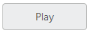

# Getting Started with ASP.NET Web Forms Toggle Button

This section explains briefly how to create a ToggleButton in your application with ASP.NET.

## Create your first Toggle Button in ASP.NET

Essential ASP.NET ToggleButton control contains built-in features like click and different display options. You can create the ToggleButton control by using the HTML helper as follows.

You can also create a WEB Project and add necessary assemblies, styles, and scripts to it.  Refer to the [ASP-Getting Started.](https://help.syncfusion.com/aspnet/getting-started)

Create an aspx file and add the following code to aspx file for ejToggleButton creation.



<ej:ToggleButton ID="ToggleButtonLarge" runat="server" Size="Large" ShowRoundedCorner="true"

    DefaultText="Play" ActiveText="Next">

</ej:ToggleButton>



Output of the above steps.

 

