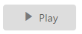

# Miscellaneous

## Show Rounded Corner 

It sets the corner of the Toggle Button in rounded shape. The Toggle Button, by default, does not have rounded corners. To set rounded corners, you can enable the ShowRoundedCorner property.

In the ASPX page, add the following button elements to configure the Toggle Button.



<ej:ToggleButton ID="ToggleButton_RoundedCorner" runat="server" Size="Small" ShowRoundedCorner="true" DefaultText="Play" ActiveText="Pause" ContentType="TextAndImage" DefaultPrefixIcon="e-mediaplay" ActivePrefixIcon="e-mediapause">

</ej:ToggleButton>



Run the above code to render the following output.

 
{:.image }

## Prevent Toggle

This property is used to prevent the state change of the Toggle Button when it is clicked. When you set the PreventToggle propertyto true, the state of the Toggle Button is not changed even though it is clicked.

In the ASPX page, add the following button elements to configure the Toggle Button.



<ej:ToggleButton ID="ToggleButton_Prevent" runat="server" Size="Small" DefaultText="Play" ActiveText="Pause" ContentType="TextAndImage" DefaultPrefixIcon="e-mediaplay" ActivePrefixIcon="e-mediapause" PreventToggle="true">

</ej:ToggleButton>



Run the above code to render the following output.

 
{:.image }

