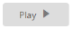

# RTL support

In some cases, it is necessary to use right-to-left alignment. You can render RTL support by using the **EnableRTL property**. In RTL mode, when there is more than one content (image/text, image/image) in button, the content is aligned in the right-to-left format. For example, when text is in the left and image is in the right positions, after applying right to left alignment these positions are interchanged.

The following steps explain the rendering of the Toggle Button with right-to-left alignment support.

In the ASPX page, add the following button elements to configure the Toggle Button.



<ej:ToggleButton ID="ToggleButton_RTL" runat="server" Size="Small" ShowRoundedCorner="true" DefaultText="Play" ActiveText="Pause" ContentType="TextAndImage" DefaultPrefixIcon="e-icon e-mediaplay" ActivePrefixIcon="e-icon e-mediapause" EnableRTL="true">

</ej:ToggleButton>



In above mentioned code example, PrefixIcon property is used and the icon that is to be on the left side, (before text) is rendered on the right side as EnableRTL property is used with PrefixIcon.  Consequently, the alignment is changed in the right to left order.

The output of the above,

 

