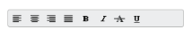
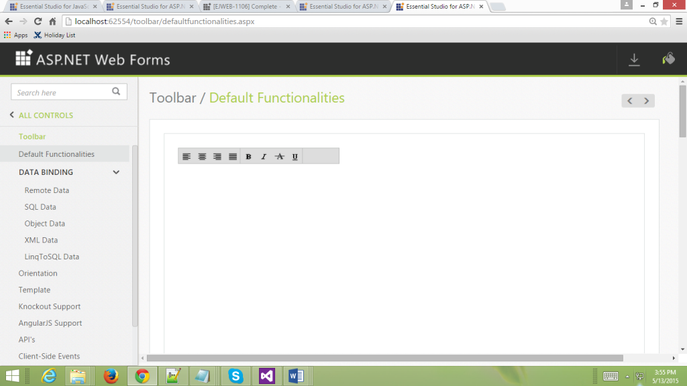
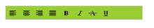

# Appearance and Styling 

## Adjusting Toolbar size

### Height

The Toolbar property Height is used to set the Height of the Toolbar. The value set to this property is string type. 

Add the following code example to the corresponding ASPX page to render the Toolbar Control



<%--Refer Local Data section for style and data bound for toolbar items.--%>

    <ej:Toolbar  ID="toolbarcontent" runat="server" Height="100px" DataIdField="Id" DataTooltipTextField="Tooltip" DataSpriteCssClassField="Css"></ej:Toolbar >



### Width

The Toolbar property Width is used to set the Width of the Toolbar. The value set to this property is a string type. 

Add the following code example to the corresponding ASPX page to render the Toolbar Control



<%--Refer Local Data section for style and data bound for toolbar items.--%>

    <ej:Toolbar  ID="toolbarcontent" runat="server" Width="300px" DataIdField="Id" DataTooltipTextField="Tooltip" DataSpriteCssClassField="Css"></ej:Toolbar >



## Enabling Rounded Corner 

The Toolbar property ShowRoundedCorner is used to enable the rounded corner for the Toolbar. The value set to this property is a Boolean type.

Add the following code example to the corresponding ASPX page to render the ToolBar Control



<%--Refer Local Data section for style and data bound for toolbar items.--%>

<ej:Toolbar ID="toolbarcontent" runat="server" Width="300px" ShowRoundedCorner="true" DataIdField="Id" DataTooltipTextField="Tooltip" DataSpriteCssClassField="Css"></ej:Toolbar>



The following screenshot displays the output of the above code.

## Enabling Separator 

The Toolbar property EnableSeparator is used to set separator between the Toolbar items. It separates one or more list items. The property IsSeparator is set to true to enable the separator for the particular Toolbar item. If it is not set, then the separator is enabled for all the Toolbar items. Here, separator is used only for “Justify” Toolbar item. The value set to this property is a Boolean type. 

Add the following code example to the corresponding ASPX page to render the Toolbar Control



<%--Refer Local Data section for style and data bound for toolbar items.--%>

<ej:Toolbar ID="toolbarcontent" EnableSeparator="true" runat="server" Width="290px" Enabled="true">

    <Items>

        <ej:ToolbarItem Id="Left" SpriteCssClass="ToolbarItems LeftAlign_tool" TooltipText="Left"></ej:ToolbarItem>

        <ej:ToolbarItem Id="Center" SpriteCssClass="ToolbarItems CenterAlign_tool" TooltipText="Center"></ej:ToolbarItem>

        <ej:ToolbarItem Id="Right" SpriteCssClass="ToolbarItems RightAlign_tool" TooltipText="Right"></ej:ToolbarItem>

        <ej:ToolbarItem Id="Justify" SpriteCssClass="ToolbarItems Justify_tool" TooltipText="Justify" IsSeparator="true"></ej:ToolbarItem>

    </Items>

    <Items>

        <ej:ToolbarItem Id="Bold" SpriteCssClass="ToolbarItems Bold_tool" TooltipText="Bold"></ej:ToolbarItem>

        <ej:ToolbarItem Id="Italic" SpriteCssClass="ToolbarItems Italic_tool" TooltipText="Italic"></ej:ToolbarItem>

        <ej:ToolbarItem Id="StrikeThrough" SpriteCssClass="ToolbarItems StrikeThrough_tool" TooltipText="StrikeThrough"></ej:ToolbarItem>

        <ej:ToolbarItem Id="UnderLine" SpriteCssClass="ToolbarItems Underline_tool" TooltipText="UnderLine"></ej:ToolbarItem>

    </Items>

</ej:Toolbar>



The following screenshot displays the output of the above code.

 

## Themes

Toolbar control’s style and appearance can be controlled based on CSS classes. In order to apply styles to the Toolbar control, you need to refer two files namely, ej.widgets.core.min.css and ej.theme.min.css. If the file ej.widgets.all.min.css is referred, then it is not necessary to include the files ej.widgets.core.min.css and ej.theme.min.css in your project, as ej.widgets.all.min.css is the combination of these two. 

By default, there are 13 themes support available for Toolbar control namely

* default-theme
* flat-azure-dark
* fat-lime
* flat-lime-dark
* flat-saffron
* flat-saffron-dark
* gradient-azure
* gradient-azure-dark
* gradient-lime
* gradient-lime-dark
* gradient-saffron
* gradient-saffron-dark
* bootstrap

## CssClass 

The Toolbar property CssClass is used to set the root class for the Toolbar control theme. The value set to this property is a string type. 

Add the following code example to the corresponding ASPX page to render the Toolbar Control



<ej:Toolbar ID="toolbarcontent" runat="server" Width="300px" CssClass="gradient-lime" DataIdField="Id" DataTooltipTextField="Tooltip" DataSpriteCssClassField="Css"></ej:Toolbar>



Add the following code example to render the ToolBar Control





 

