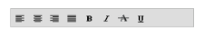
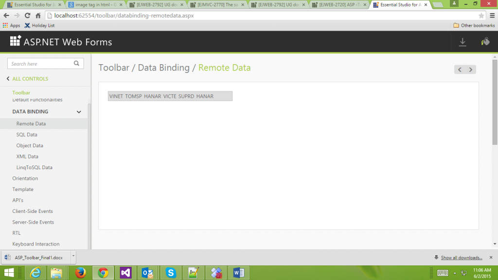
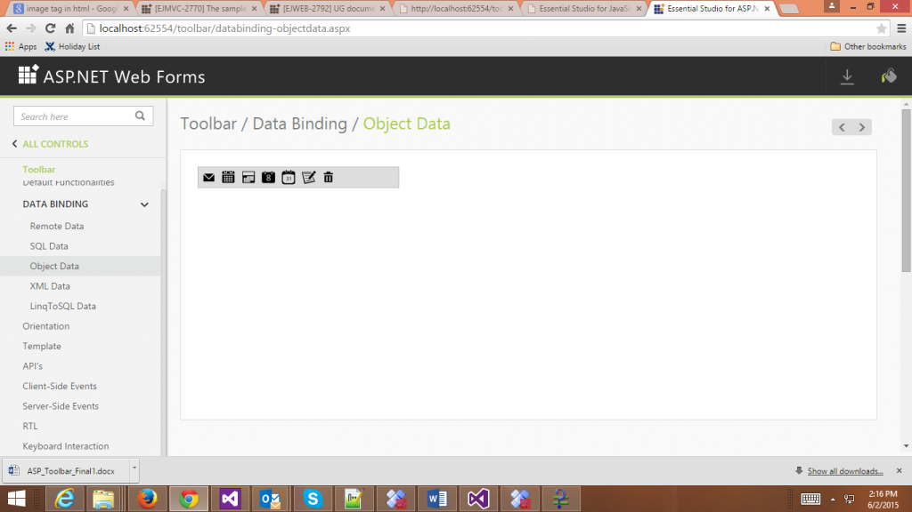

# Data binding

Toolbar provides a flexible approach for binding data from various data sources. There are various properties in Toolbar for Data Binding.

## Data fields and configuration 

The following sub-properties helps to bind either the local/remote data to the Toolbar control.

<table>
<tr>
<th>
Property</th><th>
Value Type</th><th>
Description</th></tr>
<tr>
<td>
DataSource</td><td>
object</td><td>
It specifies the data source of the Toolbar. The data source contains the list of data for generating the Toolbar items.</td></tr>
<tr>
<td>
DataSourceID</td><td>
object</td><td>
It specifies the source from which the data is bound in Toolbar items.</td></tr>
<tr>
<td>
Query</td><td>
object</td><td>
It specifies the query to retrieve the data from online server.</td></tr>
<tr>
<td>
DataIdField</td><td>
string</td><td>
It specifies the id of the tag</td></tr>
<tr>
<td>
DataTextField</td><td>
string</td><td>
It specifies the text content of the tag</td></tr>
<tr>
<td>
DataImageUrlField</td><td>
string</td><td>
This property defines the imageURL for the image location. While setting images, the folder name in which the images are stored is set to the ImageURL property.</td></tr>
<tr>
<td>
DataImageAttributeField</td><td>
string</td><td>
This property defines the style for the image. While setting an image, styles can be applied such as Height, Width by using this property.</td></tr>
<tr>
<td>
DataSpriteCssClassField</td><td>
string</td><td>
This property sets the Sprite CSS for the image tag in the Toolbar.</td></tr>
<tr>
<td>
DataHtmlAttributeField</td><td>
object</td><td>
This property sets the HTML attribute for the Toolbar item.</td></tr>
<tr>
<td>
DataTooltipTextField</td><td>
string</td><td>
This property sets the text value for Toolbar item while mouse over in the Toolbar.</td></tr>
<tr>
<td>
DataGroupField</td><td>
string</td><td>
This property is used to group the Toolbar items.</td></tr>
<tr>
<td>
DataMember</td><td>
string</td><td>
This property is used to assign the tag name in which the Toolbar items can be defined in XML.</td></tr>
</table>

## Local data

Toolbar provides extensive data binding support to generate Toolbar items so that the values can be mapped to the ToolBar fields, namely key and text.

The support to add image, image styles, sprite CSS class, query and HTML attributes options with data binding fields are also provided. 

The following code example explains the details about the data binding with the Toolbar.

Add the following code example to the corresponding ASPX page to render the Toolbar Control



<ej:Toolbar  ID="toolbar"  runat="server" Width="300px" DataIdField="Id" DataTooltipTextField="Tooltip" DataSpriteCssClassField="Css"></ej:Toolbar >



Define local DataSource elements by using the Key and Text fields in code behind and map the list data to th e DataSource property



public class ToolData

{

	public string Id

	{

		get;

		set;

	}

	public string Css

	{

		get;

		set;

	}

	public string Tooltip

	{

		get;

		set;

	}

}

protected void Page_Load(object sender, EventArgs e)

{

	List<ToolData> data = new List<ToolData>();

	data.Add(new ToolData {Id ="1", Css = "ToolbarItems LeftAlign_tool", Tooltip = "left"});

	data.Add(new ToolData {Id ="2", Css="ToolbarItems CenterAlign_tool", Tooltip="center"});

	data.Add(new ToolData {Id="3", Css="ToolbarItems RightAlign_tool", Tooltip="right"});

	data.Add(new ToolData {Id="4", Css="ToolbarItems Justify_tool",Tooltip="justify"});

	data.Add(new ToolData {Id="5", Css="ToolbarItems Bold_tool", Tooltip="bold"});

	data.Add(new ToolData {Id="6", Css="ToolbarItems Italic_tool", Tooltip="italic"});

	data.Add(new ToolData {Id="7", Css="ToolbarItems StrikeThrough_tool", Tooltip="strike"});

	data.Add(new ToolData {Id="8", Css = "ToolbarItems Underline_tool", Tooltip = "underline"});

	this.toolbar.DataSource = data;

}	



Refer to the following code example to render the Toolbar Control





The following screenshot displays the output of the above code.

 

## Remote Data

You can bind the data of the Toolbar items from remote. That is, you can access the data from any other server that is located as remote web service. Then the online link should be given in the DataSource property. 

The following code example explains how to bind the Remote data to the Toolbar,

Add the following code example to the corresponding ASPX page to render the Toolbar Control



<ej:Toolbar  ID="toolbar" runat="server" Width="340px" Orientation="Horizontal" DataTextField="CustomerID" Query="ej.Query().from('Orders').take(6)"></ej:Toolbar >





protected void Page_Load(object sender, EventArgs e)

{

 this.toolbar.DataSource = "http://mvc.syncfusion.com/Services/Northwnd.svc/";

}



The following screenshot displays the output of the above code. 

  

## SQL Data

SQL DataSource is designed to work with SQL Server databases. It uses the SQL Server .NET data provider internally. SQL Server .NET data provider classes are defined in the System.Data.SqlClient namespace. To bind the SQL DataSource to ToolBar, DataSourceID should be the id of SQL datasource. You can select the table from the select command. Create a table with given fields in SQL and refer that in the connection string to run the given sample.Refer to the following screenshot for the fields and its corresponding data types.

 

Refer to the following code example to bind SQL data in the Toolbar.

Add the following code example to the corresponding ASPX page to render the Toolbar Control



<%--Refer Local data sections for styles--%>

<ej:Toolbar ID="toolbar" runat="server" Orientation="Horizontal" DataIdField="Id" DataSpriteCssClassField="IconCss" DataTooltipTextField="ToolTip" DataSourceID="SqlDataSource1" Width="600px"></ej:Toolbar>

<asp:SqlDataSource ID="SqlDataSource1" runat="server" ConnectionString="Data Source=(LocalDB)\v11.0;AttachDbFilename=|DataDirectory|\TreeEntity.mdf;Integrated Security=True" ProviderName="System.Data.SqlClient" SelectCommand="SELECT * FROM [ToolBarItems]"></asp:SqlDataSource>



The following screenshot displays the output of the above code.

## Object Data

The object datasource control lets you to bind a specific data layer in the same manner by which you bind to the database by using other controls. The object datasource control can bind to any method that returns a DataSet or an IEnumerable object (for example, a DataReader or a collection of Classes). The major advantage of binding via object datasource is, only records that are required in the current view are retrieved from the database. To bind the object datasource to ToolBar, refer to the following code example.

Add the following code example to the corresponding ASPX page to render the Toolbar Control



<%--Refer Local data sections for styles--%>

<ej:Toolbar ID="toolbar" runat="server" Width="300px" DataSourceID="ObjectDataSource1" DataTooltipTextField="Tooltip" DataIdField="Id" DataSpriteCssClassField="Css"></ej:Toolbar>

<asp:ObjectDataSource ID="ObjectDataSource1" runat="server" SelectMethod="GetToolItems" TypeName="ToolData"></asp:ObjectDataSource>





public class ToolData

{
    public ToolData(string _id, string _css, string _tip)

    {

        this.Id = _id;

        this.Tooltip = _tip;

        this.Css = _css;

    }

    public ToolData()

    {

    }
    

    public string Id

    {

        get;

        set;

    }
    

    public string Css

    {

        get;

        set;

    }

    public string Tooltip

    {

        get;

        set;

    }

    public List<ToolData> GetToolItems()

    {

        List<ToolData> data = new List<ToolData>();

         data.Add(new ToolData { Id = "1", Css = "ToolbarItems LeftAlign_tool", Tooltip = "left" });

            data.Add(new ToolData { Id = "2", Css = "ToolbarItems CenterAlign_tool", Tooltip = "center" });

            data.Add(new ToolData { Id = "3", Css = "ToolbarItems RightAlign_tool", Tooltip = "right" });

            data.Add(new ToolData { Id = "4", Css = "ToolbarItems Justify_tool", Tooltip = "justify" });

            data.Add(new ToolData { Id = "5", Css = "ToolbarItems Bold_tool", Tooltip = "bold" });

            data.Add(new ToolData { Id = "6", Css = "ToolbarItems Italic_tool", Tooltip = "italic" });

            data.Add(new ToolData { Id = "7", Css = "ToolbarItems StrikeThrough_tool", Tooltip = "strike" });

            data.Add(new ToolData { Id = "8", Css = "ToolbarItems Underline_tool", Tooltip = "underline" });        

            return data;

    }

}



The following screenshot displays the output of the above code.

 

## XML Data

XmlDataSource is used to work with XML documents. To bind the XmlDataSource to ToolBar, DataSourceID of the toolbar should be the id of XmlDataSource. Refer to the following code example.

Add the following code example to the corresponding ASPX page to render the Toolbar Control



<%--Refer Local data sections for styles--%>

<ej:Toolbar  ID="toolbar" runat="server" Width="300px" DataIdField="Id" DataSpriteCssClassField="Sprite" DataTooltipTextField="Tooltip" DataMember="RootItem" DataSourceID="XmlDataSource1"></ej:Toolbar >

<asp:XmlDataSource ID="XmlDataSource1" runat="server" DataFile="~/App_Data/XMLTool.xml"></asp:XmlDataSource >





<?xml version="1.0" encoding="utf-8" ?>

<Items>

  <RootItem Sprite="ToolbarItems LeftAlign_tool" Id="one">

    <Tooltip>Left</Tooltip>

  </RootItem>

  <RootItem Sprite="ToolbarItems CenterAlign_tool" Id="two" >

    <Tooltip>Center</Tooltip>

  </RootItem>

  <RootItem Sprite="ToolbarItems RightAlign_tool" Id="three" >

    <Tooltip>Right</Tooltip>

  </RootItem>

  <RootItem Sprite="ToolbarItems Justify_tool" Id="four" >

    <Tooltip>Justify</Tooltip>

  </RootItem>

  <RootItem Sprite="ToolbarItems Bold_tool" Id="five">

    <Tooltip>Bold</Tooltip>

  </RootItem>

 <RootItem Sprite="ToolbarItems Italic_tool" Id="six">

    <Tooltip>Italic</Tooltip>

  </RootItem>

 <RootItem Sprite="ToolbarItems StrikeThrough_tool" Id="seven">

    <Tooltip>Strike</Tooltip>

  </RootItem>

 <RootItem Sprite="ToolbarItems Underline_tool" Id="eight">

    <Tooltip>Underline</Tooltip>

  </RootItem>

</Items>



 

### LINQ to SQL Data

The LINQ DataSource is used to bind the Toolbar data via LINQ to SQL. The property ContextTypeName indicates the location of the datasource. You can mention the exact table name of your database in the TableName property. The id of LinqDataSource should be given to DataSourceID of Toolbar. To bind data by using LINQ to SQL to Toolbar, Create a table with the given fields in LINQ to SQL and refer that in the TableName. Location of the database should be given in the ContextTypeName. Refer to the following code example.



<%--Refer Local data sections for styles--%>

<ej:Toolbar ID="toolbar" runat="server" Orientation="Horizontal" DataIdField="Id" DataSpriteCssClassField="IconCss" DataTooltipTextField="ToolTip" DataSourceID="LinqDataSource1" Width="600px"></ej:Toolbar>

<asp:LinqDataSource ID="LinqDataSource1" runat="server" ContextTypeName=" DataClasses1DataContext" EntityTypeName="" TableName="ToolBarItems"> </asp:LinqDataSource>



