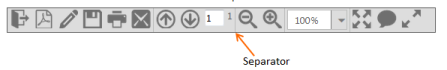
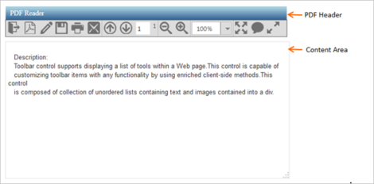

# Getting Started

## Create your first Toolbar in ASP.NET

The following section explains you how to customize the Toolbar control for a PDF Reader scenario. The following screenshot displays the appearance of the Toolbar in PDF Reader simulator application.

Here, the Toolbar consists a title and a text area as PDF Reader.

  | 

### Create a Toolbar

You can create a Toolbar control by using the following steps. The basic rendering of ASP.NET Toolbar is achieved with the default functionality.

You can create an ASP.NET Project and add necessary Dll and script with the help of the given [WebForms-Getting Started](http://help.syncfusion.com/aspnetmvc/captcha/getting-started#create-your-first-captcha-in-aspnet-mvc)Documentation.

  Add the following code example to the corresponding ASPX page for the Toolbar rendering. 



 <ej:Toolbar ID="PdfSimulator"  runat="server" Width="637px">

</ej:Toolbar>



The following output is displayed.

 

### Initialize Toolbar Items

The Toolbar consists of a list of items. From the following guidelines, you can learn how to initialize the Toolbar with the Toolbar items.



<ej:Toolbar ID="PdfSimulator" EnableSeparator="true"  runat="server"Width="220px">

    <Items>

        <ej:ToolbarItem Id="OtherFormat" SpriteCssClass="PdfDocument e-icon convertToOthers " TooltipText="Convert PDF files to Word or Excel Online.."></ej:ToolbarItem>

        <ej:ToolbarItem Id="PDFOnline" SpriteCssClass="PdfDocument e-icon convertToPdf" TooltipText="Convert files to PDF Online"></ej:ToolbarItem>

        <ej:ToolbarItem Id="signature"  SpriteCssClass="PdfDocument e-icon signature" TooltipText="Sign, add text or send a document for signature"></ej:ToolbarItem>

        <ej:ToolbarItem Id="Save" SpriteCssClass="PdfDocument e-icon save " TooltipText="Save file ( Ctrl+S )"></ej:ToolbarItem>

        <ej:ToolbarItem Id="Print" SpriteCssClass="PdfDocument e-icon print" TooltipText="Print file ( Ctrl+P ) "></ej:ToolbarItem>

        <ej:ToolbarItem Id="Message" IsSeparator="true"SpriteCssClass="PdfDocument e-icon msg" TooltipText="Message"></ej:ToolbarItem>

    </Items>

</ej:Toolbar>



Apply the styles specified in the code table to show the Toolbar items as follows. You can refer to the images from any location. 





Run the above code to render a Toolbar with a list of Toolbar items. 

 

### Render remaining Toolbar Items

To achieve the requirements, you need to render all the Toolbar items. You can separate or group the Toolbar items. The separation or grouping of Toolbar items is achieved by setting the EnableSeparator property to true for the Toolbar control. Set the IsSeparator property to true for the ToolbarItem that needs to be separated with other ToolbarItem. In the following sections, you can learn how to initialize the remaining Toolbar items and how to group the toolbar items.

Initialize and group the Toolbar items as follows.



<ej:Toolbar ID="PdfSimulator" EnableSeprator="true" runat="server"Width="637px">

        <Items>

            <ej:ToolbarItem Id="OtherFormat" SpriteCssClass="PdfDocument e-icon convertToOthers "

                TooltipText="Convert PDF files to Word or Excel Online..">

            </ej:ToolbarItem>

            <ej:ToolbarItem Id="PDFOnline" SpriteCssClass="PdfDocument e-icon convertToPdf" TooltipText="Convert files to PDF Online">

            </ej:ToolbarItem>

            <ej:ToolbarItem Id="signature" SpriteCssClass="PdfDocument e-icon signature" TooltipText="Sign, add text or send a document for signature">

            </ej:ToolbarItem>

            <ej:ToolbarItem Id="Save" SpriteCssClass="PdfDocument e-icon save " TooltipText="Save file ( Ctrl+S )">

            </ej:ToolbarItem>

            <ej:ToolbarItem Id="Print" SpriteCssClass="PdfDocument e-icon print" TooltipText="Print file ( Ctrl+P ) ">

            </ej:ToolbarItem>

            <ej:ToolbarItem Id="Message" IsSeparator="true"SpriteCssClass="PdfDocument e-icon msg"

                TooltipText="Message">

            </ej:ToolbarItem>

        </Items>

        <Items>

            <ej:ToolbarItem Id="Previous" SpriteCssClass=" PdfDocument e-icon previous " TooltipText="Show previous page ( Left Arrow )">

            </ej:ToolbarItem>

            <ej:ToolbarItem Id="Next" SpriteCssClass="PdfDocument e-icon next " TooltipText="Show next page ( Right Arrow ) ">

            </ej:ToolbarItem>

            <ej:ToolbarItem Id="pager" SpriteCssClass="PdfDocument"TooltipText="Message">

                <Template>

                    <input type="text" style="width: 22px" value="1" />

                </Template>

            </ej:ToolbarItem>

            <ej:ToolbarItem IsSeparator="true" Id="count">

                <Template>

                    1</Template>

            </ej:ToolbarItem>

        </Items>

        <Items>

            <ej:ToolbarItem Id="ZoomOut" SpriteCssClass=" PdfDocument e-icon zoomOut " TooltipText="Show next page ( Right Arrow ) ">

            </ej:ToolbarItem>

            <ej:ToolbarItem Id="ZoomIn" SpriteCssClass="PdfDocument e-icon zoomIn " IsSeparator="true"

                TooltipText="Message">

            </ej:ToolbarItem>

            <ej:ToolbarItem Id="ZoomValue" IsSeparator="true">

                <Template>

                    <ej:DropDownList ID="zoom" Width="90" Value="100%"runat="server">

                        <Items>

                            <ej:DropDownListItem Value="10%">

                            </ej:DropDownListItem>

                            <ej:DropDownListItem Value="25%">

                            </ej:DropDownListItem>

                            <ej:DropDownListItem Value="50%">

                            </ej:DropDownListItem>

                            <ej:DropDownListItem Value="100%">

                            </ej:DropDownListItem>

                            <ej:DropDownListItem Value="400%">

                            </ej:DropDownListItem>

                            <ej:DropDownListItem Value="800%">

                            </ej:DropDownListItem>

                            <ej:DropDownListItem Value="1600%">

                            </ej:DropDownListItem>

                            <ej:DropDownListItem Value="3200%">

                            </ej:DropDownListItem>

                            <ej:DropDownListItem Value="6400%">

                            </ej:DropDownListItem>

                        </Items>

                    </ej:DropDownList>

                </Template>

            </ej:ToolbarItem>

        </Items>

        <Items>

            <ej:ToolbarItem Id="FitFull" SpriteCssClass="PdfDocument e-icon fitOne" TooltipText="Fit one full page to window">

            </ej:ToolbarItem>

            <ej:ToolbarItem Id="StickyNote" SpriteCssClass="PdfDocument e-icon sticky" TooltipText="Add stick note ( Ctrl+6 ) ">

            </ej:ToolbarItem>

            <ej:ToolbarItem Id="ReadMode" SpriteCssClass="PdfDocument e-icon readMode" IsSeparator="true"

                TooltipText="View File in Read Mode">

            </ej:ToolbarItem>

        </Items>

    </ej:Toolbar>



Add the following code example to display the Toolbar items.





Set the Zoom value as it is one of the items in the Toolbar. You need to render the Dropdown list control for select zoom value. Dropdown list control is rendered with the DropDownListItem elements. The ASP.NET Dropdown control with a list of zoom values is used to render the Set Zoom value in the above code example. Refer to the following link for Dropdown creation.

[Dropdown – GettingStarted](/aspnet/dropdownlist/getting-started)

Run the above code to render the Toolbar items with separator.

 

### Add Actions to Toolbar Items

In the following section, you can learn how to render the header (Toolbar), content section (PDF viewer area) and how to set the action to Toolbar items.

N> PDF reading or rendering is not illustrated here. Simulation of the PDF Reader app to demonstrate the usage of Toolbar control is provided. PDF rendering area is ignored.

Initialize the content area and header as specified in the following code example.



<!-- control class used for aligns the pdf reader in center of a page. -->

<div class="control">

         <div class="ctrllabel">

    <!-- Here Initialize the Toolbar items as shown in above code sample and add Clientside Event as follows -->

               <ej:Toolbar ID="PdfSimulator" EnableSeprator="true" runat="server"Width="637px">

    <!--Add toolbar items from above code snippet -->

</ej:Toolbar>  

  <div id="contentSection">

        <textarea id="content" rows="10" cols="30">

   Description:

   Toolbar control supports displaying a list of tools within a Web page.This control is capable of

   customizing toolbar items with any functionality by using enriched client-side methods. This control

   is composed of collection of unordered lists containing text and images contained into a div.

        </textarea>

    



Refer to the following code example to design the PDF header and content area.





Run the above code example to render the PDF Reader as follows.

 

Now the required toolbar items are added and its appearance is configured. When you click on the Toolbar items, the operation is performed through client-slide click event. The following code example explains you on how to perform operations, when you click the Toolbar items.



<ej:Toolbar ID="PdfSimulator" EnableSeparator="true"ClientSideOnClick="onItemClick" runat="server" Width="637px">

<!--Add toolbar items from above code snippet -->

</ej:Toolbar> 





 



