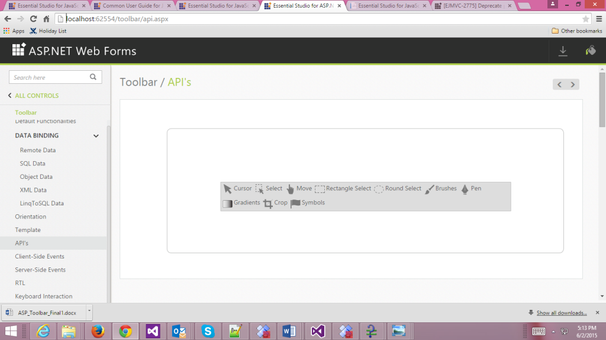

# Integration

## AngularJS

The Toolbar is availed with two types of AngularJS support namely, 

* One way binding
* Two way binding 

One way binding refers to the process of applying scope values to all the available properties of the Toolbar, but the changes made in the Toolbar widget does not reflect or get triggered in turn to the scope collection. This kind of binding applies to all the properties of the Toolbar.

Two-way binding supports both the processes – it applies the scope values to the Toolbar properties as well as the changes made in the Toolbar widget is also reflected back and triggered within the AngularJS scope change function.

To know more detail about the AngularJS binding, refer to the following link location,

<http://help.syncfusion.com/js/angularjs>

N> Add the following script files as given in the following example to access the AngularJS binding. They provide JS library for AngularJS binding.
N>
N> _angular-min.js_
N>
N> _ej.widget.angular.min.js_

The following code example explains the way to bind the data to the Toolbar widget through AngularJS support.

Add the following code example into the corresponding ASPX page to render the ToolBar Control



<!DOCTYPE html>

<html xmlns="http://www.w3.org/1999/xhtml">

<head runat="server">

    <title>Essential Studio for JavaScript :AngularJS Support for Toolbar</title>

    <link href=" http://cdn.syncfusion.com/ {{site.releaseversion}}/js/web/flat-azure/ej.web.all.min.css" rel="stylesheet" />

    <!--scripts-->

    

    

    

    

   

    

    

</head>

<body>

   

                

                    

                    

                

            

</body>

</html>











The following screenshot displays the output of the above code.

  
 

### KnockoutJS

KnockoutJS support allows you to bind the HTML elements against any of the available data models.

Two types of KnockoutJS binding is supported,

* One-way binding
* Two-way binding

One way binding refers to the process of applying observable values to all the available properties of the Toolbar, but the changes made in the Toolbar widget is not reflected and triggered in turn to the observable collection. This kind of binding applies to all the properties of the Toolbar.

Two-way binding supports both the processes – it applies the observable values to the Toolbar properties as well as the changes made in the Toolbar widget is also reflected back and triggered within the observable collections. 

For more information about the KnockoutJS binding, refer to the following online documentation in the following link location,

<http://help.syncfusion.com/js/knockoutjs>

N> Add the following script files along with the given code to access the KnockoutJS binding. They provide JS library for KnockoutJS binding.
N>
N> _knockout-min.js_
N>
N> _ej.widget.ko-latest.min.js_

The link for those script files are as follows:

[http://cdn.syncfusion.com/js/assets/external/knockout.min.js](http://cdn.syncfusion.com/js/assets/external/knockout.min.js)

[http://cdn.syncfusion.com/13.1.0.21/js/ej.widget.ko.min.js](http://cdn.syncfusion.com/13.1.0.21/js/ej.widget.ko.min.js)

The following code example explains how to bind data to the Toolbar through the KnockoutJS support. 

Add the following code example into the corresponding ASPX page to render the Toolbar control



<!DOCTYPE html>

<html xmlns="http://www.w3.org/1999/xhtml">

<head runat="server">

    <title>Essential Studio for JavaScript :AngularJS Support for Toolbar</title>

    <link href=" http://cdn.syncfusion.com/{{site.releaseversion}}/js/web/flat-azure/ej.web.all.min.css" rel="stylesheet" />

    <!--scripts-->

    

    

    

    

    

    

    

</head>

<body>

    

        

            

        

    

</body>

</html>





    





<style type="text/css" > .darktheme .cols-sample-area .e-tooltxt .editTools {

    background-image: url('../images/toolbar/editToolbar.png');

}

.cols-sample-area .e-tooltxt .editTools {

    display: block;

    background-image: url('../images/toolbar/editToolbarl.png');

    height: 26px;

    width: 26px;

    background-repeat: no-repeat;

}

.e-tooltxt:hover .editTools, .darktheme .cols-sample-area .e-tooltxt:hover .editTools {

    background-image: url('../images/toolbar/editToolbarh.png');

}

.editTools.cursor {

    background-position: -0px -0px;

}

.editTools.select {

    background-position: -0px -36px;

}

.editTools.move {

    background-position: -0px -72px;

}

.editTools.rectselect {

    background-position: -0px -108px;

}

.editTools.roundselect {

    background-position: -0px -144px;

}

.editTools.brush {

    background-position: -0px -180px;

}

.editTools.pen {

    background-position: -0px -216px;

}

.editTools.gradient {

    background-position: -0px -252px;

}

.editTools.crop {

    background-position: -0px -288px;

}

.editTools.symbols {

    background-position: -0px -324px;

}

.frame {

    height: 280px;

    width: 90%;

    border-radius: none;

    margin-left: 80px;

    margin-top: 40px;

    padding: 0;

}

.control {

    margin: 120px 120px 0;

}

</style >



The following screenshot displays the output of the above code.

 

