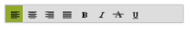

# Keyboard Navigation

The entire Toolbar commands can be accessed via the keyboard by specifying the KeyboardShortcut as in the following table.

<table>
<tr>
<th>
KeyboardShortcut</th><th>
Function</th></tr>
<tr>
<td>
Alt + j</td><td>
Focuses the control</td></tr>
<tr>
<td>
UP</td><td>
Navigates up and left.</td></tr>
<tr>
<td>
Down</td><td>
Navigates down and right.</td></tr>
<tr>
<td>
Left</td><td>
Navigates up and left.</td></tr>
<tr>
<td>
Right</td><td>
Navigates down and right.</td></tr>
<tr>
<td>
Home</td><td>
Navigates to the starting item.</td></tr>
<tr>
<td>
End</td><td>
Navigates to the ending item.</td></tr>
<tr>
<td>
Enter</td><td>
Selects the focused item</td></tr>
</table>

Here is an example that has shortcuts associated with the Toolbar items.

Add the following code example to the corresponding ASPX page to render the Toolbar Control



<%--Refer Local Data section for style and data bound for toolbar items.--%>

<ej:Toolbar  ID="toolbarcontent" runat="server" Width="300px" DataIdField="Id" DataTooltipTextField="Tooltip" DataSpriteCssClassField="Css"></ej:Toolbar >







The following screenshot displays the output of the above code.

 

