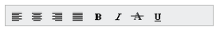

# Orientation

The toolbar control supports both vertical and horizontal orientations, allowing it to fit into any scenario. The Toolbar property Orientation defines the orientation by which the control is rendered. The value set to this property is a string type. It accepts the following values.

* “Horizontal”
* “Vertical”

The following section explains how to set orientation for the toolbar.

## Horizontal

This property sets the Toolbar in horizontal orientation.

 Add the following code example to the corresponding ASPX page to render the Toolbar Control



<%--Refer Local Data section for style and data bound for toolbar items.--%>

    <ej:Toolbar  ID="toolbarcontent" runat="server" Width="300px" Orientation="Horizontal" DataIdField="Id" DataTooltipTextField="Tooltip" DataSpriteCssClassField="Css"></ej:Toolbar >



Build and run the application.

The following screenshot displays the Toolbar output with a horizontal orientation.

  

## Vertical

This property sets the Toolbar in vertical orientation. Add the following code example to the corresponding ASPX page to render the ToolBar Control



<%--Refer Local Data section for style and data bound for toolbar items.--%>

<ej:Toolbar ID="toolbarcontent" runat="server" Orientation="Vertical" DataIdField="Id" DataTooltipTextField="Tooltip" DataSpriteCssClassField="Css"></ej:Toolbar>



The following screenshot displays the Toolbar output with a vertical orientation.

  

