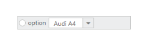

# Template Support

Templates allows you to insert custom or ASP.NET controls inside the toolbar items. You can also design simple dropdown buttons listing the items and radio button inside the Toolbar.

Set the list for DropDown control inside a list tag and define this tag as a Toolbar item. You can use all simple controls as a ToolBar item. The following code example explains how to add RadioButton and DropDownList to the Toolbar.

Add the following code example to the corresponding ASPX page to render the Toolbar Control.



<ej:Toolbar ID="toolbarTemplate" Width="250px" Height="28px" runat="server">

    <Items>

        <ej:ToolbarItem>

            <Template>

                

                    <ej:RadioButton ID="RadioButton1" Name="small" runat="server">option</ej:RadioButton>

                

                <ej:DropDownList ID="selectcar" runat="server" SelectedItemIndex="0" Width="100px" Height="23px">

                    <Items>

                        <ej:DropDownListItem Text="Audi A4" Value="Audi A4"></ej:DropDownListItem>

                        <ej:DropDownListItem Text="Audi A5" Value="Audi A5"></ej:DropDownListItem>

                        <ej:DropDownListItem Text="Audi A6" Value="Audi A6"></ej:DropDownListItem>

                        <ej:DropDownListItem Text="Audi A7" Value="Audi A7"></ej:DropDownListItem>

                        <ej:DropDownListItem Text="Audi A8" Value="Audi A8"></ej:DropDownListItem>

                    </Items>

                </ej:DropDownList>

            </Template>

        </ej:ToolbarItem>

    </Items>

</ej:Toolbar>



The following screenshot displays the Toolbar output with the embedded controls.

  

