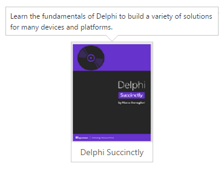
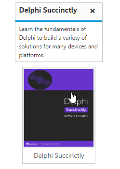

# Getting started

## Create a Tooltip

Using the following steps, you can create a Tooltip control. The basic rendering of ASP.NET Tooltip is achieved with default functionality.

1. You can create an ASP.NET Project and add necessary assembly and script with the help of the given [WebForms-Getting Started](http://help.syncfusion.com/aspnet/getting-started) Documentation.

2. Add the mentioned code to the corresponding ASPX page for Tooltip rendering.



    
    
        

            
            
Delphi Succinctly

        

    

    <ej:Tooltip For="sample" runat="server" ClientIDMode="Static"  Content="Learn the fundamentals of Delphi to build a variety of solutions for many devices and platforms."></ej:Tooltip>
    


Apply the following style sheet



    
    


## Setting Dimensions

Tooltip dimensions can be set using [width](http://help.syncfusion.com/js/api/ejtooltip#members:width) and [height](http://help.syncfusion.com/js/api/ejtooltip#members:height) API.


 
    

        TypeScript lets you write <a id="testSample"><u> JavaScript</u> </a>the way you really want to.
    

    <ej:Tooltip For="testSample" runat="server" ClientIDMode="Static"  Content="JavaScript is the programming language of HTML and the Web." Width="100px" Height="100px"></ej:Tooltip>
    


## Tooltip Appearance 

You can configure the appearance of the Tooltip with the title, close button and call out as your application requires.


 
    

        
        
Delphi Succinctly

    

    <ej:Tooltip For="sample2" runat="server" ClientIDMode="Static"  Content="Learn the fundamentals of Delphi to build a variety of solutions for many devices and platforms." Width="180px" Title="Delphi Succinctly" CloseMode="Sticky" IsBalloon="false"></ej:Tooltip>
    


Apply the following styles to show the Tooltip.



    
    


