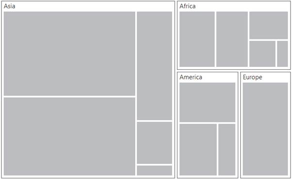
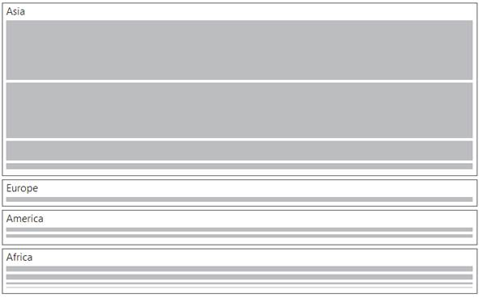

# Layout

You can decide on the visual representation of nodes belonging to all the treemap levels using the `ItemsLayoutMode` property of the TreeMap.

There are four different TreeMap layouts such as

* Squarified Layout
* SliceAndDiceAuto Layout
* SliceAndDiceHorizontal Layout
* SliceAndDiceVertical Layout

### Squarified Layout

Squarified layout creates rectangles with best aspect ratio.




protected void Page_Load(object sender, EventArgs e)

{

    this.treemap.DataSource = TreeMapPopulationData.GetData();

}





<ej:Treemap ID="treemap" runat="server" WeightValuePath = "Population" ColorValuePath = "Growth" ItemsLayoutMode=” squarified”>

</ej:Treemap>




### SliceAndDiceAuto Layout

SliceAndDiceAuto layout creates rectangles with high aspect ratio and displays them sorted both horizontally and vertically.



<ej:Treemap ID="treemap" runat="server" WeightValuePath = "Population" ColorValuePath = "Growth" ItemsLayoutMode = “sliceanddiceauto” >

</ej:Treemap>

 



 

### SliceAndDiceHorizontal Layout

SliceAndDiceHorizontal layout creates rectangles with high aspect ratio and displays them sorted horizontally.



    <ej:Treemap ID="treemap" runat="server" WeightValuePath = "Population" ColorValuePath = "Growth" ItemsLayoutMode= “sliceanddicehorizontal”>

    </ej:Treemap>

 



  

### SliceAndDiceVertical Layout

SliceAndDiceVertical layout creates rectangles with high aspect ratio and displays them sorted vertical.



    <ej:Treemap ID="treemap" runat="server" WeightValuePath = "Population" ColorValuePath = "Growth" ItemsLayoutMode= “sliceanddicevertical”>

    </ej:Treemap>

 



 