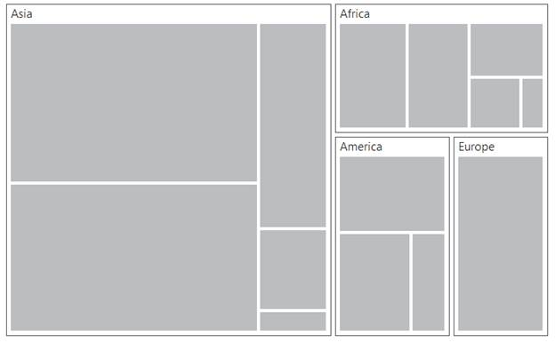

# TreeMapLevels

The `Levels` of TreeMap can be categorized into two types as,

* FlatLevel
* Hierarchical Level

Following customization options are available to customize the treemap level as per your requirements.

* To specify the background color for the group, you can use `GroupBackground` property.

* To specify the border color for the group, you can use `GroupBorderColor` property.

* To maintain the border thickness for the group, you can use `GroupBorderThickness` property.

* You can specify the gaps between groups using `GroupGap` property.

* You can specify the padding using `GroupPadding` property.

* For specifying the header height, you can use `HeaderHeight` property.

* You can customize the header template using `HeaderTemplate` property.

* To specify the label position, you can use `LabelPosition` property.

* To specify the label template for treemap, you can use `LabelTemplate` property.

* You can specify the label visibility using `LabelVisibilityMode` property.

* You can control the label visibility using `ShowLabels` property.

* For controlling text overflow, you can use `TextOverflow` property.

### Flat Level

#### Group Path

You can use `GroupPath` property for every flat level of the TreeMap control. It is a path to a field on the source object that serves as the “Group” for the level specified. You can group the data based on the GroupPath in the TreeMap control. When the GroupPath is not specified, then the items are not grouped and the data is displayed in the order specified in the DataSource.

#### Group Gap

You can use `GroupGap` property to separate the items from every flat level and to differentiate the levels mentioned in the TreeMap control.



protected void Page_Load(object sender, EventArgs e)

{

    this.treemap.DataSource = TreeMapPopulationData.GetData();

}





<ej:Treemap ID="treemap" runat="server" WeightValuePath = "Population" ColorValuePath = "Growth">

    <Levels>

           <ej:TreeMapLevel GroupPath = "Continent" GroupGap = "5" HeaderHeight = "25">

           </ej:TreeMapLevel>

    </Levels>

</ej:Treemap>



## HierarchicalLevel

TreeMap Hierarchical level is used to define levels for hierarchical data collection that contains tree-structured data.




public partial class flatCollection : Page

{

    protected void Page_Load(object sender, EventArgs e)

    {

        this.treemap.DataSource = SalesData.GetData();

   }

}

[Serializable]
public class SalesData

{

    public string Country { get; set; }

    public string Name { get; set; }

    public double Sales { get; set; }

    public double Expense { get; set; }

    public static List<SalesData> GetData()

    {

        List<SalesData> lt = new List<SalesData>();

        lt.Add(new SalesData() { Country = "United States", Name = "New York", Sales = 2353, Expense = 2000 });

        lt.Add(new SalesData() { Country = "United States", Name = "Los Angeles", Sales = 3453, Expense = 3000 });

        lt.Add(new SalesData() { Country = "United States", Name = "San Francisco", Sales = 8456, Expense = 8000 });

        lt.Add(new SalesData() { Country = "United States", Name = "Chicago", Sales = 6785, Expense = 7000 });

        lt.Add(new SalesData() { Country = "United States", Name = "Miami", Sales = 7045, Expense = 6000 });

        lt.Add(new SalesData() { Country = "Canada", Name = "Toronto", Sales = 7045, Expense = 7000 });

        lt.Add(new SalesData() { Country = "Canada", Name = "Vancouver", Sales = 4352, Expense = 4000 });

        lt.Add(new SalesData() { Country = "Canada", Name = "Winnipeg", Sales = 7843, Expense = 7500 });

        lt.Add(new SalesData() { Country = "Mexico", Name = "Mexico City", Sales = 7843, Expense = 6500 });

        lt.Add(new SalesData() { Country = "Mexico", Name = "Cancun", Sales = 6683, Expense = 6000 });

        lt.Add(new SalesData() { Country = "Mexico", Name = "Acapulco", Sales = 2454, Expense = 2000 });

        return lt;

    }

}





<ej:Treemap ID="treemap" runat="server" WeightValuePath = "Population" ColorValuePath = "Growth">

</ej:Treemap>




