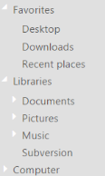
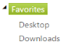

## Appearance and Styling

### Theme

TreeView control’s style and appearance can be controlled based on CSS classes. In order to apply styles to the TreeView control, you can refer to two files namely, ej.widgets.core.min.css and ej.theme.min.css. When you refer to the file ej.widgets.all.min.css, it is not necessary to include the files ej.widgets.core.min.css and ej.theme.min.css in your project, as ej.widgets.all.min.css is the combination of these two. 

By default, there are 13 themes support available for TreeView control namely,

* default-theme
* flat-azure-dark
* fat-lime
* flat-lime-dark
* flat-saffron
* flat-saffron-dark
* gradient-azure
* gradient-azure-dark
* gradient-lime
* gradient-lime-dark
* gradient-saffron
* gradient-saffron-dark
* bootstrap-theme

### Css Class

Sets the root class for TreeView theme. This cssClass API helps you to use custom skinning option for TreeView control. By defining the root class by using this API, you can include this root class in CSS.

The following steps explain enabling the cssClass property for TreeView.

In the ASPX page, add elements to configure TreeView.



<ej:TreeView ID="treeview4" runat="server" CssClass="customCss">

    <Nodes>

        <ej:TreeViewNode Expanded="True" Text="Favorites">

            <Nodes>

                <ej:TreeViewNode Text="Desktop">

                </ej:TreeViewNode>

                <ej:TreeViewNode Text="Downloads">

                </ej:TreeViewNode>

                <ej:TreeViewNode Text="Recent places">

                </ej:TreeViewNode>

            </Nodes>

        </ej:TreeViewNode>

        <ej:TreeViewNode Expanded="True" Text="Libraries">

            <Nodes>

                <ej:TreeViewNode Text="Documents">

                    <Nodes>

                        <ej:TreeViewNode Text="My Documents">

                        </ej:TreeViewNode>

                        <ej:TreeViewNode Text="Public Documents">

                        </ej:TreeViewNode>

                    </Nodes>

                </ej:TreeViewNode>

                <ej:TreeViewNode Text="Pictures">

                    <Nodes>

                        <ej:TreeViewNode Text="My Pictures">

                        </ej:TreeViewNode>

                        <ej:TreeViewNode Text="Public Pictures">

                        </ej:TreeViewNode>

                    </Nodes>

                </ej:TreeViewNode>

                <ej:TreeViewNode Text="Music">

                    <Nodes>

                        <ej:TreeViewNode Text="My Music">

                        </ej:TreeViewNode>

                        <ej:TreeViewNode Text="Public Music">

                        </ej:TreeViewNode>

                    </Nodes>

                </ej:TreeViewNode>

            </Nodes>

        </ej:TreeViewNode>

        <ej:TreeViewNode Text="Computer">

            <Nodes>

                <ej:TreeViewNode Text="Folder(C)">

                </ej:TreeViewNode>

                <ej:TreeViewNode Text="Folder(D)">

                </ej:TreeViewNode>

                <ej:TreeViewNode Text="Folder(E)">

                </ej:TreeViewNode>

            </Nodes>

        </ej:TreeViewNode>

    </Nodes>

</ej:TreeView>



Define CSS class for customizing the TreeView.



.customCss

    {

        background-color: #E0E0E0; /* Old browsers */

        color: white;

        border: 1px solid transparent;

        border-image: initial;

    }



{  | markdownify }
{:.image }

### Adjusting TreeView Size

You can adjust the TreeView size, height and width, by using the properties width and height.

#### Height

You can customize the height of the TreeView control by using the Height property.

The following steps explain how to use the Height property of TreeView.

In the ASPX page, add elements to configure TreeView.



<ej:TreeView ID="treeview4" runat="server" Height="300px">

    <Nodes>

        <ej:TreeViewNode Expanded="True" Text="Favorites">

            <Nodes>

                <ej:TreeViewNode Text="Desktop">

                </ej:TreeViewNode>

                <ej:TreeViewNode Text="Downloads">

                </ej:TreeViewNode>

                <ej:TreeViewNode Text="Recent places">

                </ej:TreeViewNode>

            </Nodes>

        </ej:TreeViewNode>

        <ej:TreeViewNode Expanded="True" Text="Libraries">

            <Nodes>

                <ej:TreeViewNode Text="Documents">

                    <Nodes>

                        <ej:TreeViewNode Text="My Documents">

                        </ej:TreeViewNode>

                        <ej:TreeViewNode Text="Public Documents">

                        </ej:TreeViewNode>

                    </Nodes>

                </ej:TreeViewNode>

                <ej:TreeViewNode Text="Pictures">

                    <Nodes>

                        <ej:TreeViewNode Text="My Pictures">

                        </ej:TreeViewNode>

                        <ej:TreeViewNode Text="Public Pictures">

                        </ej:TreeViewNode>

                    </Nodes>

                </ej:TreeViewNode>

                <ej:TreeViewNode Text="Music">

                    <Nodes>

                        <ej:TreeViewNode Text="My Music">

                        </ej:TreeViewNode>

                        <ej:TreeViewNode Text="Public Music">

                        </ej:TreeViewNode>

                    </Nodes>

                </ej:TreeViewNode>

            </Nodes>

        </ej:TreeViewNode>

        <ej:TreeViewNode Text="Computer">

            <Nodes>

                <ej:TreeViewNode Text="Folder(C)">

                </ej:TreeViewNode>

                <ej:TreeViewNode Text="Folder(D)">

                </ej:TreeViewNode>

                <ej:TreeViewNode Text="Folder(E)">

                </ej:TreeViewNode>

            </Nodes>

        </ej:TreeViewNode>

    </Nodes>

</ej:TreeView>



{  | markdownify }
{:.image }

#### Width

You can customize the width of the TreeView control by using the Width property. By specifying the Width property, you can change the Width value in the document.

The following steps explain how to use the Width property for TreeView.

In the ASPX page, add elements to configure TreeView.      



<ej:TreeView ID="treeview4" runat="server" Width="400px">

    <Nodes>

        <ej:TreeViewNode Expanded="True" Text="Favorites">

            <Nodes>

                <ej:TreeViewNode Text="Desktop">

                </ej:TreeViewNode>

                <ej:TreeViewNode Text="Downloads">

                </ej:TreeViewNode>

                <ej:TreeViewNode Text="Recent places">

                </ej:TreeViewNode>

            </Nodes>

        </ej:TreeViewNode>

        <ej:TreeViewNode Expanded="True" Text="Libraries">

            <Nodes>

                <ej:TreeViewNode Text="Documents">

                    <Nodes>

                        <ej:TreeViewNode Text="My Documents">

                        </ej:TreeViewNode>

                        <ej:TreeViewNode Text="Public Documents">

                        </ej:TreeViewNode>

                    </Nodes>

                </ej:TreeViewNode>

                <ej:TreeViewNode Text="Pictures">

                    <Nodes>

                        <ej:TreeViewNode Text="My Pictures">

                        </ej:TreeViewNode>

                        <ej:TreeViewNode Text="Public Pictures">

                        </ej:TreeViewNode>

                    </Nodes>

                </ej:TreeViewNode>

                <ej:TreeViewNode Text="Music">

                    <Nodes>

                        <ej:TreeViewNode Text="My Music">

                        </ej:TreeViewNode>

                        <ej:TreeViewNode Text="Public Music">

                        </ej:TreeViewNode>

                    </Nodes>

                </ej:TreeViewNode>

            </Nodes>

        </ej:TreeViewNode>

        <ej:TreeViewNode Text="Computer">

            <Nodes>

                <ej:TreeViewNode Text="Folder(C)">

                </ej:TreeViewNode>

                <ej:TreeViewNode Text="Folder(D)">

                </ej:TreeViewNode>

                <ej:TreeViewNode Text="Folder(E)">

                </ej:TreeViewNode>

            </Nodes>

        </ej:TreeViewNode>

    </Nodes>

</ej:TreeView>



{  | markdownify }
{:.image }

