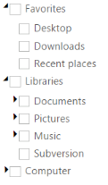

## Checkbox Support

TreeView allows you to check or uncheck the nodes. When you check the parent node of TreeView, the corresponding child nodes are automatically moved to checked state. A parent node check state is automatically set to indeterminate when it has checked and unchecked child nodes. To enable this feature, set the ShowCheckbox property to “True”.

The following steps explain how you can enable the ShowCheckbox property for TreeView.

In the ASPX page, add an element to configure TreeView.



<ej:TreeView ID="treeview1" runat="server" ShowCheckbox="true">

    <Nodes>

        <ej:TreeViewNode Expanded="True" Text="Favorites">

            <Nodes>

                <ej:TreeViewNode Text="Desktop">

                </ej:TreeViewNode>

                <ej:TreeViewNode Text="Downloads">

                </ej:TreeViewNode>

                <ej:TreeViewNode Text="Recent places">

                </ej:TreeViewNode>

            </Nodes>

        </ej:TreeViewNode>

        <ej:TreeViewNode Expanded="True" Text="Libraries">

            <Nodes>

                <ej:TreeViewNode Text="Documents">

                    <Nodes>

                        <ej:TreeViewNode Text="My Documents">

                        </ej:TreeViewNode>

                        <ej:TreeViewNode Text="Public Documents">

                        </ej:TreeViewNode>

                    </Nodes>

                </ej:TreeViewNode>

                <ej:TreeViewNode Text="Pictures">

                    <Nodes>

                        <ej:TreeViewNode Text="My Pictures">

                        </ej:TreeViewNode>

                        <ej:TreeViewNode Text="Public Pictures">

                        </ej:TreeViewNode>

                    </Nodes>

                </ej:TreeViewNode>

                <ej:TreeViewNode Text="Music">

                    <Nodes>

                        <ej:TreeViewNode Text="My Music">

                        </ej:TreeViewNode>

                        <ej:TreeViewNode Text="Public Music">

                        </ej:TreeViewNode>

                    </Nodes>

                </ej:TreeViewNode>

            </Nodes>

        </ej:TreeViewNode>

        <ej:TreeViewNode Text="Computer">

            <Nodes>

                <ej:TreeViewNode Text="Folder(C)">

                </ej:TreeViewNode>

                <ej:TreeViewNode Text="Folder(D)">

                </ej:TreeViewNode>

                <ej:TreeViewNode Text="Folder(E)">

                </ej:TreeViewNode>

            </Nodes>

        </ej:TreeViewNode>

    </Nodes>

</ej:TreeView>



{  | markdownify }
{:.image }

### Auto Check Parent Node

To overcome the default functionality of TreeView, that is, when you don’t require the parent node check state being moved to indeterminate state and when you check the corresponding child node, you can enable the property AutoCheckParentNode. By using this functionality, you can check the single parent node as well as the corresponding child nodes. You can specify the property AutoCheckParentNode in TreeView as follows.



<ej:TreeView ID="treeview1" runat="server" AutoCheckParentNode="true">

    <Nodes>

        <ej:TreeViewNode Expanded="True" Text="Favorites">

            <Nodes>

                <ej:TreeViewNode Text="Desktop">

                </ej:TreeViewNode>

                <ej:TreeViewNode Text="Downloads">

                </ej:TreeViewNode>

                <ej:TreeViewNode Text="Recent places">

                </ej:TreeViewNode>

            </Nodes>

        </ej:TreeViewNode>

        <ej:TreeViewNode Expanded="True" Text="Libraries">

            <Nodes>

                <ej:TreeViewNode Text="Documents">

                    <Nodes>

                        <ej:TreeViewNode Text="My Documents">

                        </ej:TreeViewNode>

                        <ej:TreeViewNode Text="Public Documents">

                        </ej:TreeViewNode>

                    </Nodes>

                </ej:TreeViewNode>

                <ej:TreeViewNode Text="Pictures">

                    <Nodes>

                        <ej:TreeViewNode Text="My Pictures">

                        </ej:TreeViewNode>

                        <ej:TreeViewNode Text="Public Pictures">

                        </ej:TreeViewNode>

                    </Nodes>

                </ej:TreeViewNode>

                <ej:TreeViewNode Text="Music">

                    <Nodes>

                        <ej:TreeViewNode Text="My Music">

                        </ej:TreeViewNode>

                        <ej:TreeViewNode Text="Public Music">

                        </ej:TreeViewNode>

                    </Nodes>

                </ej:TreeViewNode>

            </Nodes>

        </ej:TreeViewNode>

        <ej:TreeViewNode Text="Computer">

            <Nodes>

                <ej:TreeViewNode Text="Folder(C)">

                </ej:TreeViewNode>

                <ej:TreeViewNode Text="Folder(D)">

                </ej:TreeViewNode>

                <ej:TreeViewNode Text="Folder(E)">

                </ej:TreeViewNode>

            </Nodes>

        </ej:TreeViewNode>

    </Nodes>

</ej:TreeView>



### Checked Nodes

You can specify the Checked Nodes in TreeView initially by using the property CheckedNodes.To achieve this, set ShowCheckbox property as true in TreeView.

In the ASPX page, add an element to configure TreeView.



<ej:TreeView ID="treeview1" runat="server" ShowCheckbox="true">

    <Nodes>

        <ej:TreeViewNode Expanded="True" Text="Favorites">

            <Nodes>

                <ej:TreeViewNode Text="Desktop">

                </ej:TreeViewNode>

                <ej:TreeViewNode Text="Downloads">

                </ej:TreeViewNode>

                <ej:TreeViewNode Text="Recent places">

                </ej:TreeViewNode>

            </Nodes>

        </ej:TreeViewNode>

        <ej:TreeViewNode Expanded="True" Text="Libraries">

            <Nodes>

                <ej:TreeViewNode Text="Documents">

                    <Nodes>

                        <ej:TreeViewNode Text="My Documents">

                        </ej:TreeViewNode>

                        <ej:TreeViewNode Text="Public Documents">

                        </ej:TreeViewNode>

                    </Nodes>

                </ej:TreeViewNode>

                <ej:TreeViewNode Text="Pictures">

                    <Nodes>

                        <ej:TreeViewNode Text="My Pictures">

                        </ej:TreeViewNode>

                        <ej:TreeViewNode Text="Public Pictures">

                        </ej:TreeViewNode>

                    </Nodes>

                </ej:TreeViewNode>

                <ej:TreeViewNode Text="Music">

                    <Nodes>

                        <ej:TreeViewNode Text="My Music">

                        </ej:TreeViewNode>

                        <ej:TreeViewNode Text="Public Music">

                        </ej:TreeViewNode>

                    </Nodes>

                </ej:TreeViewNode>

            </Nodes>

        </ej:TreeViewNode>

        <ej:TreeViewNode Text="Computer">

            <Nodes>

                <ej:TreeViewNode Text="Folder(C)">

                </ej:TreeViewNode>

                <ej:TreeViewNode Text="Folder(D)">

                </ej:TreeViewNode>

                <ej:TreeViewNode Text="Folder(E)">

                </ej:TreeViewNode>

            </Nodes>

        </ej:TreeViewNode>

    </Nodes>

</ej:TreeView>



The following code explains you the configuration of CheckedNodes property in TreeView.CheckedNodes index collection is given to the integer array.



// List the node checked level

public partial class Checkbox : System.Web.UI.Page

{

    protected void Page_Load(object sender, EventArgs e)

    {

        List<int> nodes = new List<int>() { 0, 4 };

        this.treeview.CheckedNodes = nodes;

    }

}



<table>
<tr>
<td>
Properties</td><td>
Description</td><td>
Default value</td><td>
Data type</td></tr>
<tr>
<td>
DataSource</td><td>
The data source contains the list of data for generating the TreeView items.</td><td>
Null</td><td>
object</td></tr>
<tr>
<td>
Query</td><td>
It specifies the query to retrieve the data from the online server.</td><td>
Null</td><td>
object</td></tr>
<tr>
<td>
DataExpandedField</td><td>
It specifies the ID of data expanded.</td><td>
Null</td><td>
String</td></tr>
<tr>
<td>
DataHasChildField</td><td>
It specifies the child in the ID of data.  </td><td>
Null</td><td>
String</td></tr>
<tr>
<td>
DataIsCheckedField</td><td>
It specifies ID of data checked.</td><td>
Null</td><td>
String</td></tr>
<tr>
<td>
DataLinkAttributeField</td><td>
It specifies the link attributes such as sizes,target,type,etc.</td><td>
Null</td><td>
String</td></tr>
<tr>
<td>
DataParentIdField</td><td>
It specifies the Parent Id of the data.</td><td>
Null</td><td>
String</td></tr>
<tr>
<td>
DataIdField</td><td>
It specifies the ID of the data.</td><td>
Null</td><td>
String</td></tr>
<tr>
<td>
DataSourceID</td><td>
Specifies the ID of the DataSource.</td><td>
Null</td><td>
String</td></tr>
<tr>
<td>
DataMember</td><td>
Specifies the member in a data source to bind to the data list control.</td><td>
Null</td><td>
String</td></tr>
<tr>
<td>
DataTextField</td><td>
It specifies the name of the column value that binds the TreeView text.</td><td>
Null</td><td>
String</td></tr>
<tr>
<td>
DataValueField</td><td>
It specifies the ID of the value.</td><td>
Null</td><td>
String</td></tr>
<tr>
<td>
DataImageUrlField</td><td>
It defines the imageURL for the image location.</td><td>
Null</td><td>
String</td></tr>
<tr>
<td>
DataImageAttributesField</td><td>
It defines the image attributes such as height, width, styles, etc.</td><td>
Null</td><td>
String</td></tr>
<tr>
<td>
DataSpriteCssField</td><td>
It defines the sprite CSS for the image tag.</td><td>
Null</td><td>
String</td></tr>
<tr>
<td>
DataHtmlAttributesField</td><td>
It defines the html attributes such as ID, class, styles for the item.</td><td>
Null</td><td>
String</td></tr>
<tr>
<td>
DataSelectedField</td><td>
This field defines the tag value to be selected initially. Corresponding field that is mapped has boolean values to select the list items on control creation. The data with value true in this field is selected automatically when the control is initialized.</td><td>
Null</td><td>
String</td></tr>
</table>

