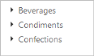
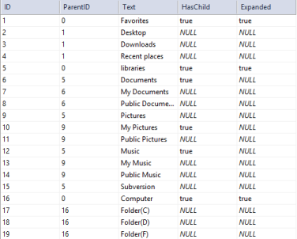
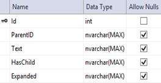
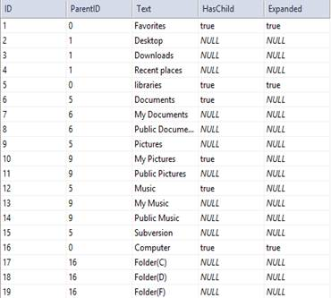

# Data Binding 

The TreeView is populated with the node information taken from a data source. The TreeView supports binding data sources containing hierarchical data and supports both local data and remote data, for retrieving data from a specified data source. You can also display the hierarchical data in TreeView. TreeView exposes its specific data-related properties allowing you to specify from which data source field the node information is to be retrieved from.

You can populate TreeView items by using data binding support such as JSON and OData services. 

## Fields

The Field property in TreeView includes the data source fields and it can be set with appropriate values as follows.

## Local Data

To bind the Local Data to the TreeView control, map the user-defined json data names with its appropriate data source field. You can bind data to TreeView by mapping fields such as dataSource,id, parentId, text, hasChild and expanded. 

The following steps explain how you can bind local data to TreeView.

In the ASPX page, add an element to configure TreeView.          



<%--In the Design page, assign the values for DataTextField, DataIdField, DataParentIdField, DataHasChildField.--%>

<ej:TreeView ID="treeview" runat="server" DataTextField="Text" DataIdField="ID" DataParentIdField="ParentID" DataHasChildField="HasChild">

</ej:TreeView>





// Define local DataSource elements by using the ID,parentID ,Text and HasChild fields in code behind and map the list data to DataSource property.

public partial class _Default : Page

{

    protected void Page_Load(object sender, EventArgs e)

    {

        this.treeview.DataSource = new TreeLocalDataSource().GetTreeDataItems().ToList();

    }

}

public class TreeLocalDataSource

{

    public TreeLocalDataSource(){ }

    public TreeLocalDataSource(int _id, int _parentid, string _text, string _hasChild)

    {

        this.ID = _id;

        this.ParentID = _parentid;

        this.Text = _text;

        this.HasChild = _hasChild;

    }

    [Browsable(true)]

    public int ID

    {

        get;

        set;

    }

    [Browsable(true)]

    public int ParentID

    {

        get;

        set;

    }

    [Browsable(true)]

    public string Text

    {

        get;

        set;

    }

    [Browsable(true)]

    public string HasChild

    {

        get;

        set;

    }

    public List<TreeLocalDataSource> GetTreeDataItems()

    {

        List<TreeLocalDataSource> data = new List<TreeLocalDataSource>();

        data.Add(new TreeLocalDataSource(1, 0, "Favorites", "true"));

        data.Add(new TreeLocalDataSource(2, 1, "Desktop", ""));

        data.Add(new TreeLocalDataSource(3, 1, "Downloads", ""));

        data.Add(new TreeLocalDataSource(4, 1, "Recent places", ""));

        data.Add(new TreeLocalDataSource(5, 0, "libraries", "true"));

        data.Add(new TreeLocalDataSource(6, 5, "Documents", "true"));

        data.Add(new TreeLocalDataSource(7, 6, "My Documents", ""));

        data.Add(new TreeLocalDataSource(8, 6, "Public Documents", ""));

        data.Add(new TreeLocalDataSource(9, 5, "Pictures", "true"));

        data.Add(new TreeLocalDataSource(10, 9, "My Pictures", ""));

        data.Add(new TreeLocalDataSource(11, 9, "Public Pictures", ""));

        data.Add(new TreeLocalDataSource(12, 5, "Music", "true"));

        data.Add(new TreeLocalDataSource(13, 9, "My Music", ""));

        data.Add(new TreeLocalDataSource(14, 9, "Public Music", ""));

        data.Add(new TreeLocalDataSource(15, 5, "Subversion", ""));

        data.Add(new TreeLocalDataSource(16, 0, "Computer", "true"));

        data.Add(new TreeLocalDataSource(17, 16, "Folder(C)", ""));

        data.Add(new TreeLocalDataSource(18, 16, "Folder(D)", ""));

        data.Add(new TreeLocalDataSource(19, 16, "Folder(F)", ""));

        return data;

    }

}



  

## Remote Data

You can bind TreeView to Remote Data by using dataManager and the query in fields is used to retrieve the data. dataManager supports the following types of data-binding: JSON, Web Services, oData. It uses two different classes; ej.DataManager for processing, and ej.Query for serving data. ej.DataManager communicates with data source and ej.Query generates data queries that are read by the dataManager. In the following link, how to create dataManager is explained in full detail.

[http://help.syncfusion.com/ug/js/default.htm#!Documents/createyourdatamanage.htm](http://help.syncfusion.com/ug/js/default.htm)

The following steps explain how you can bind remote data to TreeView control.

In the ASPX page, add an element to configure TreeView.            

Define dataManager and assign remote data source to it. Here dataManager gets the remote web service and filters the data by using Query. The select property of ejQuery is used to retrieve the specified columns from the data source.



<ej:TreeView ID="Treeview" runat="server" DataTextField="CustomerID">

</ej:TreeView>





// Initialize the control in CS page

protected void Page_Load(object sender, EventArgs e)

    {

        this.Treeview.DataSource = "http://mvc.syncfusion.com/Services/Northwnd.svc/";

        this.Treeview.Query = "ej.Query().from('Customers').take(3)";

    }



 

## SQL Data

TreeView provides extensive data binding support to populate TreeView nodes, so that the values can be mapped to the TreeView fields from an existing SQL data source by using DataSourceID property. 

The following steps explain SQL data binding to TreeView.

Define an SQL data source in the web page and configure the data source as per your requirement. For the following code example an SQL data table is created.

The following image displays the sample database used.

<table>
<tr>
<td>
{{'' | markdownify }}

</td><td>
{{'' | markdownify }}

</td></tr>
</table>
In the Design page, assign the values for DataTextField, DataIdField, DataParentIdField, DataHasChildField. In DataSourceID field assign the ID of the existing SQL data source



<ej:TreeView ID="TreeSQLDS" runat="server" DataSourceID="SqlDataSource1" DataTextField="Text" DataIdField="ID" DataParentIdField="ParentID" DataHasChildField="HasChild" DataExpandedField="Expanded">

</ej:TreeView>

<%--DataBase configured for TreeView control--%>

<asp:SqlDataSource ID="SqlDataSource1" runat="server" ConnectionString="<%$ ConnectionStrings:TreeDBConnectionString %>" SelectCommand="SELECT * FROM [TreeBind]">

</asp:SqlDataSource>



  

## Object DataSource

TreeView provides ObjectDataSource data binding support to populate TreeView nodes, so that the values can be mapped to the TreeView fields from an existing ObjectDataSource by using DataSourceID property. 

The following steps explain the ObjectDataSource data binding to TreeView.

Define an ObjectDataSource in the web page and configure the data source elements. Add the class file to App_Data folder in your web application



namespace ASPWebTreeView

{

    public class TreeObjectDataSource

    {

       public TreeObjectDataSource(){ }

        public TreeObjectDataSource(int _id, int _parentid, string _text, string _hasChild, string _expanded)

        {

            this.ID = _id;

            this.ParentID = _parentid;

            this.Text = _text;

            this.HasChild = _hasChild;

            this.Expanded = _expanded;

        }

        [Browsable(true)]

        public int ID

        {

            get;

            set;

        }

        [Browsable(true)]

        public int ParentID

        {

            get;

            set;

        }

        [Browsable(true)]

        public string Text

        {

            get;

            set;

        }

        [Browsable(true)]

        public string HasChild

        {

            get;

            set;

        }

        [Browsable(true)]

        public string Expanded

        {

            get;

            set;

        }

        public List<TreeObjectDataSource> GetTreeDataItems()

        {

            List<TreeObjectDataSource> data = new List<TreeObjectDataSource>();

            data.Add(new TreeObjectDataSource(1, 0, "Favorites", "true", "true"));

            data.Add(new TreeObjectDataSource(2, 1, "Desktop", "", ""));

            data.Add(new TreeObjectDataSource(3, 1, "Downloads", "", ""));

            data.Add(new TreeObjectDataSource(4, 1, "Recent places", "", ""));

            data.Add(new TreeObjectDataSource(5, 0, "libraries", "true", ""));

            data.Add(new TreeObjectDataSource(6, 5, "Documents", "true", ""));

            data.Add(new TreeObjectDataSource(7, 6, "My Documents", "", ""));

            data.Add(new TreeObjectDataSource(8, 6, "Public Documents", "", ""));

            data.Add(new TreeObjectDataSource(9, 5, "Pictures", "true", ""));

            data.Add(new TreeObjectDataSource(10, 9, "My Pictures", "", ""));

            data.Add(new TreeObjectDataSource(11, 9, "Public Pictures", "", ""));

            data.Add(new TreeObjectDataSource(12, 5, "Music", "true", ""));

            data.Add(new TreeObjectDataSource(13, 9, "My Music", "", ""));

            data.Add(new TreeObjectDataSource(14, 9, "Public Music", "", ""));

            data.Add(new TreeObjectDataSource(15, 5, "Subversion", "", ""));

            data.Add(new TreeObjectDataSource(16, 0, "Computer", "true", ""));

            data.Add(new TreeObjectDataSource(17, 16, "Folder(C)", "", ""));

            data.Add(new TreeObjectDataSource(18, 16, "Folder(D)", "", ""));

            data.Add(new TreeObjectDataSource(19, 16, "Folder(F)", "", ""));

            return data;

        }

    }

}



In the Design page, assign the values for DataTextField, DataIdField, DataParentIdField, DataHasChildField.In DataSourceID field assign the ID of the existing ObjectDataSource



<ej:TreeView ID="Treeview1" runat="server" DataSourceID="ObjectDataSource1" DataTextField="Text" DataIdField="ID" DataParentIdField="ParentID" DataHasChildField="HasChild" DataExpandedField="Expanded">

</ej:TreeView>

<%--DataBase configured for TreeView control--%>

<asp:ObjectDataSource ID="ObjectDataSource1" runat="server" TypeName=" ASPWebTreeView.TreeObjectDataSource SelectMethod="GetTreeDataItems">

</asp:ObjectDataSource>



   

## Linq-to-SQL Data

TreeView provides extensive data binding support to populate TreeView nodes, so that the values can be mapped to the TreeView fields from an existing Linq-to-SQL data source by using DataSourceID property. 

The following steps explain the SQL data binding to TreeView textbox.

Define a Linq-to-SQL data source in the web page and configure the data source as per your requirement, by using the database. In the following code example, an SQL table is used to create a DBML class

<table>
<tr>
<td>
{{'' | markdownify }}

</td><td>
{{'' | markdownify }}

</td></tr>
</table>
In the Design page, assign values for DataTextField, DataIdField, DataParentIdField DataHasChildField. In DataSourceID field assign the ID of the existing Linq-to-SQL data source.



<ej:TreeView ID="TreeLinqToSql" runat="server" DataSourceID="LinqDataSource1" DataTextField="Text" DataIdField="ID" DataParentIdField="ParentID" DataHasChildField="HasChild"

DataExpandedField="Expanded">

</ej:TreeView>

<asp:LinqDataSource ID="LinqDataSource1" runat="server" ContextTypeName="ASPweb.TreeView.Tree_Linq_To_SqlDataContext" EntityTypeName="" TableName="TreeLinqs">

</asp:LinqDataSource>



   

## XML Data

TreeView provides XML data binding support to populate TreeeView nodes, so that the values can be mapped to the TreeView fields from an existing XML data by using DataSourceID property. 

The following steps explain the XML data binding to TreeView.

In the Design page, assign the values for DataTextField, DataParentIdField. In DataSourceID field assign the ID of the existing XML datasource. 



<ej:TreeView ID="TreeXmlDS" runat="server" DataSourceID="XmlDataSource1" DataTextField="Item" DataParentIdField="RootItem">

</ej:TreeView>

<asp:XmlDataSource ID="XmlDataSource1" runat="server"

DataFile="~\App_Data\XMLData.xml">

</asp:XmlDataSource>



Load the nodes of TreeView in the xml data as follows.



<?xml version="1.0" encoding="utf-8" ?>

<items>

  <RootItem Text="Favorites" Url="#">

    <Item Text="Desktop" Url="#"></Item>

    <Item Text="Downloads" Url="#"></Item>

    <Item Text="Recent places" Url="#"></Item>

  </RootItem>

  <RootItem Text="Libraries" Url="#">

    <RootItem Text="Documents" Url="#">

      <Item Text="My Documents" Url="#"></Item>

      <Item Text="Public Documents" Url="#"></Item>

    </RootItem>

    <RootItem Text="Pictures" Url="#">

      <Item Text="My Pictures" Url="#"></Item>

      <Item Text="Public Pictures" Url="#"></Item>

    </RootItem>

    <RootItem Text="Music" Url="#">

      <Item Text="My Music" Url="#"></Item>

      <Item Text="Public Music" Url="#"></Item>

    </RootItem>

  </RootItem>

  <RootItem Text="Computer" Expanded="True" Url="#">

    <Item Text="Folder(C)" Url="#"></Item>

    <Item Text="Folder(D)" Url="#"></Item>

    <Item Text="Folder(F)" Url="#"></Item>

  </RootItem>

</items>



   

