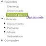

## Drag and Drop

You can Drag and Drop the nodes within the TreeView control or drag a particular node from one tree to another tree.

To enable or disable this option, set the appropriate value for the AllowDragAndDrop property. When AllowDragAndDrop is enabled, the nodes of a TreeView are dragged and dropped between all levels. 

The following steps explain enabling the AllowDragAndDrop property for TreeView.

In the ASPX page, add the elements to configure TreeView.



<ej:TreeView ID="treeview1" runat="server" AllowDragAndDrop="true">

    <Nodes>

        <ej:TreeViewNode Expanded="True" Text="Favorites">

            <Nodes>

                <ej:TreeViewNode Text="Desktop">

                </ej:TreeViewNode>

                <ej:TreeViewNode Text="Downloads">

                </ej:TreeViewNode>

                <ej:TreeViewNode Text="Recent places">

                </ej:TreeViewNode>

            </Nodes>

        </ej:TreeViewNode>

        <ej:TreeViewNode Expanded="True" Text="Libraries">

            <Nodes>

                <ej:TreeViewNode Text="Documents">

                    <Nodes>

                        <ej:TreeViewNode Text="My Documents">

                        </ej:TreeViewNode>

                        <ej:TreeViewNode Text="Public Documents">

                        </ej:TreeViewNode>

                    </Nodes>

                </ej:TreeViewNode>

                <ej:TreeViewNode Text="Pictures">

                    <Nodes>

                        <ej:TreeViewNode Text="My Pictures">

                        </ej:TreeViewNode>

                        <ej:TreeViewNode Text="Public Pictures">

                        </ej:TreeViewNode>

                    </Nodes>

                </ej:TreeViewNode>

                <ej:TreeViewNode Text="Music">

                    <Nodes>

                        <ej:TreeViewNode Text="My Music">

                        </ej:TreeViewNode>

                        <ej:TreeViewNode Text="Public Music">

                        </ej:TreeViewNode>

                    </Nodes>

                </ej:TreeViewNode>

            </Nodes>

        </ej:TreeViewNode>

        <ej:TreeViewNode Text="Computer">

            <Nodes>

                <ej:TreeViewNode Text="Folder(C)">

                </ej:TreeViewNode>

                <ej:TreeViewNode Text="Folder(D)">

                </ej:TreeViewNode>

                <ej:TreeViewNode Text="Folder(E)">

                </ej:TreeViewNode>

            </Nodes>

        </ej:TreeViewNode>

    </Nodes>

</ej:TreeView>



<table>
<tr>
<td>

{:.image }
{{ '_Node appearance while dragging_' | markdownify }}</td><td>
{{ '_Node appearance after dropping_' | markdownify }}</td></tr>
</table>
### Allow Drop Child

You can allow the child level of specified node to be dropped in TreeView by using the AllowDropChild property, and it is specified in the controls section as follows.



<ej:TreeView ID="treeview1" runat="server" AllowDropChild="true">

    <Nodes>

        <ej:TreeViewNode Expanded="True" Text="Favorites">

            <Nodes>

                <ej:TreeViewNode Text="Desktop">

                </ej:TreeViewNode>

                <ej:TreeViewNode Text="Downloads">

                </ej:TreeViewNode>

                <ej:TreeViewNode Text="Recent places">

                </ej:TreeViewNode>

            </Nodes>

        </ej:TreeViewNode>

        <ej:TreeViewNode Expanded="True" Text="Libraries">

            <Nodes>

                <ej:TreeViewNode Text="Documents">

                    <Nodes>

                        <ej:TreeViewNode Text="My Documents">

                        </ej:TreeViewNode>

                        <ej:TreeViewNode Text="Public Documents">

                        </ej:TreeViewNode>

                    </Nodes>

                </ej:TreeViewNode>

                <ej:TreeViewNode Text="Pictures">

                    <Nodes>

                        <ej:TreeViewNode Text="My Pictures">

                        </ej:TreeViewNode>

                        <ej:TreeViewNode Text="Public Pictures">

                        </ej:TreeViewNode>

                    </Nodes>

                </ej:TreeViewNode>

                <ej:TreeViewNode Text="Music">

                    <Nodes>

                        <ej:TreeViewNode Text="My Music">

                        </ej:TreeViewNode>

                        <ej:TreeViewNode Text="Public Music">

                        </ej:TreeViewNode>

                    </Nodes>

                </ej:TreeViewNode>

            </Nodes>

        </ej:TreeViewNode>

        <ej:TreeViewNode Text="Computer">

            <Nodes>

                <ej:TreeViewNode Text="Folder(C)">

                </ej:TreeViewNode>

                <ej:TreeViewNode Text="Folder(D)">

                </ej:TreeViewNode>

                <ej:TreeViewNode Text="Folder(E)">

                </ej:TreeViewNode>

            </Nodes>

        </ej:TreeViewNode>

    </Nodes>

</ej:TreeView>



### Allow Drag and Drop across control

In TreeView control, you can drag and drop a node from one TreeView to another by using the property AllowDragAndDropAcrossControl. You can specify the property in TreeView control as follows.



<ej:TreeView ID="treeview1" runat="server" AllowDragAndDropAcrossControl="true">

    <Nodes>

        <ej:TreeViewNode Expanded="True" Text="Favorites">

            <Nodes>

                <ej:TreeViewNode Text="Desktop">

                </ej:TreeViewNode>

                <ej:TreeViewNode Text="Downloads">

                </ej:TreeViewNode>

                <ej:TreeViewNode Text="Recent places">

                </ej:TreeViewNode>

            </Nodes>

        </ej:TreeViewNode>

        <ej:TreeViewNode Expanded="True" Text="Libraries">

            <Nodes>

                <ej:TreeViewNode Text="Documents">

                    <Nodes>

                        <ej:TreeViewNode Text="My Documents">

                        </ej:TreeViewNode>

                        <ej:TreeViewNode Text="Public Documents">

                        </ej:TreeViewNode>

                    </Nodes>

                </ej:TreeViewNode>

                <ej:TreeViewNode Text="Pictures">

                    <Nodes>

                        <ej:TreeViewNode Text="My Pictures">

                        </ej:TreeViewNode>

                        <ej:TreeViewNode Text="Public Pictures">

                        </ej:TreeViewNode>

                    </Nodes>

                </ej:TreeViewNode>

                <ej:TreeViewNode Text="Music">

                    <Nodes>

                        <ej:TreeViewNode Text="My Music">

                        </ej:TreeViewNode>

                        <ej:TreeViewNode Text="Public Music">

                        </ej:TreeViewNode>

                    </Nodes>

                </ej:TreeViewNode>

            </Nodes>

        </ej:TreeViewNode>

        <ej:TreeViewNode Text="Computer">

            <Nodes>

                <ej:TreeViewNode Text="Folder(C)">

                </ej:TreeViewNode>

                <ej:TreeViewNode Text="Folder(D)">

                </ej:TreeViewNode>

                <ej:TreeViewNode Text="Folder(E)">

                </ej:TreeViewNode>

            </Nodes>

        </ej:TreeViewNode>

    </Nodes>

</ej:TreeView>



### Allow Drop Sibling

You can drag the root node and drop it into the same level of node that is a sibling node in TreeView by using the property AllowDropSibling. You can specify the property AllowDropSibling in TreeView control as follows.



<ej:TreeView ID="treeview1" runat="server" AllowDropSibling="true">

    <Nodes>

        <ej:TreeViewNode Expanded="True" Text="Favorites">

            <Nodes>

                <ej:TreeViewNode Text="Desktop">

                </ej:TreeViewNode>

                <ej:TreeViewNode Text="Downloads">

                </ej:TreeViewNode>

                <ej:TreeViewNode Text="Recent places">

                </ej:TreeViewNode>

            </Nodes>

        </ej:TreeViewNode>

        <ej:TreeViewNode Expanded="True" Text="Libraries">

            <Nodes>

                <ej:TreeViewNode Text="Documents">

                    <Nodes>

                        <ej:TreeViewNode Text="My Documents">

                        </ej:TreeViewNode>

                        <ej:TreeViewNode Text="Public Documents">

                        </ej:TreeViewNode>

                    </Nodes>

                </ej:TreeViewNode>

                <ej:TreeViewNode Text="Pictures">

                    <Nodes>

                        <ej:TreeViewNode Text="My Pictures">

                        </ej:TreeViewNode>

                        <ej:TreeViewNode Text="Public Pictures">

                        </ej:TreeViewNode>

                    </Nodes>

                </ej:TreeViewNode>

                <ej:TreeViewNode Text="Music">

                    <Nodes>

                        <ej:TreeViewNode Text="My Music">

                        </ej:TreeViewNode>

                        <ej:TreeViewNode Text="Public Music">

                        </ej:TreeViewNode>

                    </Nodes>

                </ej:TreeViewNode>

            </Nodes>

        </ej:TreeViewNode>

        <ej:TreeViewNode Text="Computer">

            <Nodes>

                <ej:TreeViewNode Text="Folder(C)">

                </ej:TreeViewNode>

                <ej:TreeViewNode Text="Folder(D)">

                </ej:TreeViewNode>

                <ej:TreeViewNode Text="Folder(E)">

                </ej:TreeViewNode>

            </Nodes>

        </ej:TreeViewNode>

    </Nodes>

</ej:TreeView>



