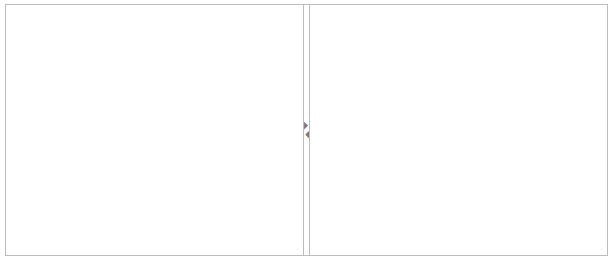
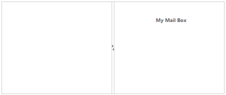
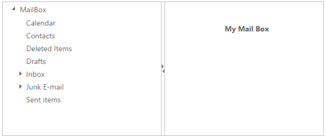
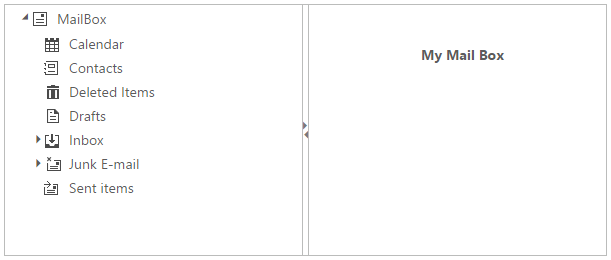
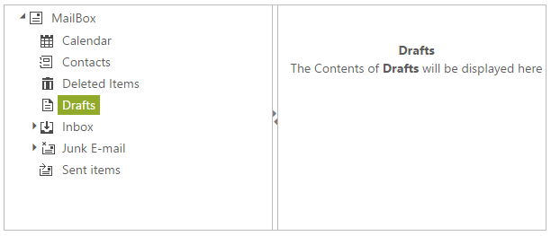
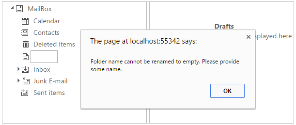
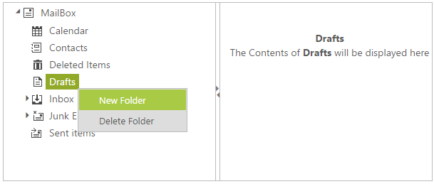
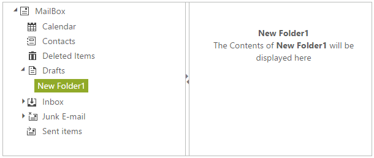
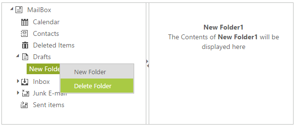

# Getting Started

The Essential ASP.NET WebForms TreeView property represents hierarchical data in a tree-like structure. TreeView allows you to edit, drag items to other TreeView, add check boxes, etc. Refer to the following section, to customize TreeView in a real time Mail Box Scenario that helps you to show items in a Mailbox with necessary features of TreeView property. The following screenshot demonstrates the functions of TreeView property with Drag and Drop option.

 

In the above screenshot, you can select the mailbox items and you can write the corresponding functions of the selected item. You can drag and drop the item from one group to another group by using the Drag and Drop option. You can use the Splitter control to split the mail options and its corresponding functions.

## Create the Splitter 

The Essential ASP.NET WebForms Splitter is a layout control that allows you to divide a web page into distinct areas by using the resizable panes. ManySplitter panes are created and placed inside the Splitter control and the split bars are inserted automatically between the adjacent panes. For more information about the splitter refer to the Splitter-Getting Started documentation.

Create a WebForms Project and add necessary Dll’s and scripts with the help of the given [WebForms-Getting Started](http://help.syncfusion.com/ug/js/Documents/gettingstartedwithmv.htm) Documentation.

Add the following code to the corresponding design page for rendering the Splitter window. 



    <ej:splitter height="251" width="601" id="outersplitter" runat="server">

            <ej:SplitPane >

                
 

            </ej:SplitPane >

            <ej:SplitPane >

                
 

            </ej:SplitPane >

 </ej:splitter>



 

### Configure TreeView inside the Splitter widget

Essential ASP.NET WebForms TreeView widget basically renders with built-in features like keyboard navigation with animations and flexible API’s.Essential ASP.NET WebForms can be generated from UL LI elements, JSON data source or by using OData service.

In this application, you can create the TreeView with the JSON data source.

You can style the right pane and render TreeView by adding 
 element in the splitter 
 elements for the Mailbox application.

Add the following style section to render the Splitter layout.





Add TreeView initialization inside the Splitter section.



<ej:Splitter Height="250" Width="601" ID="outersplitter" runat="server">

            <ej:SplitPane>

                <div class="splitdiv">

                    

< ej:TreeView ID="Mailbox" runat="server">

                        </ ej:TreeView>

                    

                

            </ej:SplitPane>

            <ej:SplitPane>

                

                    <div class="cont">

                        <!-- Div elements for displaying the messages-->

                        <div class="mailHead">

                            My Mail Box

                        <div class="mailCont">

                        

                    

                

            </ej:SplitPane>

</ej:Splitter>



 

### Configure Data Source

Create the JSON Data Source for TreeView and initialize as follows.

Add the following data list in the code behind and bind it to the treeview object by using DataSource property. Map the corresponding fields to TreeView element by using datafields.



//Define a class in code behind page

public class TreeIconsDataSource

{

    public TreeIconsDataSource()    { }

    public TreeIconsDataSource(int _id, int _parentid, string _text, string_hasChild, string _expanded, string _spriteCssClass)

    {

        this.ID = _id;

        this.ParentID = _parentid;

        this.Text = _text;

        this.HasChild = _hasChild;

        this.Expanded = _expanded;

        this.SpriteCssClass = _spriteCssClass;

    }

//Treeview data source should have Id, ParentId and Text as mandatory

    public int ID { get; set; }

// ParentId takes the value of the parent nodes I

    public int ParentID { get; set; }

//Text to be displayed in the treeview node

    public string Text { get; set; }

//Set to true if node has children

    public string HasChild { get; set; }

//Set to true if node to be expanded initially

    public string Expanded { get; set; }

//Image icon for nodes taken from the sprite css classes

    public string SpriteCssClass { get; set; }

    public List<TreeIconsDataSource> GetTreeIconItems()

    {

        List<TreeIconsDataSource> data = new List<TreeIconsDataSource>();

        data.Add(new TreeIconsDataSource(1, 0, "MailBox", "true", "true", "mailicon sprite-root"));

        data.Add(new TreeIconsDataSource(2, 1, "Calendar", "", "", "mailicon sprite-calendar"));

        data.Add(new TreeIconsDataSource(3, 1, "Contacts", "", "", "mailicon sprite-contacts"));

        data.Add(new TreeIconsDataSource(4, 1, "Deleted Items", "", "", "mailicon sprite-deleted"));

        data.Add(new TreeIconsDataSource(5, 1, "Drafts", "", "", "mailicon sprite-drafts"));

        data.Add(new TreeIconsDataSource(6, 1, "Inbox", "true", "", "mailicon sprite-inbox"));

        data.Add(new TreeIconsDataSource(7, 6, "Incidents", "", "", "mailicon sprite-folder"));

        data.Add(new TreeIconsDataSource(8, 6, "Forums", "", "", "mailicon sprite-folder"));

        data.Add(new TreeIconsDataSource(9, 6, "Issues", "", "", "mailicon sprite-folder"));

        data.Add(new TreeIconsDataSource(10, 1, "Junk E-mail", "", "", "mailicon sprite-junk"));

         data.Add(new TreeIconsDataSource(12, 10, "Forums", "", "", "mailicon sprite-folder"));

        data.Add(new TreeIconsDataSource(11, 1, "Sent items", "", "", "mailicon sprite-sentitems"));

        return data;

    }

}

//Map the created list data to DataSource property of TreeView

protected void Page_Load(object sender, EventArgs e)

 {

   this.Mailbox.DataSource = new TreeIconsDataSource().GetTreeIconItems().ToList();

 }



Add the following code in the Splitter section to render the TreeView in the right side pane.



<%--TreeView code inside splitter--%>

<div class="splitdiv">

<%--Map the corresponding TreeView Fields to DataSource items--%>                 

<ej:TreeView ID="Mailbox" runat="server" DataSourceID="ObjectDataSource1"DataTextField="Text" DataIdField="ID"

        DataParentIdField="ParentID" DataHasChildField="HasChild"DataExpandedField="Expanded">

</ej:TreeView>

 



 

### Configure TreeView with Sprite Icons

To design the TreeView look like Mail options application, you can create the Sprite CSS styles for using Mail Icons from the following image source. The source image is taken from the following installed location.

[Installed Drive]:\Users\[user name]\AppData\Local\Syncfusion\EssentialStudio\{{site.releaseversion}}\Web \Samples\web\Content\images\mail\ mailicons.png

Copy the “mailicons.png” from the above location and paste it in the folder location of the HTML sample page.

You can show the Sprite image icons in TreeView loaded inside the <styles> tag, by using the styles shown in the following code sample.





Add the following code in the Splitter section to render the TreeView in the right side pane.



<%-- TreeView code inside splitter--%>

<div class="splitdiv">                            

     <ej:TreeView ID="Mailbox" runat="server" DataSourceID="ObjectDataSource1"DataTextField="Text" DataIdField="ID"

        DataParentIdField="ParentID" DataHasChildField="HasChild"DataExpandedField="Expanded" DataSpriteCssField="SpriteCssClass">

     </ej:TreeView>

  
                    



Execute the above code to render the TreeView with Mail Icons.

 

### Set the Node Editing Option 

To rename the mail folders, set AllowEditing property to “true”. You can also use F2 key or double-click the node to rename the node.



<%--TreeView code inside splitter--%>

<div class="splitdiv">                             

<ej:TreeView ID="Mailbox" runat="server" DataSourceID="ObjectDataSource1"DataTextField="Text" DataIdField="ID"

        DataParentIdField="ParentID" DataHasChildField="HasChild"DataExpandedField="Expanded" DataSpriteCssField="SpriteCssClass"AllowEditing="true">

</ej:TreeView>



Execute the above code example to render node editing.           

 

### Set the Drag and Drop Option 

In this application you can Drag and Drop the folders anywhere inside the mailbox by setting the AllowDragAndDrop option to True.

Execute the following code example to Drag and Drop the nodes anywhere within the TreeView.



<%--TreeView code inside splitter--%>

<div class="splitdiv">

    
                            

       <ej:TreeView ID="Mailbox" runat="server" DataSourceID="ObjectDataSource1"DataTextField="Text" DataIdField="ID"

        DataParentIdField="ParentID" DataHasChildField="HasChild"DataExpandedField="Expanded" DataSpriteCssField="SpriteCssClass" Width="400px"AllowEditing="true" AllowDragAndDrop="true">

       </ej:TreeView>

     

 



### Configure Events for the TreeView

When you click on the Mailbox folder item, the corresponding navigation action is performed in the ClientSideOnNodeSelected event and this is achieved by declaring the ClientSideOnNodeSelected event with the corresponding call back function.  You can rename the folder names and it is not renamed as empty. This validation process is done manually in the ClientSideOnInlineEditValidation event.



<%--TreeView code inside splitter--%>

<div class="splitdiv">

    
                              

        <ej:TreeView ID="Mailbox" runat="server" DataSourceID="ObjectDataSource1"DataTextField="Text" DataIdField="ID"

        DataParentIdField="ParentID" DataHasChildField="HasChild"DataExpandedField="Expanded" DataSpriteCssField="SpriteCssClass" Width="400px"AllowEditing="true" AllowDragAndDrop="true" ClientSideOnNodeSelected="treeClicked"ClientSideOnInlineEditValidation="validateFolder">

       </ej:TreeView>

    



Initialize the script section to validate editing and select operation.





Execute the above code example to render TreeView. When you select the mail folder in the TreeView, the corresponding action takes place by raising the ClientSideOnNodeSelected event.

 

N> The inline edit validation is done when “ClientSideOnInlineEditValidation” event occurs, as in the screenshot as follows. The “ClientSideOnInlineEditValidation” event rises only when the “AllowEditing” property is set to True.

 

### Add or Delete the Folders by using Context Menu

You can add or remove the nodes dynamically during runtime. It is achieved by adding the Context Menu option to the TreeView. In the Context Menu, you can configure add or remove the node functions to the TreeView. The following code example illustrates how to configure the Context Menuelements for the TreeView.

Initialize the Context Menu in the Splitter section as follows.



<%--TreeView code inside splitter--%>                     

    

        <ej:treeview id="Mailbox" runat="server" datasourceid="ObjectDataSource1" datatextfield="Text"

            dataidfield="ID" dataparentidfield="ParentID" datahaschildfield="HasChild" dataexpandedfield="Expanded"

            dataspritecssfield="SpriteCssClass" width="400px" allowediting="true" allowdraganddrop="true"

            clientsideonnodeselected="treeClicked" clientsideoninlineeditvalidation="validateFolder">

         </ej:treeview>

    

    <!-- Initialize Elements for the context menu -->

    

        <ej:menu id="treeviewMenu" runat="server" menutype="ContextMenu" contextmenutarget="#LayoutSection_ControlsSection_outersplitter_ctl00_Mailbox"

            openonclick="false" showsublevelarrows="true" clientsideonbeforecontextopen="beforeOpen"

            clientsideonclick="menuClick">

            <Items><ej:MenuItem Id="New" Text="New Folder"></ej:MenuItem> </Items>

            <Items><ej:MenuItem Id="Delete" Text="Delete Folder"></ej:MenuItem></Items>

        </ej:menu>

    



Initialize the Context Menu in the script section to create new folder and delete folder.





The following screenshot illustrates adding of new folder in the TreeView by using the Context Menu. You can right-click on the TreeView Node and select the new folder option in the Context Menu for the selected folder.

 

The following screenshot illustrates the deleting of new folder that is created as a child of the “Drafts” folder. You can right-click on the New Folder1 and select the Delete Folder option in the Context Menu.

 
 

