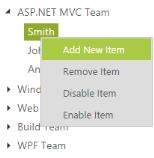

# How To

## Update the modified data from tree to database.

TreeView allows us to get the updated tree data after performing such operation like node editing, drag and drop, add and remove node. Using [getTreeData](http://help.syncfusion.com/js/api/ejtreeview#methods:gettreedata) method you can get the updated tree data.

Refer the following code block to know how to get updated data from TreeView.

In the code behind page, create a data list which contains the details about tree nodes and map the list data to DataSource property of TreeView with that also specify the method to store modified data.
    
    
    
        public partial class TreeViewFeatures : System.Web.UI.Page
        {
            List<loadData> treeData = new List<loadData>();
            protected void Page_Load(object sender, EventArgs e)
            {
                var storedData = System.Web.HttpContext.Current.Session["modifiedData"];
                if (storedData == null)
                {
                    treeData.Add(new loadData { Id = 1, Parent = 0, Text = "Item 1", Expanded = true });
                    treeData.Add(new loadData { Id = 2, Parent = 0, Text = "Item 2" });
                    treeData.Add(new loadData { Id = 3, Parent = 0, Text = "Item 3" });
                    treeData.Add(new loadData { Id = 4, Parent = 0, Text = "Item 4" });
                    treeData.Add(new loadData { Id = 5, Parent = 1, Text = "Item 1.1" });
                    treeData.Add(new loadData { Id = 6, Parent = 1, Text = "Item 1.2" });
                    treeData.Add(new loadData { Id = 7, Parent = 1, Text = "Item 1.3" });
                    treeData.Add(new loadData { Id = 8, Parent = 3, Text = "Item 3.1" });
                    treeData.Add(new loadData { Id = 9, Parent = 3, Text = "Item 3.2" });
                    treeData.Add(new loadData { Id = 10, Parent = 5, Text = "Item 1.1.1" });
                    this.treeView.DataSource = treeData;
                }
                else
                    this.treeView.DataSource = storedData;
    
            }
            [System.Web.Services.WebMethod]
            public static void StoreData(List<loadData> data)
            {
                System.Web.HttpContext.Current.Session["modifiedData"] = (data.Count > 0 ? data : null);
            }
    
        }
        public class loadData
        {
            public int Id { get; set; }
            public int Parent { get; set; }
            public string Text { get; set; }
            public bool Expanded { get; set; }
        }
        
    
    
In the view page, add TreeView element and specify the scripts for sending modified data through AJAX action with that also specify clear cache option.
    
    
    
        <ej:TreeView
            ID="treeView"
            runat="server"
            DataTextField="Text"
            DataIdField="Id"
            DataParentIdField="Parent"
            DataExpandedField="Expanded"
            ClientSideOnCreated="onCreate">
        </ej:TreeView>
        <ej:Button
            ID="move"
            Text="Move"
            Type="Button"
            runat="server"
            ClientSideOnClick="onMove">
        </ej:Button>
        <ej:Button
            ID="clear"
            Text="Clear"
            Type="Button"
            runat="server"
            ClientSideOnClick="onClear">
        </ej:Button>
        
        
    

You can also get the updated data source for remote data binding after performing the operation like editing, selecting/unselecting, expanding/collapsing, checking/unchecking and removing node. You cannot get the updated data source when you perform operation like drag and drop, adding node for remote data binding.

The updated data source also contains custom attributes ("ContactTitle", "OrderID", "EmployeeID", "Freight") if you return these from server.

Refer the following code block to know more about how to get updated data with custom attributes from TreeView for remote data binding.

In the view page, add TreeView element and specify the scripts for getting updated data source.


<button id="btn1" onclick="getSelectedNodeObject()" type="button">GetSelectedNodeObject</button>

<ej:TreeView runat="server" ID="tree1" DataIdField="CustomerID" DataTextField="CustomerID" Query="ej.Query().from('Orders').select('CustomerID,OrderID,EmployeeID,Freight').take(3)">
    <DataManager URL="//js.syncfusion.com/ejServices/Wcf/Northwind.svc/" CrossDomain="true"></DataManager>
    <Child Id="Country" ParentId="CustomerID" Text="ContactName" Query="ej.Query().from('Customers').select('CustomerID,ContactTitle,ContactName,Country')">
        <DataManager URL="//js.syncfusion.com/ejServices/Wcf/Northwind.svc/" CrossDomain="true"></DataManager>
    </Child>
</ej:TreeView>


    
## TreeView context menu to process node operations.

TreeView control is availed with the context menu options that open on right-click, over the node. Other than the default menu items available, you can add the new node dynamically in TreeView and also delete the item, enable and disable the item in TreeView. It is achieved by adding the context menu option to the TreeView.

**Menu Item**

By default, the context menu options are provided with four items namely: Add New Item, Delete Item, Enable Item and Disable Item. When you want to customize and use your own custom menu items, then you can customize the TreeView with the desired collections.

The following code example illustrates how to configure the context menu elements for the TreeView and in the following example, you have to specify the menu type as ej.MenuType.ContextMenu and in the menuClick function, you can check the cases with add, delete, remove or enable item in TreeView.
And each functionality in the context menu option is done by specific methods. For example, you have added the new item in TreeView by using the addNode() method, delete the item using removeNode() method, disable the item using disableNode() method and enable the item enableNode() method respectively.

The following steps explain how you can enable the ShowCheckbox property for TreeView.

In the view page, add TreeView element and specify context menu items.
    
    
    
        <ej:TreeView
            ID="treeView"
            runat="server"
            Height="300px"
            Width="400px">
            <Nodes>
                <ej:TreeViewNode Expanded="True" Text="ASP.NET Web Team">
                    <Nodes>
                        <ej:TreeViewNode Text="Smith">
                        </ej:TreeViewNode>
                        <ej:TreeViewNode Text="Johnson">
                        </ej:TreeViewNode>
                        <ej:TreeViewNode Text="Anderson">
                        </ej:TreeViewNode>
                    </Nodes>
                </ej:TreeViewNode>
                <ej:TreeViewNode Text="Windows Team">
                    <Nodes>
                        <ej:TreeViewNode Text="Clark">
                        </ej:TreeViewNode>
                        <ej:TreeViewNode Text="Wright">
                        </ej:TreeViewNode>
                        <ej:TreeViewNode Text="Lopez">
                        </ej:TreeViewNode>
                    </Nodes>
                </ej:TreeViewNode>
                <ej:TreeViewNode Text="Web Team">
                    <Nodes>
                        <ej:TreeViewNode Text="Joshua">
                        </ej:TreeViewNode>
                        <ej:TreeViewNode Text="Matthew">
                        </ej:TreeViewNode>
                        <ej:TreeViewNode Text="David">
                        </ej:TreeViewNode>
                    </Nodes>
                </ej:TreeViewNode>
                <ej:TreeViewNode Text="Build Team">
                    <Nodes>
                        <ej:TreeViewNode Text="Ryan">
                        </ej:TreeViewNode>
                        <ej:TreeViewNode Text="Justin">
                        </ej:TreeViewNode>
                        <ej:TreeViewNode Text="Robert">
                        </ej:TreeViewNode>
                    </Nodes>
                </ej:TreeViewNode>
                <ej:TreeViewNode Text="WPF Team">
                    <Nodes>
                        <ej:TreeViewNode Text="Brown">
                        </ej:TreeViewNode>
                        <ej:TreeViewNode Text="Johnson">
                        </ej:TreeViewNode>
                        <ej:TreeViewNode Text="Miller">
                        </ej:TreeViewNode>
                    </Nodes>
                </ej:TreeViewNode>
            </Nodes>
        </ej:TreeView>
    
        

            <ej:Menu
                ID="Menu1"
                MenuType="ContextMenu"
                ClientSideOnClick="menuClick"
                ClientSideOnBeforeContextOpen="beforeOpen"
                OpenOnClick="false"
                runat="server"
                ContextMenuTarget="#LayoutSection_ControlsSection_treeView">
                <Items>
                    <ej:MenuItem Text="Add New Item">
                    </ej:MenuItem>
                </Items>
                <Items>
                    <ej:MenuItem Text="Remove Item">
                    </ej:MenuItem>
                </Items>
                <Items>
                    <ej:MenuItem Text="Disable Item">
                    </ej:MenuItem>
                </Items>
                <Items>
                    <ej:MenuItem Text="Enable Item">
                    </ej:MenuItem>
                </Items>
            </ej:Menu>
        

        
    
    
Define menu events in the script as follows,

    
    
    
        
    

The output for the context menu for TreeView control is as follows.

## Sorted data using refresh method

TreeView allows you to refresh the entire tree data using [refresh](http://help.syncfusion.com/js/api/ejtreeview#methods:refresh) method. Refer the below code block to know how to sort entire tree data using refresh method.

In the code behind page, create a data list which contains the details about tree nodes and map the list data to DataSource property of TreeView.
    
    
    
        public partial class TreeViewFeatures : System.Web.UI.Page
        {
            List<LoadData> treeData = new List<LoadData>();
            protected void Page_Load(object sender, EventArgs e)
            {
                treeData.Add(new LoadData { Id = 1, Parent = 0, Text = "Item 1", Expanded = true });
                treeData.Add(new LoadData { Id = 2, Parent = 0, Text = "Item 4" });
                treeData.Add(new LoadData { Id = 3, Parent = 0, Text = "Item 3" });
                treeData.Add(new LoadData { Id = 4, Parent = 0, Text = "Item 2" });
                treeData.Add(new LoadData { Id = 5, Parent = 1, Text = "Item 1.1" });
                treeData.Add(new LoadData { Id = 6, Parent = 1, Text = "Item 1.2" });
                treeData.Add(new LoadData { Id = 7, Parent = 1, Text = "Item 1.3" });
                treeData.Add(new LoadData { Id = 8, Parent = 3, Text = "Item 3.1" });
                treeData.Add(new LoadData { Id = 9, Parent = 3, Text = "Item 3.2" });
                treeData.Add(new LoadData { Id = 10, Parent = 5, Text = "Item 1.1.1" });
                this.treeview.DataSource = treeData;
            }
        }
        public class LoadData
        {
            public int Id { get; set; }
            public int Parent { get; set; }
            public string Text { get; set; }
            public bool Expanded { get; set; }
        }
        
    
    
In the view page, add TreeView element and map the properties defined in to the corresponding fields in data source with that specify the scripts for sorting and refreshing tree data.
    
    
    
        <ej:TreeView
            ID="treeview"
            runat="server"
            DataTextField="Text"
            DataIdField="Id"
            DataParentIdField="Parent"
            DataExpandedField="Expanded">
        </ej:TreeView>
        <ej:Button
            ID="sortButton"
            Text="Sort Countries"
            Type="Button"
            runat="server"
            ClientSideOnClick="sortCountries">
        </ej:Button>
        
        
    
    
## Persist updated data after edit, add and remove node

TreeView allow us to persist the updated data after performing some tree operations like node add and delete. Refer the following code block to know how to persist updated tree data after refresh.

The [nodeAdd](https://help.syncfusion.com/api/js/ejtreeview#events:nodeadd), [nodeCut](https://help.syncfusion.com/api/js/ejtreeview#events:nodecut), [nodeDelete](https://help.syncfusion.com/api/js/ejtreeview#events:nodedelete) and [nodePaste](https://help.syncfusion.com/api/js/ejtreeview#events:nodepaste) events occurs based on Treeview node manipulation. The [beforeAdd](https://help.syncfusion.com/api/js/ejtreeview#events:beforeadd), 
[beforeCut](https://help.syncfusion.com/api/js/ejtreeview#events:beforecut), [beforeDelete](https://help.syncfusion.com/api/js/ejtreeview#events:beforedelete) and [beforePaste](https://help.syncfusion.com/api/js/ejtreeview#events:beforepaste) events are triggered before the TreeView component node manipulation.

In the code behind page, create a data list which contains the details about tree nodes and map the list data to DataSource property of TreeView with that specify the method to store modified data.
    
    
    
        public partial class TreeViewFeatures : System.Web.UI.Page
        {
            List<LoadData> treeData = new List<LoadData>();
            protected void Page_Load(object sender, EventArgs e)
            {
                var storedData = System.Web.HttpContext.Current.Session["modifiedData"];
                if (storedData == null)
                {
                    treeData.Add(new LoadData { Id = 1, Parent = 0, Text = "Item 1", Expanded = true });
                    treeData.Add(new LoadData { Id = 2, Parent = 0, Text = "Item 2" });
                    treeData.Add(new LoadData { Id = 3, Parent = 0, Text = "Item 3" });
                    treeData.Add(new LoadData { Id = 4, Parent = 0, Text = "Item 4" });
                    treeData.Add(new LoadData { Id = 5, Parent = 1, Text = "Item 1.1" });
                    treeData.Add(new LoadData { Id = 6, Parent = 1, Text = "Item 1.2" });
                    treeData.Add(new LoadData { Id = 7, Parent = 1, Text = "Item 1.3" });
                    treeData.Add(new LoadData { Id = 8, Parent = 3, Text = "Item 3.1" });
                    treeData.Add(new LoadData { Id = 9, Parent = 3, Text = "Item 3.2" });
                    treeData.Add(new LoadData { Id = 10, Parent = 5, Text = "Item 1.1.1" });
                    this.treeView.DataSource = treeData;
                }
                else
                    this.treeView.DataSource = storedData;
    
            }
            [System.Web.Services.WebMethod]
            public static void StoreData(List<LoadData> data)
            {
                System.Web.HttpContext.Current.Session["modifiedData"] = (data.Count > 0 ? data : null);
            }
    
        }
        public class LoadData
        {
            public int Id { get; set; }
            public int Parent { get; set; }
            public string Text { get; set; }
            public bool Expanded { get; set; }
        }
        
    
    
In the view page, add TreeView element and specify the scripts for sending modified data through AJAX action.
    
    
    
        <ej:TreeView
            ID="treeView"
            runat="server"
            DataTextField="Text"
            DataIdField="Id"
            DataParentIdField="Parent"
            DataExpandedField="Expanded"
            ClientSideOnCreated="onCreate"
            ClientSideOnNodeAdd="updateData"
            ClientSideOnNodeDelete="updateData"
            ClientSideOnNodeEdit="updateData">
        </ej:TreeView>
        <ej:Button
            ID="clear"
            Text="Clear Cache"
            Type="Button"
            runat="server"
            ClientSideOnClick="clearCache">
        </ej:Button>
        <ej:Button
            ID="add"
            Text="Add Node"
            Type="Button"
            runat="server"
            ClientSideOnClick="addNode">
        </ej:Button>
        <ej:Button
            ID="remove"
            Text="Remove Node"
            Type="Button"
            runat="server"
            ClientSideOnClick="removeNode">
        </ej:Button>
    
        
        
    
    
## Filtering nodes in TreeView

You can able to filter TreeView nodes based on node text. Refer the below code blocks to filter tree nodes based on the node text.

In the code behind page, create a data list which contains the details about tree nodes and map the list data to DataSource property of TreeView.
    
    
    
        public partial class TreeViewFeatures : System.Web.UI.Page
        {
            List<LoadData> treeData = new List<LoadData>();
            protected void Page_Load(object sender, EventArgs e)
            {
                treeData.Add(new LoadData { Id = 1, Parent = 0, Text = "Item 1", Expanded = true });
                treeData.Add(new LoadData { Id = 2, Parent = 0, Text = "Item 4" });
                treeData.Add(new LoadData { Id = 3, Parent = 0, Text = "Item 3" });
                treeData.Add(new LoadData { Id = 4, Parent = 0, Text = "Item 2" });
                treeData.Add(new LoadData { Id = 5, Parent = 1, Text = "Item 1.1" });
                treeData.Add(new LoadData { Id = 6, Parent = 1, Text = "Item 1.2" });
                treeData.Add(new LoadData { Id = 7, Parent = 1, Text = "Item 1.3" });
                treeData.Add(new LoadData { Id = 8, Parent = 3, Text = "Item 3.1" });
                treeData.Add(new LoadData { Id = 9, Parent = 3, Text = "Item 3.2" });
                treeData.Add(new LoadData { Id = 10, Parent = 5, Text = "Item 1.1.1" });
                this.treeview.DataSource = treeData;
            }
        }
        public class LoadData
        {
            public int Id { get; set; }
            public int Parent { get; set; }
            public string Text { get; set; }
            public bool Expanded { get; set; }
        }
        
    
    
In the view page, add TreeView element and map the properties defined in to the corresponding fields in data source with that specify the script for filtering tree nodes.
    
    
    
        

            

                Treeview with Filtering Nodes
            

            

                <!-- TextBox Element -->
                <ej:MaskEdit
                    runat="server"
                    ID="inputBox"
                    Width="100%"
                    InputMode="Text"
                    MaskFormat=""
                    ClientSideOnChange="searchNodes">
                </ej:MaskEdit>
                <!-- TreeView Element -->
                <ej:TreeView
                    ID="treeview"
                    runat="server"
                    DataTextField="Text"
                    DataIdField="Id"
                    DataParentIdField="Parent"
                    DataExpandedField="Expanded"
                    ClientSideOnCreated="onCreate">
                </ej:TreeView>
            

        

        
        
        
    
    
## AngularJS data binding to update data while add and remove node

TreeView allows us to bind and update tree data in mapped data component while adding and removing node using AngularJS binding. Refer the below code block to know how to update data using AngularJS binding.
    
    
    
    

        

            

                

                    <button type="button" ng-click="add()">Add</button>
                    <button type="button" ng-click="remove()">Remove</button>
                    

                

                

                    <table>
                        <tr>
                            <td>
                                
direct to $scope.dataList

                                

                                    <input type="text" ng-model="icon.name" class="sampleText" /><button type="button" ng-click="delete(icon.fieldsId)">Delete</button> 
                                

                            </td>
                        </tr>
                    </table>
                

            

        

    

    
    
    
    
    
## Set tooltip for TreeView nodes

TreeView allows you to set tooltip option to TreeView nodes using [fields.linkAttribute](http://help.syncfusion.com/js/api/ejtreeview#members:fields-linkattribute) property of TreeView. Refer the below code block to know how to set tooltip for TreeView nodes.

In the code behind page, create a data list which contains the details about tree nodes and map the list data to DataSource property of TreeView.
    
    
    
        public partial class TreeViewFeatures : System.Web.UI.Page
        {
            List<LoadData> treeData = new List<LoadData>();
            protected void Page_Load(object sender, EventArgs e)
            {
                treeData.Add(new LoadData
                {
                    Id = 1,
                    Parent = 0,
                    Text = "Item 1",
                    Expanded = true,
                    LinkAttribute = new LinkAttribute()
                    {
                        Title = "First Item"
                    }
                });
                treeData.Add(new LoadData
                {
                    Id = 2,
                    Parent = 0,
                    Text = "Item 2",
                    LinkAttribute = new LinkAttribute()
                    {
                        Title = "Second Item"
                    }
                });
                treeData.Add(new LoadData
                {
                    Id = 3,
                    Parent = 0,
                    Text = "Item 3"
                });
                treeData.Add(new LoadData
                {
                    Id = 4,
                    Parent = 0,
                    Text = "Item 4"
                });
                treeData.Add(new LoadData
                {
                    Id = 5,
                    Parent = 1,
                    Text = "Item 1.1"
                });
                treeData.Add(new LoadData
                {
                    Id = 6,
                    Parent = 1,
                    Text = "Item 1.2"
                });
                treeData.Add(new LoadData
                {
                    Id = 7,
                    Parent = 1,
                    Text = "Item 1.3"
                });
                treeData.Add(new LoadData
                {
                    Id = 8,
                    Parent = 3,
                    Text = "Item 3.1"
                });
                treeData.Add(new LoadData
                {
                    Id = 9,
                    Parent = 3,
                    Text = "Item 3.2"
                });
                treeData.Add(new LoadData
                {
                    Id = 10,
                    Parent = 5,
                    Text = "Item 1.1.1"
                });
                this.treeView.DataSource = treeData;
            }
        }
        public class LoadData
        {
            public int Id { get; set; }
            public int Parent { get; set; }
            public string Text { get; set; }
            public bool Expanded { get; set; }
            public object LinkAttribute { get; set; }
        }
        public class LinkAttribute
        {
            public string Title { get; set; }
        }
        
    
    
In the view page, add TreeView element and map the properties defined in to the corresponding fields in data source.
    
    
    
        <ej:TreeView
            ID="treeView"
            runat="server"
            DataTextField="Text"
            DataIdField="Id"
            DataParentIdField="Parent"
            DataExpandedField="Expanded"
            DataLinkAttributeField="LinkAttribute">
        </ej:TreeView>
        
    
    
## Auto hide/ show the expand/ collapse icon of TreeView

You can able to display expand icon on mouse entering into TreeView and hide while leaving from the TreeView. Refer the below code blocks to know how to hide/ show the expand/collapse icons automatically based on mouse position.

In the code behind page, create a data list which contains the details about tree nodes and map the list data to DataSource property of TreeView.
    
    
    
        public partial class TreeViewFeatures : System.Web.UI.Page
        {
            List<LoadData> treeData = new List<LoadData>();
            protected void Page_Load(object sender, EventArgs e)
            {
                treeData.Add(new LoadData { Id = 1, Parent = 0, Text = "Item 1", Expanded = true });
                treeData.Add(new LoadData { Id = 2, Parent = 0, Text = "Item 4" });
                treeData.Add(new LoadData { Id = 3, Parent = 0, Text = "Item 3" });
                treeData.Add(new LoadData { Id = 4, Parent = 0, Text = "Item 2" });
                treeData.Add(new LoadData { Id = 5, Parent = 1, Text = "Item 1.1" });
                treeData.Add(new LoadData { Id = 6, Parent = 1, Text = "Item 1.2" });
                treeData.Add(new LoadData { Id = 7, Parent = 1, Text = "Item 1.3" });
                treeData.Add(new LoadData { Id = 8, Parent = 3, Text = "Item 3.1" });
                treeData.Add(new LoadData { Id = 9, Parent = 3, Text = "Item 3.2" });
                treeData.Add(new LoadData { Id = 10, Parent = 5, Text = "Item 1.1.1" });
                this.treeView.DataSource = treeData;
            }
        }
        public class LoadData
        {
            public int Id { get; set; }
            public int Parent { get; set; }
            public string Text { get; set; }
            public bool Expanded { get; set; }
        }
        
    
    
In the view page, add TreeView element and map the properties defined into the corresponding fields in data source with that specify the scripts to hide and show the icon for Tree nodes.
    
    
    
        

            <ej:TreeView
                ID="treeView"
                runat="server"
                DataTextField="Text"
                DataIdField="Id"
                DataParentIdField="Parent"
                DataExpandedField="Expanded"
                ClientSideOnCreated="onCreate">
            </ej:TreeView>
        

        
        
    
    
## Customize the expand/ collapse icons of TreeView

You can able to customize the TreeView expand and collapse icon by using “**CssClass**” property of TreeView. Refer the below code block to know how to customize the expand/ collapse icons.

In the view page, add TreeView element and map the properties defined in to the corresponding fields in data source with that specify the styles for customizing expand/ collapse icons of TreeView.
    
    
    
        

            <ej:TreeView
                ID="treeView"
                runat="server"
                DataTextField="Text"
                DataIdField="Id"
                DataParentIdField="Parent"
                DataExpandedField="Expanded"
                CssClass="customize">
            </ej:TreeView>
        

    
        
        
    
    
## How to get all checked nodes details of TreeView in server end

In button click, you need to get all checked node details of TreeView and send it to server using AJAX. 

Refer the following code block to know how to get checked nodes details in server end.

In the view page, add TreeView element and specify the scripts for sending checked node details in button click.
    
    
    
        

            <ej:TreeView
                ID="tree"
                runat="server"
                Width="400px"
                ShowCheckbox="true">
                <Nodes>
                    <ej:TreeViewNode Expanded="True" Text="Item 1">
                        <Nodes>
                            <ej:TreeViewNode Text="Item 1.1">
                                <Nodes>
                                    <ej:TreeViewNode Text="Item 1.1.1"></ej:TreeViewNode>
                                    <ej:TreeViewNode Text="Item 1.1.2"></ej:TreeViewNode>
                                </Nodes>
                            </ej:TreeViewNode>
                            <ej:TreeViewNode Text="Item 1.2">
                            </ej:TreeViewNode>
                        </Nodes>
                    </ej:TreeViewNode>
                    <ej:TreeViewNode Text="Item 2"></ej:TreeViewNode>
                    <ej:TreeViewNode Text="Item 3"></ej:TreeViewNode>
                </Nodes>
            </ej:TreeView>
            <input type="button" id="getNodes" value="GetCheckedNodes" />
        

        
        
    
    
In the code behind page, configure following settings to get all the checked node details.
    
    
    
            // In nodeData all checkedNodes are received
            [System.Web.Services.WebMethod]
            public static void CheckedNodes(List<TreeViewItems> nodeData)
            {
                for (var i = 0; i < nodeData.Count; i++)
                {
                    Console.WriteLine(nodeData[i].Text);
                }            
            }
            
    
    
	