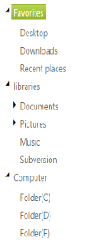

## Integration

### Angular Binding

AngularJS is a JavaScript framework. It is added to an HTML page with a 

    

        

    

 
 



In the above code example, “ng-app” is a directive that is used to declare an element as a root element of the application, allowing behavior to be modified through custom HTML tags and by using the “ng-controller” directive you can get the scope value of TreeView control.

 

### Knockout Binding

KnockoutJS is a JavaScript library that allows you to bind HTML elements against any data model.

It uses a Model-View-ViewModel (MVVM) design pattern, where the Model is your stored data, View is the visual representation of that data (UI) and ViewModel acts as the intermediary between the Model and the View. For more information about the Knockout binding, refer to the online documentation in the following link,

<http://docs.syncfusion.com/js/knockoutjs>

When using KO, the view page is simply an HTML document with declarative bindings and you can link it to the ViewModel. ViewModel is nothing but an object, holding a list of items for creating the TreeView control by using Knockout binding.

In Knockout binding by using ko.observableArray, you can hold the data of TreeView and bind it to an array of values by using ko.applyBindings. When you call ko.applyBindings with a specific element, it binds everything under that element.

The following example depicts the way to bind data to the TreeView control through Knockout Support.



<%--To add the following scripts in your aspx page for knockout support--%>   

    

    



  

