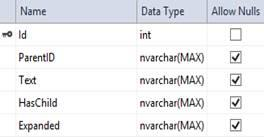
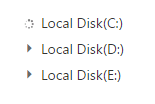
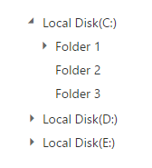

# Populate Data

TreeView can be populated with local or remote data source by using a property [DataSource](https://help.syncfusion.com/cr/aspnetmvc/Syncfusion.JavaScript.TreeViewFieldsBuilder.html#Syncfusion_JavaScript_TreeViewFieldsBuilder_Datasource_Syncfusion_JavaScript_DataSource_), which is the member of **TreeView**

In TreeView, you should use **DataField** based properties to go with data source. It specifies the mapping fields for the data source to receive the data, query to process the data and field mappers to map the data members.

## Fields

Below table list outs the field members with description.  

<table>
<tr>
<td>
    {{'**Properties**'| markdownify }}
</td>
<td>
    {{'**Description**'| markdownify }}
</td>
</tr>
<tr>
<td>
DataSource
</td>
<td>
The data source contains the list of data for generating the TreeView list.
</td>
</tr>
<tr>
<td>
DataSourceID
</td>
<td>
It specifies the existing data source id, using this id we can populate data to treeview from existing data source.
</td>
</tr>
<tr>
<td>
Query
</td>
<td>
It specifies the query to retrieve the data from the online server.
</td>
</tr>
<tr>
<td>
TableName
</td>
<td>
It specifies the name of the table from which data to be processed from given data source.
</td>
</tr>
<tr>
<td>
DataIdField
</td>
<td>
It specifies the ID of the node.
</td>
</tr>
<tr>
<td>
DataParentIdField
</td>
<td>
It specifies the parent id of the node
</td>
</tr>
<tr>
<td>
DataTextField
</td>
<td>
It specifies the text content of the node.
</td>
</tr>
<tr>
<td>
DataHasChildField
</td>
<td>
It specifies the node has child (which is the nested or inner level of nodes). Also it’s used in load on demand of tree data.
</td>
</tr>
<tr>
<td>
DataExpandedField
</td>
<td>
It specifies the tree node to be in expanded state
</td>
</tr>
<tr>
<td>
DataSelectedField
</td>
<td>
It specifies the select node at initialize. [note: only one node get selected]
</td>
</tr>
<tr>
<td>
DataIsCheckedField
</td>
<td>
It specifies the node to be in checked state, if tree node represented with checkboxes. 
</td>
</tr>
<tr>
<td>
DataImageUrlField
</td>
<td>
It defines the image location.
</td>
</tr>
<tr>
<td>
DataImageAttributeField
</td>
<td>
It defines the image attributes such as height, width, styles, etc.
</td>
</tr>
<tr>
<td>
DataSpriteCssField
</td>
<td>
It defines the sprite CSS for the image tag.
</td>
</tr>
<tr>
<td>
DataHtmlAttributeField
</td>
<td>
It defines the HTML attributes such as class and styles for a node ("li" tag).
</td>
</tr>
<tr>
<td>
DataLinkAttributeField
</td>
<td>
It defines the HTML attributes such as class and styles for a link tag, which is child of node.
</td>
</tr>
</table>

Mapping all fields with data source

In the code behind page, create a data list which contains the details about tree nodes and map the list data to DataSource property of TreeView.
    
    
    
        public partial class TreeViewFeatures : System.Web.UI.Page
        {
            List<LoadData> treeData = new List<LoadData>();
            protected void Page_Load(object sender, EventArgs e)
            {
                treeData.Add(new LoadData
                {
                    Id = 1,
                    Parent = 0,
                    Text = "Item 1",
                    Expanded = true,
                    NodeProperty = new Dictionary<string, string>() {
                    { "class", "textblue" },
                    { "value", "Item 1" }
                    }
                });
                treeData.Add(new LoadData
                {
                    Id = 2,
                    Parent = 0,
                    Text = "Item 2",
                    LinkProperty = new Dictionary<string, string>() {
                    { "class", "textunderline" },
                    { "href", "http://www.syncfusion.com" },
                    { "target", "_blank"}
                    }
                });
                treeData.Add(new LoadData
                {
                    Id = 3,
                    Parent = 0,
                    Text = "Item 3",
                    Selected = true,
                    SpriteImage = "mailicon sprite-calendar"
                });
                treeData.Add(new LoadData
                {
                    Id = 4,
                    Parent = 0,
                    Text = "Item 4",
                    NodeChecked = true,
                    ImageProperty = new Dictionary<string, string>() {
                    { "width", "20px" },
                    { "height", "20px" }
                    },
                    ImageURL = "http://cdn.syncfusion.com/13.3.0.7/js/web/flat-azure/images/ajax-loader.gif"
                });
                treeData.Add(new LoadData
                {
                    Id = 5,
                    Parent = 1,
                    Text = "Item 1.1"
                });
                treeData.Add(new LoadData
                {
                    Id = 6,
                    Parent = 1,
                    Text = "Item 1.2"
                });
                treeData.Add(new LoadData
                {
                    Id = 7,
                    Parent = 1,
                    Text = "Item 1.3"
                });
                treeData.Add(new LoadData
                {
                    Id = 8,
                    Parent = 3,
                    Text = "Item 3.1"
                });
                treeData.Add(new LoadData
                {
                    Id = 9,
                    Parent = 3,
                    Text = "Item 3.2"
                });
                treeData.Add(new LoadData
                {
                    Id = 10,
                    Parent = 5,
                    Text = "Item 1.1.1"
                });
                this.treeview.DataSource = treeData;
            }
        }
        public class LoadData
        {
            public int Id { get; set; }
            public int Parent { get; set; }
            public string Text { get; set; }
            public string SpriteImage { get; set; }
            public string ImageURL { get; set; }
            public bool HasChild { get; set; }
            public bool Expanded { get; set; }
            public bool Selected { get; set; }
            public bool NodeChecked { get; set; }
            public object NodeProperty { get; set; }
            public object LinkProperty { get; set; }
            public object ImageProperty { get; set; }
        }
        
    
    
In the view page, add TreeView element and map the properties defined to the corresponding fields in data source.
    
    
    
        <ej:TreeView
            ID="treeview"
            runat="server"
            DataTextField="Text"
            DataIdField="Id"
            DataParentIdField="Parent"
            DataHasChildField="HasChild"
            DataIsCheckedField="NodeChecked"
            DataSelectedField="Selected"
            DataExpandedField="Expanded"
            DataHtmlAttributeField="NodeProperty"
            DataImageAttributeField="ImageProperty"
            DataImageUrlField="ImageURL"
            DataLinkAttributeField="LinkProperty"
            ShowCheckbox="true">
        </ej:TreeView>    
    
    
    
N>**If you want to display nodes in Root level, exclude parent attribute or specify “0” in corresponding value.**

## Local data

TreeView can be rendered from a self-referential data by providing the two required fields “**id”**and “**parent**”. 

In the code behind page, create a data list which contains the details about tree nodes and map the list data to the DataSource property of TreeView.
    
    
    
        public partial class TreeViewFeatures : System.Web.UI.Page
        {
            List<LoadData> treeData = new List<LoadData>();
            protected void Page_Load(object sender, EventArgs e)
            {
                treeData.Add(new LoadData { Id = 1, Parent = 0, Text = "Item 1", Expanded = true });
                treeData.Add(new LoadData { Id = 2, Parent = 0, Text = "Item 2" });
                treeData.Add(new LoadData { Id = 3, Parent = 0, Text = "Item 3" });
                treeData.Add(new LoadData { Id = 4, Parent = 0, Text = "Item 4" });
                treeData.Add(new LoadData { Id = 5, Parent = 1, Text = "Item 1.1" });
                treeData.Add(new LoadData { Id = 6, Parent = 1, Text = "Item 1.2" });
                treeData.Add(new LoadData { Id = 7, Parent = 1, Text = "Item 1.3" });
                treeData.Add(new LoadData { Id = 8, Parent = 3, Text = "Item 3.1" });
                treeData.Add(new LoadData { Id = 9, Parent = 3, Text = "Item 3.2" });
                treeData.Add(new LoadData { Id = 10, Parent = 5, Text = "Item 1.1.1" });
                this.treeview.DataSource = treeData;
            }
        }
        public class LoadData
        {
            public int Id { get; set; }
            public int Parent { get; set; }
            public string Text { get; set; }
            public bool Expanded { get; set; }
        }
        
    
    

In the view page, add TreeView element and map the properties defined in to the corresponding fields in data source.
    
    
    
        <ej:TreeView 
            ID="treeview" 
            runat="server" 
            DataTextField="Text" 
            DataIdField="Id" 
            DataParentIdField="Parent" 
            DataExpandedField="Expanded">
        </ej:TreeView>
        
    

### Nested Object Support 

The nested object support is provided for the TreeView component.

In the code behind page, create a data list which contains the details about tree nodes and map the list data to the DataSource property of TreeView.
    
    
    
        public partial class TreeViewFeatures : System.Web.UI.Page
        {
            List<LoadData> load = new List<LoadData>();
            protected void Page_Load(object sender, EventArgs e)
            {
                load.Add(new LoadData { Id = 1, Parent = 0, Text = new InnerData { nodeName = "Item 1" } });
                load.Add(new LoadData { Id = 2, Parent = 0, Text = new InnerData { nodeName = "Item 2" } });
                load.Add(new LoadData { Id = 3, Parent = 0, Text = new InnerData { nodeName = "Item 3" } });
                load.Add(new LoadData { Id = 4, Parent = 1, Text = new InnerData { nodeName = "Item 1.1" } });
                load.Add(new LoadData { Id = 5, Parent = 1, Text = new InnerData { nodeName = "Item 1.2" } });
                load.Add(new LoadData { Id = 6, Parent = 3, Text = new InnerData { nodeName = "Item 3.1" } });
                this.treeview.DataSource = load;
            }
        }
        public class LoadData
        {
            public int Id { get; set; }
            public int Parent { get; set; }
            public InnerData Text { get; set; }
        }
        public class InnerData
        {
            public string nodeName { get; set; }
        }
        
    
    

In the view page, add TreeView element and map the properties defined in to the corresponding fields in data source.
    
    
    
        <ej:TreeView 
            ID="treeview" 
            runat="server" 
            DataTextField="Text.nodeName" 
            DataIdField="Id" 
            DataParentIdField="Parent">
        </ej:TreeView>
        
    

## Remote Data

When using remote data binding, the adaptor of [ej.DataManager](http://helpjs.syncfusion.com/js/api/ejdatamanager#) plays vital role in processing queries to make them suitable to sends along with data request and also process the response data from the server.
[http://help.syncfusion.com/js/datamanager/getting-started#create-your-datamanager-in-javascript](http://help.syncfusion.com/js/datamanager/getting-started#create-your-datamanager-in-javascript)

### OData

**OData** is a standardized protocol for creating and consuming data. The following steps explain how you can bind remote data to TreeView control.

In the code behind page, specify the remote data source URL and query, which is used to filter data. The select property of ej.Query is used to retrieve the specified columns from the data source.
    
    
    
            protected void Page_Load(object sender, EventArgs e)
            {
                this.treeview.DataSource = "//js.syncfusion.com/demos/ejServices/Wcf/Northwind.svc/"; 
                this.treeview.Query = "ej.Query().from('Customers').take(3)"; 
            }
            
    
    
In the view page, add an element to configure TreeView.
    
    
    
        <ej:TreeView
            ID="treeview"
            runat="server"
            DataTextField="CustomerID">
        </ej:TreeView>
        
    
    
### Web API

Using [ej.WebApiAdaptor](http://helpjs.syncfusion.com/js/datamanager/data-adaptors#webapi-adaptor), you can bind Web API service data to TreeView as shown in below code example

In the code behind page, specify the Web API data source URL and other settings as follows.
    
    
    
        protected void Page_Load(object sender, EventArgs e)
        {
            DataSource treeData = new DataSource();
            treeData.URL = "http://js.syncfusion.com/demos/ejServices/api/TreeViewData/GetAllData";
            treeData.Adaptor = AdaptorType.WebApiAdaptor.ToString();
            treeData.CrossDomain = true;
            this.treeview.DataSource = treeData;
        }
        
    
    
In the view page, add an element to configure TreeView.
    
    
    
        <ej:TreeView
            ID="treeview"
            runat="server"
            DataTextField="name"
            DataIdField="id"
            DataParentIdField="parent">
        </ej:TreeView>
        
    
    
### Other Restful web services
The custom adaptor concept of [ej.DataManager](http://helpjs.syncfusion.com/js/api/ejdatamanager#) allow you to customize or generate your own adaptor which is used to process query and result data. 
[http://helpjs.syncfusion.com/js/datamanager/data-adaptors#custom-adaptor](http://helpjs.syncfusion.com/js/datamanager/data-adaptors#custom-adaptor)

When using remote data binding, the adaptor of [ej.DataManager](http://helpjs.syncfusion.com/js/api/ejdatamanager#) plays vital role in processing queries to make them suitable to sends along with data request and also process the response data from the server.

In the code behind page, create a data list which contains the details about tree nodes and map the list data to the DataSource property of TreeView.
    
    
    
        public partial class TreeViewFeatures : System.Web.UI.Page
        {
            List<LoadData> treeData = new List<LoadData>();
            protected void Page_Load(object sender, EventArgs e)
            {
                treeData.Add(new LoadData { Id = 1, Parent = 0, Text = "Item 1", Expanded = true });
                treeData.Add(new LoadData { Id = 2, Parent = 0, Text = "Item 2" });
                treeData.Add(new LoadData { Id = 3, Parent = 0, Text = "Item 3" });
                treeData.Add(new LoadData { Id = 4, Parent = 0, Text = "Item 4" });
                treeData.Add(new LoadData { Id = 5, Parent = 1, Text = "Item 1.1" });
                treeData.Add(new LoadData { Id = 6, Parent = 1, Text = "Item 1.2" });
                treeData.Add(new LoadData { Id = 7, Parent = 1, Text = "Item 1.3" });
                treeData.Add(new LoadData { Id = 8, Parent = 3, Text = "Item 3.1" });
                treeData.Add(new LoadData { Id = 9, Parent = 3, Text = "Item 3.2" });
                treeData.Add(new LoadData { Id = 10, Parent = 5, Text = "Item 1.1.1" });
                this.treeView.DataSource = treeData;
            }
        }
        public class LoadData
        {
            public int Id { get; set; }
            public int Parent { get; set; }
            public string Text { get; set; }
            public bool Expanded { get; set; }
        }
        
    
    
In the view page, add TreeView element and specify the custom adaptor as shown below.
    
    
    
        <ej:TreeView
            ID="treeView"
            runat="server"
            DataTextField="Text"
            DataIdField="Id"
            DataParentIdField="Parent"
            DataExpandedField="Expanded"
            ClientSideOnCreated="onCreate">
        </ej:TreeView>
        
        
    
    
## SQL Data

TreeView provides extensive data binding support to populate TreeView nodes, so that the values can be mapped to the TreeView fields from an existing SQL data source by using DataSourceID property.

The following steps explain SQL data binding to TreeView.

Define an SQL data source in the web page and configure the data source as per your requirement. For the following code example an SQL data table is created.

The following image displays the sample database used.

<table>
<tr>
<td>
    {{ '' | markdownify }}
</td>
<td>    
    {{ '' | markdownify }}
</td>
</tr>
</table>

In the view page, assign the values for DataTextField, DataIdField, DataParentIdField, DataHasChildField. In DataSourceID field assign the ID of the existing SQL data source.
    
    
    
        <ej:TreeView
            ID="TreeSQLDS"
            runat="server"
            DataSourceID="SqlDataSource1"
            DataTextField="Text"
            DataIdField="ID"
            DataParentIdField="ParentID"
            DataHasChildField="HasChild"
            DataExpandedField="Expanded">
        </ej:TreeView>
    
        <%--DataBase configured for TreeView control--%>
        <asp:SqlDataSource
            ID="SqlDataSource1"
            runat="server"
            ConnectionString="<%$ ConnectionStrings:TreeDBConnectionString %>"
            SelectCommand="SELECT * FROM [TreeBind]">
        </asp:SqlDataSource>
        
    
    
## Object DataSource

TreeView provides object data source binding support to populate TreeView nodes, so that the values can be mapped to the TreeView fields from an existing object data source by using DataSourceID property.

The following steps explain the object data source binding to TreeView.

Define an object data source in the web page and configure the data source elements. Add the class file to App_Data folder in your web application.
    
    
    
    namespace ASPWebTreeView
    {
    
        public class TreeObjectDataSource
        {
    
            public TreeObjectDataSource() { }
    
            public TreeObjectDataSource(int _id, int _parentId, string _text, string _hasChild, string _expanded)
            {
    
                this.ID = _id;
    
                this.ParentID = _parentId;
    
                this.Text = _text;
    
                this.HasChild = _hasChild;
    
                this.Expanded = _expanded;
    
            }
    
            [Browsable(true)]
    
            public int ID
            {
    
                get;
    
                set;
    
            }
    
            [Browsable(true)]
    
            public int ParentID
            {
    
                get;
    
                set;
    
            }
    
            [Browsable(true)]
    
            public string Text
            {
    
                get;
    
                set;
    
            }
    
            [Browsable(true)]
    
            public string HasChild
            {
    
                get;
    
                set;
    
            }
    
            [Browsable(true)]
    
            public string Expanded
            {
    
                get;
    
                set;
    
            }
    
            public List<TreeObjectDataSource> GetTreeDataItems()
            {
    
                List<TreeObjectDataSource> data = new List<TreeObjectDataSource>();
    
                data.Add(new TreeObjectDataSource(1, 0, "Favorites", "true", "true"));
    
                data.Add(new TreeObjectDataSource(2, 1, "Desktop", "", ""));
    
                data.Add(new TreeObjectDataSource(3, 1, "Downloads", "", ""));
    
                data.Add(new TreeObjectDataSource(4, 1, "Recent places", "", ""));
    
                data.Add(new TreeObjectDataSource(5, 0, "libraries", "true", ""));
    
                data.Add(new TreeObjectDataSource(6, 5, "Documents", "true", ""));
    
                data.Add(new TreeObjectDataSource(7, 6, "My Documents", "", ""));
    
                data.Add(new TreeObjectDataSource(8, 6, "Public Documents", "", ""));
    
                data.Add(new TreeObjectDataSource(9, 5, "Pictures", "true", ""));
    
                data.Add(new TreeObjectDataSource(10, 9, "My Pictures", "", ""));
    
                data.Add(new TreeObjectDataSource(11, 9, "Public Pictures", "", ""));
    
                data.Add(new TreeObjectDataSource(12, 5, "Music", "true", ""));
    
                data.Add(new TreeObjectDataSource(13, 9, "My Music", "", ""));
    
                data.Add(new TreeObjectDataSource(14, 9, "Public Music", "", ""));
    
                data.Add(new TreeObjectDataSource(15, 5, "Subversion", "", ""));
    
                data.Add(new TreeObjectDataSource(16, 0, "Computer", "true", ""));
    
                data.Add(new TreeObjectDataSource(17, 16, "Folder(C)", "", ""));
    
                data.Add(new TreeObjectDataSource(18, 16, "Folder(D)", "", ""));
    
                data.Add(new TreeObjectDataSource(19, 16, "Folder(F)", "", ""));
    
                return data;
    
            }
    
        }
    
    }
    
    
    
In the view page, assign the values for DataTextField, DataIdField, DataParentIdField, DataHasChildField. In DataSourceID field assign the ID of the existing object data source
    
    
    
        <ej:TreeView
            ID="Treeview1"
            runat="server"
            DataSourceID="ObjectDataSource1"
            DataTextField="Text"
            DataIdField="ID"
            DataParentIdField="ParentID"
            DataHasChildField="HasChild"
            DataExpandedField="Expanded">
        </ej:TreeView>
    
        <%--DataBase configured for TreeView control--%>
        <asp:ObjectDataSource
            ID="ObjectDataSource1"
            runat="server"
            TypeName=" ASPWebTreeView.TreeObjectDataSource"
            SelectMethod="GetTreeDataItems">
        </asp:ObjectDataSource>
        
    
    
## LINQ to SQL Data

TreeView provides extensive data binding support to populate TreeView nodes, so that the values can be mapped to the TreeView fields from an existing LINQ to SQL data source by using DataSourceID property.

The following steps explain the SQL data binding to TreeView textbox.

Define a LINQ to SQL data source in the web page and configure the data source as per your requirement, by using the database. In the following code example, an SQL table is used to create a DBML class

<table>
<tr>
<td>
    {{ '' | markdownify }}
</td>
<td>
    {{ '' | markdownify }}
</td>
</tr>
</table>

In the view page, assign values for DataTextField, DataIdField, DataParentIdField DataHasChildField. In DataSourceID field assign the ID of the existing LINQ to SQL data source.
    
    
    
        <ej:TreeView
            ID="TreeLinqToSql"
            runat="server"
            DataSourceID="LinqDataSource1"
            DataTextField="Text"
            DataIdField="ID"
            DataParentIdField="ParentID"
            DataHasChildField="HasChild"
            DataExpandedField="Expanded">
        </ej:TreeView>
    
        <asp:LinqDataSource
            ID="LinqDataSource1"
            runat="server"
            ContextTypeName="ASPWebTreeView.Tree_Linq_To_SqlDataContext"
            EntityTypeName=""
            TableName="TreeLinqs">
        </asp:LinqDataSource>
        
    
    
## XML Data

TreeView provides XML data binding support to populate TreeView nodes, so that the values can be mapped to the TreeView fields from an existing XML data by using DataSourceID property.

The following steps explain the XML data binding to TreeView.

In the view page, assign the values for DataTextField, DataParentIdField. In DataSourceID field assign the ID of the existing XML data source.
    
    
    
        <ej:TreeView
            ID="TreeXmlDS"
            runat="server"
            DataSourceID="XmlDataSource1"
            DataTextField="Item"
            DataParentIdField="RootItem">
        </ej:TreeView>
    
        

            <asp:XmlDataSource
                ID="XmlDataSource1"
                runat="server"
                DataFile="~\App_Data\XMLData.xml">
            </asp:XmlDataSource>
        

        
    
    
Load the node details of TreeView in the XML data as follows.

    
    
    <?xml version="1.0" encoding="utf-8" ?>
    
    <items>
    
    <RootItem Text="Favorites" Url="#">
    
        <Item Text="Desktop" Url="#"></Item>
    
        <Item Text="Downloads" Url="#"></Item>
    
        <Item Text="Recent places" Url="#"></Item>
    
    </RootItem>
    
    
    
    <RootItem Text="Libraries" Url="#">
    
        <RootItem Text="Documents" Url="#">
    
        <Item Text="My Documents" Url="#"></Item>
    
        <Item Text="Public Documents" Url="#"></Item>
    
    </RootItem>
    
    <RootItem Text="Pictures" Url="#">
    
        <Item Text="My Pictures" Url="#"></Item>
    
        <Item Text="Public Pictures" Url="#"></Item>
    
    </RootItem>
    
    <RootItem Text="Music" Url="#">
    
        <Item Text="My Music" Url="#"></Item>
    
        <Item Text="Public Music" Url="#"></Item>
    
    </RootItem>
    
    </RootItem>
    
    <RootItem Text="Computer" Expanded="True" Url="#">
    
        <Item Text="Folder(C)" Url="#"></Item>
    
        <Item Text="Folder(D)" Url="#"></Item>
    
        <Item Text="Folder(F)" Url="#"></Item>
    
    </RootItem>
    
    </items>
    
    
    

## Load on demand

Load on demand is a technique (Lazy load) that is used to reduce the bandwidth size of consuming huge data. You can load data on demand in TreeView by using “**LoadOnDemand**” property when you’re going to use huge data.

For local data source, TreeView loads the first level nodes initially. While expand a parent node then TreeView loads it’s the child nodes from the data source based on the parentId member. It reduces the time to render TreeView with huge data.

In the code behind page, create a data list which contains the details about tree nodes and map the list data to the DataSource property of TreeView.
    

    
[Serializable]
public class loadOnDemand
{
    public loadOnDemand(int _id, int _parentId = 0, string _text = "", string _hasChild = "")
    {
        this.ID = _id;
        this.ParentID = _parentId;
        this.Text = _text;
        this.HasChild = _hasChild;
    }
    public loadOnDemand() { }

    [Browsable(true)]
    public int ID { get; set; }

    [Browsable(true)]
    public int ParentID { get; set; }

    [Browsable(true)]
    public string Text { get; set; }

    [Browsable(true)]
    public string HasChild { get; set; }

    public List<loadOnDemand> GetTreeItems()
    {
        List<loadOnDemand> data = new List<loadOnDemand>();
        data.Add(new loadOnDemand(1, 0, "Local Disk(C:)", "true" ));
        data.Add(new loadOnDemand(2, 0, "Local Disk(D:)", "true" ));
        data.Add(new loadOnDemand(3, 0, "Local Disk(E:)", "true" ));
        data.Add(new loadOnDemand(4, 1, "Folder 1", "true" ));
        data.Add(new loadOnDemand(5, 1, "Folder 2" ));
        data.Add(new loadOnDemand(6, 1, "Folder 3" ));
        data.Add(new loadOnDemand(7, 2, "Folder 4" ));
        data.Add(new loadOnDemand(8, 2, "Folder 5", "true" ));
        data.Add(new loadOnDemand(9, 2, "Folder 6" ));
        data.Add(new loadOnDemand(10, 3, "Folder 7" ));
        data.Add(new loadOnDemand(11, 3, "Folder 8" ));
        data.Add(new loadOnDemand(12, 3, "Folder 9", "true" ));
        data.Add(new loadOnDemand(13, 4, "File 1" ));
        data.Add(new loadOnDemand(14, 4, "File 2" ));
        data.Add(new loadOnDemand(15, 4, "File 3" ));
        data.Add(new loadOnDemand(16, 8, "File 4" ));
        data.Add(new loadOnDemand(17, 8, "File 5" ));
        data.Add(new loadOnDemand(18, 8, "File 6" ));
        data.Add(new loadOnDemand(19, 12, "File 7" ));
        data.Add(new loadOnDemand(20, 12, "File 8" ));
        data.Add(new loadOnDemand(21, 12, "File 9" ));
        return data;
    }
}
        

    
In the view page, add a TreeView element and map the properties defined in to the corresponding fields of “Datasource” and enable load on demand option.
    

    
<ej:TreeView ID="Treeview" runat="server" DataSourceID="ObjectDataSource1" DataTextField="Text" DataIdField="ID"
    DataParentIdField="ParentID" DataHasChildField="HasChild" LoadOnDemand="true">
</ej:TreeView>
<asp:ObjectDataSource ID="ObjectDataSource1" runat="server" TypeName="loadOnDemand"
    SelectMethod="GetTreeItems"></asp:ObjectDataSource>
        


The following screenshot displays the load on demand for local data source in TreeView control.

While expanding the parent node
{:.caption}

After expanding the parent node
{:.caption}

For more details about load on demand for local data source, refer the sample [here](http://asp.syncfusion.com/demos/web/treeview/loadOnDemand.aspx).

For remote data source, TreeView loads the first level nodes initially. While expand the node from TreeView, the data manager passes the query to the controller. Based on this query, you can filter the data from table and return to TreeView.
   
Refer below code example to load data on demand from remote data source.


    
<ej:TreeView runat="server" ID="tree" LoadOnDemand="true" DataIdField="CategoryID" DataTextField="CategoryName"
    DataHasChildField="CategoryName" Query="ej.Query().from('Categories').select('CategoryID,CategoryName').take(3)">
    <DataManager URL="//js.syncfusion.com/demos/ejServices/Wcf/Northwind.svc/" />
    <Child TableName="Products" ParentId="CategoryID" Text="ProductName">
        <DataManager URL="//js.syncfusion.com/demos/ejServices/Wcf/Northwind.svc/" />
    </Child>
</ej:TreeView>
        


For Web Method Adaptor, TreeView loads the first level nodes initially. While expand the node from TreeView, the data manager passes the Data Manager instance to the controller. The Data Manager instance contains the parent Id and filter options. Based on the Data Manager instance, you can filter the data from data source and return to TreeView.

In the code behind page, create a data list which contains the details about tree nodes and map the list data to the DataSource property of TreeView and create method to handle client side request.



namespace WebApplication
{
    public partial class _Default : Page
    {
        [WebMethod]
        [ScriptMethod(ResponseFormat = ResponseFormat.Json)]
        public static object Data(Syncfusion.JavaScript.DataManager value)
        {
            var load = new loadOnDemand();
            List<loadOnDemand> treeData = load.GetTreeItems();
            IEnumerable<loadOnDemand> results;
            if (value.Where == null)
            {
                //return the first level nodes
                results = treeData.Where(item => item.ParentID == 0);
            }
            else
            {
                //return the nodes which has parentId as you request
                results = treeData.Where(s => s.ParentID == Convert.ToInt32(value.Where[0].value));
            }
            return results;
        }
    }    
}

[Serializable]
public class loadOnDemand
{
    public loadOnDemand(int _id, int _parentId = 0, string _text = "", string _hasChild = "")
    {
        this.ID = _id;
        this.ParentID = _parentId;
        this.Text = _text;
        this.HasChild = _hasChild;
    }
    public loadOnDemand() { }

    [Browsable(true)]
    public int ID { get; set; }

    [Browsable(true)]
    public int ParentID { get; set; }

    [Browsable(true)]
    public string Text { get; set; }

    [Browsable(true)]
    public string HasChild { get; set; }

    public List<loadOnDemand> GetTreeItems()
    {
        List<loadOnDemand> data = new List<loadOnDemand>();
        data.Add(new loadOnDemand(1, 0, "Local Disk(C:)", "true"));
        data.Add(new loadOnDemand(2, 0, "Local Disk(D:)", "true"));
        data.Add(new loadOnDemand(3, 0, "Local Disk(E:)", "true"));
        data.Add(new loadOnDemand(4, 1, "Folder 1", "true"));
        data.Add(new loadOnDemand(5, 1, "Folder 2"));
        data.Add(new loadOnDemand(6, 1, "Folder 3"));
        data.Add(new loadOnDemand(7, 2, "Folder 4"));
        data.Add(new loadOnDemand(8, 2, "Folder 5", "true"));
        data.Add(new loadOnDemand(9, 2, "Folder 6"));
        data.Add(new loadOnDemand(10, 3, "Folder 7"));
        data.Add(new loadOnDemand(11, 3, "Folder 8"));
        data.Add(new loadOnDemand(12, 3, "Folder 9", "true"));
        data.Add(new loadOnDemand(13, 4, "File 1"));
        data.Add(new loadOnDemand(14, 4, "File 2"));
        data.Add(new loadOnDemand(15, 4, "File 3"));
        data.Add(new loadOnDemand(16, 8, "File 4"));
        data.Add(new loadOnDemand(17, 8, "File 5"));
        data.Add(new loadOnDemand(18, 8, "File 6"));
        data.Add(new loadOnDemand(19, 12, "File 7"));
        data.Add(new loadOnDemand(20, 12, "File 8"));
        data.Add(new loadOnDemand(21, 12, "File 9"));
        return data;
    }
}


    
In the view page, add a TreeView element and map the properties defined in to the corresponding fields of “Datasource” and enable load on demand option.
    

    
<ej:TreeView runat="server" ID="tree" LoadOnDemand="true" DataIdField="ID" DataTextField="Text"
    DataHasChildField="HasChild" DataParentIdField="ParentID">
    <DataManager URL="Default.aspx/Data" Adaptor="WebMethodAdaptor" />
</ej:TreeView> 
        


The following screenshot displays the load on demand for Web Method Adaptor in TreeView control.

While expanding the parent node
{:.caption}

After expanding the parent node
{:.caption}
