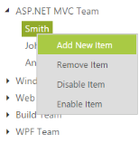

## TreeView with Context Menu Support

TreeView control is available with context menu options that open when right clicked over the node. Other than the default menu items available, you can add the new node dynamically in TreeView or delete the item. You can also enable or disable the item in TreeView. It is achieved by adding the Context Menu option to the TreeView.

### Menu Item

By default, the Context Menu options are provided with 4 items namely Add New Item, Delete Item, Enable Item and Disable Item. When you want to customize and use your own Custom Menu items, you can customize the TreeView with your desired collections. 

The following code example illustrates how to configure the Context Menu elements for the TreeView and in the following example, specify the Menu type as ContextMenu and in the menuClick function, you can check the cases with add, delete, remove or enable item in TreeView. 

And each functionality in the context menu option is done by a specific method.For example, you can add a new item in TreeView by using the addNode() method, delete the item by using removeNode() method, disable the item by using disableNode() method and enable the item by using enableNode() method respectively.

The following steps explain enabling the ShowCheckbox property for TreeView.

Configure TreeView in the ASPX page as follows.



<ej:TreeView ID="treeView" runat="server" Height="300px" Width="400px">

    <Nodes>

        <ej:TreeViewNode Expanded="True" Text="ASP.NET MVC Team">

            <Nodes>

                <ej:TreeViewNode Text="Smith">

                </ej:TreeViewNode>

                <ej:TreeViewNode Text="Johnson">

                </ej:TreeViewNode>

                <ej:TreeViewNode Text="Anderson">

                </ej:TreeViewNode>

            </Nodes>

        </ej:TreeViewNode>

        <ej:TreeViewNode Text="Windows Team">

            <Nodes>

                <ej:TreeViewNode Text="Clark">

                </ej:TreeViewNode>

                <ej:TreeViewNode Text="Wright">

                </ej:TreeViewNode>

                <ej:TreeViewNode Text="Lopez">

                </ej:TreeViewNode>

            </Nodes>

        </ej:TreeViewNode>

        <ej:TreeViewNode Text="Web Team">

            <Nodes>

                <ej:TreeViewNode Text="Joshua">

                </ej:TreeViewNode>

                <ej:TreeViewNode Text="Matthew">

                </ej:TreeViewNode>

                <ej:TreeViewNode Text="David">

                </ej:TreeViewNode>

            </Nodes>

        </ej:TreeViewNode>

        <ej:TreeViewNode Text="Build Team">

            <Nodes>

                <ej:TreeViewNode Text="Ryan">

                </ej:TreeViewNode>

                <ej:TreeViewNode Text="Justin">

                </ej:TreeViewNode>

                <ej:TreeViewNode Text="Robert">

                </ej:TreeViewNode>

            </Nodes>

        </ej:TreeViewNode>

        <ej:TreeViewNode Text="WPF Team">

            <Nodes>

                <ej:TreeViewNode Text="Brown">

                </ej:TreeViewNode>

                <ej:TreeViewNode Text="Johnson">

                </ej:TreeViewNode>

                <ej:TreeViewNode Text="Miller">

                </ej:TreeViewNode>

            </Nodes>

        </ej:TreeViewNode>

    </Nodes>

</ej:TreeView>

    <ej:Menu ID="Menu1" MenuType="ContextMenu" ClientSideOnClick="menuclick" ClientSideOnBeforeContextOpen="beforeOpen"

        OpenOnClick="false" runat="server" ContextMenuTarget="#LayoutSection_ControlsSection_treeView">

        <Items>

            <ej:MenuItem Text="Add New Item">

            </ej:MenuItem>

        </Items>

        <Items>

            <ej:MenuItem Text="Remove Item">

            </ej:MenuItem>

        </Items>

        <Items>

            <ej:MenuItem Text="Disable Item">

            </ej:MenuItem>

        </Items>

        <Items>

            <ej:MenuItem Text="Enable Item">

            </ej:MenuItem>

        </Items>

    </ej:Menu>



Define the events in the script as follows.





 

