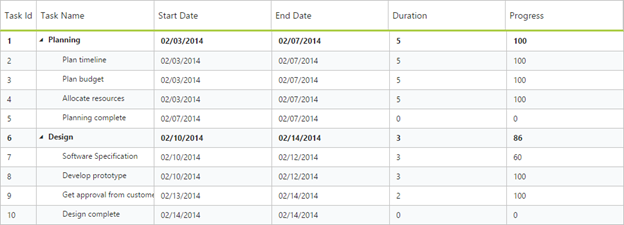

# Appearance and Styling

You can customize the look and feel of the TreeGrid control by applying themes.

You are provided the following twelve different themes in TreeGrid control.

1. Flat Azure                          

2. Flat Azure Dark                 

3. Flat Lime                             

4. Flat Lime Dark                  

5. Flat Saffron                       

6. Flat Saffron Dark

7. Gradient Azure

8. Gradient Azure Dark

9. Gradient Lime

10. Gradient Lime Dark

11. Gradient Saffron

12. Gradient Saffron Dark

You can apply the theme (Gradient lime) to the TreeGrid control by using the style sheet from the online link as follows.



<!DOCTYPE html>

<html xmlns="http://www.w3.org/1999/xhtml">

<head>

<title>Getting Started with TreeGrid Control for JavaScript</title>

<!-- style sheet for default theme(gradient lime) -->

<link href=" http://cdn.syncfusion.com/13.1.0.21/js/web/flat-azure/ej.web.all.min.css" rel="stylesheet">

//...

</html>



The following screenshot shows the TreeGrid control with Gradient-lime theme.

 
{:.image }

