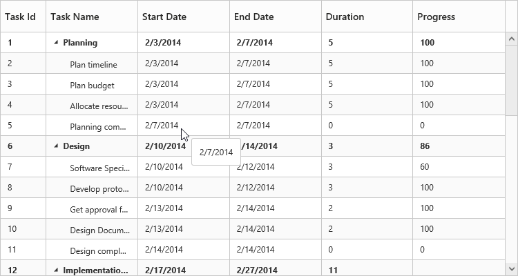
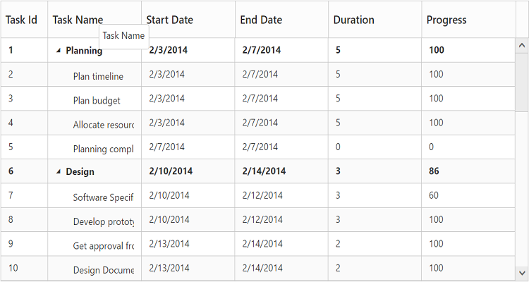
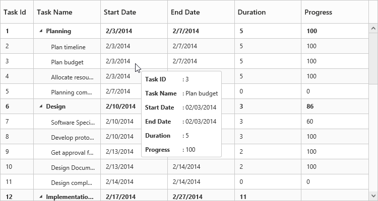
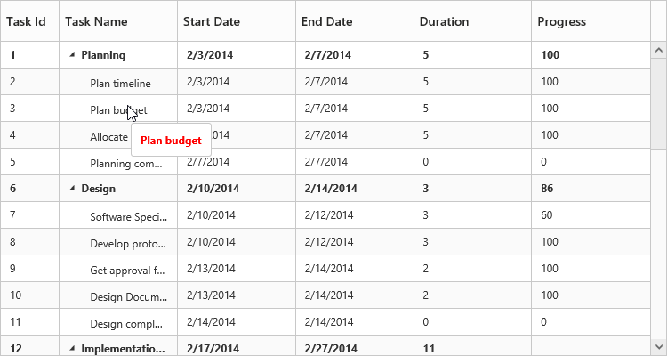
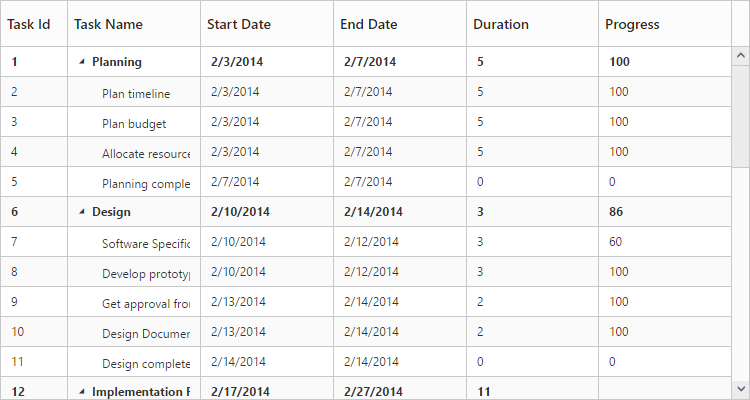
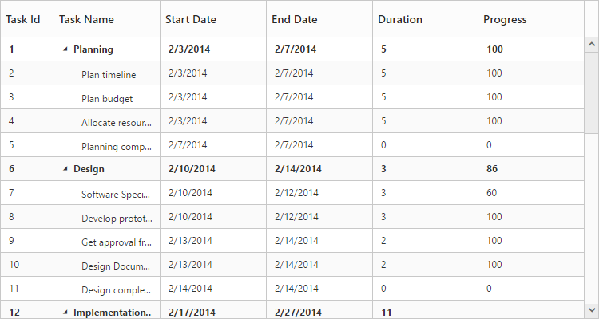
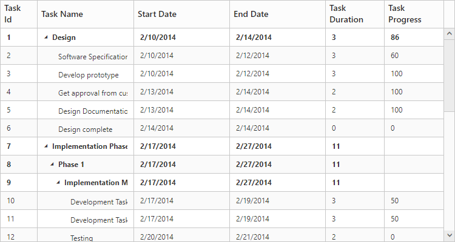
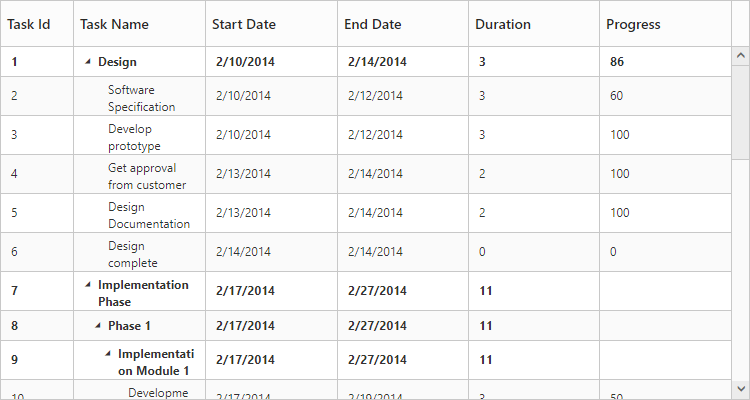

# Cell

## Tooltip

In TreeGrid tooltip can be enabled using `ShowGridCellTooltip` property. Using this property tooltip can be enabled for cells both header and content.

Please find the example describes the above behavior.



<ej:TreeGrid runat="server" ID="TreeGridControl" … ShowGridCellTooltip="true">

     //...

</ej:TreeGrid>



The following output shows the result of above code example.

Cell Tooltip
{:.caption}

Header Tooltip
{:.caption}

### Tooltip Template

It is possible to display a custom tooltip across all the TreeGrid cells using the property `CellTooltipTemplate` with the property `ShowGridCellTooltip` enabled. We need to set the template of the custom tooltip to this property.

Please find code example describes the cell tooltip template support.



<ej:TreeGrid runat="server" ID="TreeGridControl" … ShowGridCellTooltip="true" CellTooltipTemplate="cellTooltipTemplate">

     //...

</ej:TreeGrid>



The following output shows the result of above code example.

### Column tooltip

By using the property `Columns.Tooltip` it is possible to display a custom tooltip for a specific column. The ID of the script template must be set to the `Columns.Tooltip` property.

Please refer the following code example for setting a custom tooltip for a specific column.



<ej:TreeGrid runat="server" ID="TreeGridControl" ChildMapping="Children" >

  <columns>

      //..

     <ej:TreeGridColumn HeaderText="Task Name" Field="taskName" Tooltip="template" />

     //..

  </columns>             

</ej:TreeGrid>



The following output shows the output of above code snippets.

N> Template element should be enclosed with `

<ej:TreeGrid runat="server" ID="TreeGridControl" ChildMapping="Children" >

  <columns>

      //..

     <ej:TreeGridColumn HeaderText="Task Id" Field="taskID" HeaderTooltip="template" />

     //..

  </columns>             

</ej:TreeGrid>



The following output shows the result of above code example.

## Clip Mode

Clip mode enables the TreeGrid to clip cell content and header content when the content exceeds the boundary of the cell width. 

We can specify the type of clip mode using `Columns.ClipMode` property, clip mode will be enabled for both TreeGrid content and header of that specific column.

The below are the available clipping modes in TreeGrid,

1. Clip
2. Ellipsis

### Clip

When ClipMode of Columns property set as `Clip`, then it truncates the overflown text in the cell.

N> 1. By default the `ClipMode` will be set as `Clip`.

The following code example describes the above behavior.



<ej:TreeGrid runat="server" ID="TreeGridControl" ChildMapping="Children" >

  <columns>

      //..

     <ej:TreeGridColumn HeaderText="Task Id" Field="taskID" ClipMode="Clip" />

     //..

  </columns>             

</ej:TreeGrid>



The following output shows the result of above code example.

### Ellipsis

When `Columns.ClipMode` property is set as `Ellipsis` then it shows ellipsis for the overflown cell.

The following code example describes the above behavior.



<ej:TreeGrid runat="server" ID="TreeGridControl" ChildMapping="Children" >

  <columns>

      //..

     <ej:TreeGridColumn HeaderText="Task Id" Field="taskID" ClipMode="Ellipsis" />

     //..

  </columns>             

</ej:TreeGrid>



The following output is shows the result of the above code example.

## Text Wrap
Text wrap enables the TreeGrid to wrap cell content or header content to next line when the content exceeds the boundary of the cell width.

### Header Text Wrap

To enable header cell text wrap, set `HeaderTextOverflow` property as `Wrap`.

N> By default the `HeaderTextOverflow` will be set as `None`.

The following code example describes the above behavior.



<ej:TreeGrid runat="server" ID="TreeGridControl" ChildMapping="Children" HeaderTextOverflow="Wrap" >

    //..           

</ej:TreeGrid>



The following output shows the result of above code example.

### Content Text Wrap

To enable cell text wrap, set `AllowTextWrap` property as `true`.

N> 1.By default the `AllowTextWrap` will be set as `false`.

N> 2.The text wrap feature provide only limited support in virtualization mode.

The following code example describes the above behavior.



<ej:TreeGrid runat="server" ID="TreeGridControl" ChildMapping="Children" AllowTextWrap="true" >

    //..           

</ej:TreeGrid>

});



The following output shows the result of above code example.

