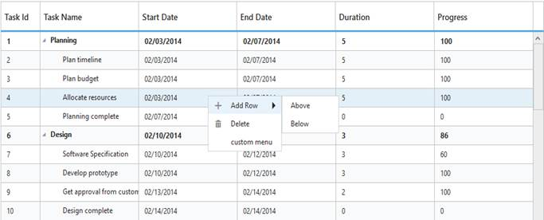

# Context Menu

The **Context menu** in TreeGrid control is used to manipulate (add, edit and delete) the TreeGrid rows. In TreeGrid, context menu can be enabled with `ContextMenuSettings` property. The `ContextMenuSettings` property contains two inner properties `ShowContextMenu` and `ContextMenuItems`.

The `ShowContextMenu` property is used to **enable or disable** the context menu, default value for this property is `false`.

The `ContextMenuItems` property is used to add the menu items to context menu, this property renders `Add` and `Delete` by default when the menu items are not provided.



<ej:TreeGrid ID="treegrid1" runat="server">
  <EditSettings AllowEditing="true" EditMode="rowEditing" />
  <ContextMenuSettings ShowContextMenu="true" ContextMenuItems="add,edit,delete"/>
</ej:TreeGrid>



The following screenshot displays the Context menu in TreeGrid control.

  

## ContextMenu Customization

The Context menu can be customized by adding a new custom menu item to it. In TreeGrid, context menu can be customized using the ContextMenuOpen client-side event. This event is triggered when the context menu is rendered with mouse right click action. The following properties are available in the event.

* headerText: Display text for menu item.
* iconPath: Image location for menu item.
* eventHandler: Client side event for menu item click.



<ej:TreeGrid ID="treegrid1" runat="server" ContextMenuOpen="customMenu">
  <ContextMenuSettings ShowContextMenu="true" />
</ej:TreeGrid>

<asp:ScriptManager ID="ScriptManager" runat="server"/>



The following screenshot displays the customization of Context menu in TreeGrid control.

 

# Header Context Menu
Header context menu can be enabled by setting `ShowContextMenu` as `true`. The default value of the `ShowContextMenu` property is `false`.

Following options are shown in header context menu. 

* **Column Chooser** - Display all the column names; you can enable or disable a column by select or deselect the respective column name in the column chooser menu. This option is default option of header context menu.
* **Sort Ascending & Sort Descending** - Used to sort the items in the column. These menu options will be displayed only when you enable the `AllowSorting` property. To perform multilevel sorting, the `AllowMultiSorting` property should be enabled.
* **Freeze, Unfreeze & Freeze Preceding Columns** - Used to freeze or unfreeze the columns. These set of menu options will be displayed in all the columns when `IsFrozen` property is enabled in any of the columns. However you can control the visibility of these menu options in a particular column by enabling/disabling the `AllowFreezing` property of that specific column.

The below code snippet explains how to enable header context menu in TreeGrid



<ej:TreeGrid ID="treegrid1" AllowSorting="true">
  <ContextMenuSettings ShowContextMenu="true" />
  <Columns>
    <ej:TreeGridColumn Field="StartDate" HeaderText= "Start Date"   
      IsFrozen="true" EditType="Datepicker">
    </ej:TreeGridColumn>
  </Columns>
</ej:TreeGrid>



The following screenshot displays the Header context menu in TreeGrid control.

