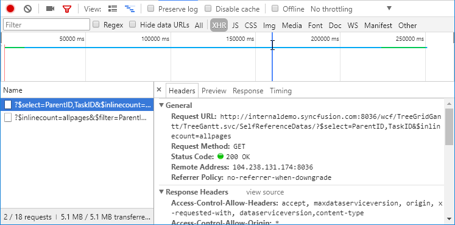
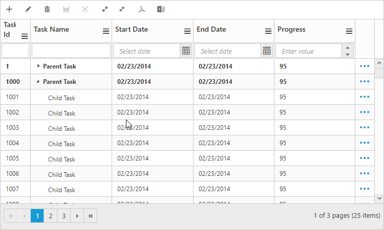

# Data Binding

Data Binding is the process that establishes a connection between the application and different kinds of data sources such as business objects.

## Local Data Binding

In Local Data Binding, datasource for rendering the TreeGrid control is retrieved from the same application locally.

Two types of Data Binding are possible with TreeGrid control, 

* Hierarchical Datasource Binding
* Self-Referential Data Binding (Flat Data)

### Hierarchy Datasource Binding

The following code example shows you how to bind the Hierarchical local data into the TreeGrid control.



TreeGrid.aspx.cs
using Syncfusion.JavaScript;

using Syncfusion.JavaScript.Models;

using System;

using System.Collections.Generic;

using System.Data;

using System.Linq;

using System.Web;

using System.Web.UI;

using System.Web.UI.WebControls;

using WebSampleBrowser.TreeGrid.Model;

namespace WebSampleBrowser.TreeGrid

{
    public partial class TreeGridDefault : System.Web.UI.Page

    {
        protected void Page_Load(object sender, EventArgs e)

        {

            TaskDetailsCollection TaskCollection = new TaskDetailsCollection();

            this.TreeGridControlDefault.DataSource = TaskCollection.GetDataSource();

            this.TreeGridControlDefault.DataBind();

        }  

     }

    public class TaskDetailsCollection

    {

        public List<TaskDetails> GetDataSource()

        {

            List<TaskDetails> tasks = new List<TaskDetails>();

            tasks.Add(new TaskDetails()

            {

                TaskID = 1,

                TaskName = "Planning",

                StartDate = "02/03/2014",

                EndDate = "02/07/2014",

                Progress = "100",

                Duration = 5,

            });

            tasks[0].SubTasks = new List<TaskDetails>();

            tasks[0].SubTasks.Add(new TaskDetails()

            {
                TaskID = 2,

                TaskName = "Plan timeline",

                StartDate = "02/03/2014",

                EndDate = "02/07/2014",

                Duration = 5,

                Progress = "100"

            });

            tasks[0].SubTasks.Add(new TaskDetails()

            {
                TaskID = 3,

                TaskName = "Plan budget",

                StartDate = "02/03/2014",

                EndDate = "02/07/2014",

                Duration = 5,

                Progress = "100"

            });

            tasks[0].SubTasks.Add(new TaskDetails()

            {
                TaskID = 4,

                TaskName = "Allocate resources",

                StartDate = "02/03/2014",

                EndDate = "02/07/2014",

                Duration = 5,

                Progress = "100"

            });

            tasks[0].SubTasks.Add(new TaskDetails()

            {
                TaskID = 5,

                TaskName = "Planning complete",

                StartDate = "02/07/2014",

                EndDate = "02/07/2014",

                Duration = 0,

                Progress = "0"

            });

    //...

    //...
            return tasks;

        }

    }

    public class TaskDetails

    {
        public int TaskID { get; set; }

        public string TaskName { get; set; }

        public string StartDate { get; set; }

        public string EndDate { get; set; }

        public int Duration { get; set; }

        public string Progress { get; set; }

        public List<TaskDetails> SubTasks { get; set; }     

    }
}

 



<%@ Page Language="C#" AutoEventWireup="true" MasterPageFile="~/Samplebrowser.Master" CodeBehind="TreeGridDefault.aspx.cs" Inherits="WebSampleBrowser.TreeGrid.TreeGridDefault" %>

<%@ Register assembly="Syncfusion.EJ" namespace="Syncfusion.JavaScript.Models" tagprefix="cc1" %>

<asp:Content ID="Content1" ContentPlaceHolderID="SampleHeading" runat="server">

    TreeGrid / Default

</asp:Content>

<asp:Content ID="ControlContent" runat="server" ContentPlaceHolderID="ControlsSection">           

       
                  

        <ej:TreeGrid runat="server" ID="TreeGridControlDefault" 

             ChildMapping="SubTasks" 

             TreeColumnIndex="1">

            <columns>

                <ej:TreeGridColumn HeaderText="Task Id" Field="TaskID" Width="45" />

                <ej:TreeGridColumn HeaderText="Task Name" Field="TaskName" />

                <ej:TreeGridColumn HeaderText="Start Date" Field="StartDate" />

                <ej:TreeGridColumn HeaderText="End Date" Field="EndDate" />

                <ej:TreeGridColumn HeaderText="Duration" Field="Duration" />

                <ej:TreeGridColumn HeaderText="Progress" Field="Progress" />

            </columns>            

        </ej:TreeGrid>

       

</asp:Content>

<asp:Content ID="Content2" runat="server" ContentPlaceHolderID="ScriptSection">

    

</asp:Content>




The output of the above steps is as follows:

 

### Self-Referential Data Binding (Flat Data)

TreeGrid is rendered from Self-Referential data structures by providing two fields: ID field and parent ID field.

* ID Field- This field contains unique values used to identify nodes. Its name is assigned to the IdMapping property.

* Parent ID Field- This field contains values that indicate parent nodes. Its name is assigned to the ParentIdMapping property.




TreeGrid.aspx.cs

using System.Linq;

using System.Web;

using System.Web.UI;

using System.Web.UI.WebControls;

using WebSampleBrowser.TreeGrid.Model;

namespace WebSampleBrowser.TreeGrid

{
    public partial class TreeGridDefault : System.Web.UI.Page

    {
        protected void Page_Load(object sender, EventArgs e)

        {

            TaskDetailsCollection TaskCollection = new TaskDetailsCollection();

            this.TreeGridControlDefault.DataSource = TaskCollection.GetDataSource();

            this.TreeGridControlDefault.DataBind();

        }
    }
	
    public class TaskDetails

    {
        public string StartDate { get; set; }
		
        public int Id { get; set; }

        public int ParentId { get; set; }

        public string Name { get; set; }

        public int Duration { get; set; }

        public int PercentDone { get; set; }

        public List<Data> Children { get; set; }

    }
	
    public class TaskDetailsCollection

    {

        public List<TaskDetails> GetDataSource()

        {

            List<TaskDetails> list = new List<TaskDetails>();

            list.Add(new TaskDetails()

            {

                Id = 1,

                Name = "Parent Task 1",

                StartDate = "02/03/2014",

                Duration = 5

            });

            list.Add(new TaskDetails()

            {

                Id = 2,

                Name = " Child Task 1",

                ParentId = 1,

                StartDate = "02/03/2014",

                Duration = 5,

            });
			
            list.Add(new TaskDetails()

            {
                Id = 3,

                ParentId = 1,

                Name = "Child Task 2",

                StartDate = "02/03/2014",

                Duration = 5,

                PercentDone = 100,

            });

            list.Add(new TaskDetails()

            {
                Id = 4,

                ParentId = 1,

                Name = "Child Task 3",

                StartDate = "02/03/2014",

                Duration = 5,

                PercentDone = 40,

            });

            list.Add(new TaskDetails()

            {
                Id = 5,

                Name = "Parent Task 2",

                StartDate = "02/03/2014",

                Duration = 5,

                PercentDone = 100,

            });

            list.Add(new TaskDetails()

            {
       			Id = 6,

                ParentId = 5,

                Name = " Child Task 1",

                StartDate = "02/03/2014",

                Duration = 5,

            });

            list.Add(new TaskDetails()

            {
                Id = 7,

                ParentId = 5,

                Name = " Child Task 2",

                StartDate = "02/03/2014",

                Duration = 5,

                PercentDone = 100,

            });

     //...

    //...
	return list;

        }
	}
}
 



TreeGrid.aspx

<%@ Page Language="C#" AutoEventWireup="true" MasterPageFile="~/Samplebrowser.Master" CodeBehind="TreeGridDefault.aspx.cs" Inherits="WebSampleBrowser.TreeGrid.TreeGridDefault" %>

<%@ Register assembly="Syncfusion.EJ" namespace="Syncfusion.JavaScript.Models" tagprefix="cc1" %>

<asp:Content ID="Content1" ContentPlaceHolderID="SampleHeading" runat="server">

    TreeGrid / Default

</asp:Content>

<asp:Content ID="ControlContent" runat="server" ContentPlaceHolderID="ControlsSection">           

       
                  

        <ej:TreeGrid runat="server" ID="TreeGridControlDefault" 

             TreeColumnIndex="1"

             IdMapping="Id"

             ParentIdMapping="ParentId">

            <columns>

                <ej:TreeGridColumn HeaderText="Task Id" Field="Id" Width="45" />

                <ej:TreeGridColumn HeaderText="Task Name" Field="Name" />

                <ej:TreeGridColumn HeaderText="Start Date" Field="StartDate" />

                <ej:TreeGridColumn HeaderText="Duration" Field="Duration" />

                <ej:TreeGridColumn HeaderText="Progress" Field="PercentDone" />

            </columns>            

        </ej:TreeGrid>

       

</asp:Content>

<asp:Content ID="Content2" runat="server" ContentPlaceHolderID="ScriptSection">

    

</asp:Content>




The following screenshot shows the output of the above steps,

 

## Remote data binding

### Load on demand

TreeGrid provides `Load on Demand` support for rendering remote data. Load on demand is considered in TreeGrid for the following actions, 

* Expanding root nodes.
* Navigating pages, with paging enabled in TreeGrid.

When load on demand is enabled, all the root nodes are rendered in collapsed state at initial load.

When load on demand support is enabled in TreeGrid with paging, the current or active page’s root node alone will be rendered in collapsed state. On expanding the root node, the child nodes will be loaded from the remote server. 

When a root node is expanded, its child nodes are rendered and are cached locally, such that on consecutive expand/collapse actions on root node, the child nodes are loaded from the cache instead from the remote server.

Similarly, if the user navigates to a new page, the root nodes of that specific page, will be rendered with request to the remote server.

N> 1. Load on demand support in TreeGrid can be enabled only for remote data.
N> 2. For better initial load time performance, we need to define the “HasChildMapping” property.

Load on demand support in TreeGrid can be enabled by using the property `EnableLoadOnDemand`.

The following code explains how to use Load on Demand in TreeGrid Control,



 <ej:TreeGrid runat="server" ID="TreeGridLoadonDemand" IdMapping="TaskID" ParentIdMapping="ParentID" HasChildMapping="isParent" EnableLoadOnDemand="true" EnableVirtualization="true">
    <DataManager URL="http://js.syncfusion.com/demos/ejServices/Wcf/TreeGridGantt/TreeGantt.svc/SelfReferenceDatas" CrossDomain="true"></DataManager>
    <Columns>
        <ej:TreeGridColumn HeaderText="Task Id" Field="TaskID" Width="45" />
        <ej:TreeGridColumn HeaderText="Task Name" Field="TaskName" />
        <ej:TreeGridColumn HeaderText="Start Date" Field="StartDate" EditType="datetimepicker" />
        <ej:TreeGridColumn HeaderText="End Date" Field="EndDate" EditType="datetimepicker" />
        <ej:TreeGridColumn HeaderText="Progress" Field="Progress" />
    </Columns>
</ej:TreeGrid>



The output for load on demand support in TreeGrid:

The following output shows how load on demand works for expanding action

### Load at once:

On remote data binding, for every action such as paging, sorting, filtering, the data will be fetched from remote server each time. To avoid requesting the data from the remote server for each action, we can set TreeGrid to load all the data on initialization and make all the data operations in client side. To enable this, we can use Offline property of `ej.DataManager`. the following code example explains this.



 <ej:TreeGrid runat="server" ID="TreeGridLoadonDemand" IdMapping="TaskID" ParentIdMapping="ParentID" HasChildMapping="isParent" EnableVirtualization="true">
    <DataManager URL="http://js.syncfusion.com/demos/ejServices/Wcf/TreeGridGantt/TreeGantt.svc/SelfReferenceDatas" Offline="true"></DataManager>
    <Columns>
        <ej:TreeGridColumn HeaderText="Task Id" Field="TaskID" Width="45" />
        <ej:TreeGridColumn HeaderText="Task Name" Field="TaskName" />
        <ej:TreeGridColumn HeaderText="Start Date" Field="StartDate" EditType="datetimepicker" />
        <ej:TreeGridColumn HeaderText="End Date" Field="EndDate" EditType="datetimepicker" />
        <ej:TreeGridColumn HeaderText="Progress" Field="Progress" />
    </Columns>
</ej:TreeGrid>



Please refer the [link](https://help.syncfusion.com/js/datamanager/data-binding#offline-mode "offline") for further reference on offline property

**Limitations**:

1. Mapping the expand state of a record using `ExpandStateMapping` property is not supported in load on demand feature.
2. If a root or parent node is in collapsed state (child nodes not yet loaded), then that parent node will not be expanded while inserting new child to that parent node using toolbar icon or drag and drop actions.

