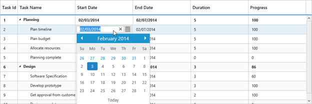

## Editing

The TreeGrid control provides built-in support for Editing cell items. 

Cell Editing

Update the task details through grid Cell Editing by setting EditMode as CellEditing.

The following code example shows you how to enable CellEditing in TreeGrid control.



<ej:TreeGrid runat="server" ID="TreeGridControlEditing">

//...

<EditSettings AllowEditing="true" EditMode="CellEditing"/>

</ej:TreeGrid>



The output of TreeGrid with CellEditing is as follows.

{  | markdownify }
{:.image }

