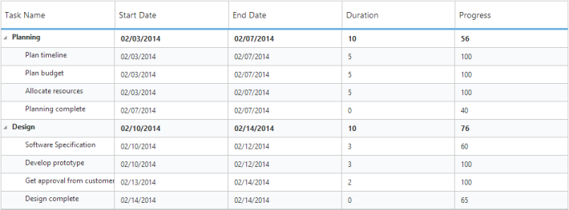
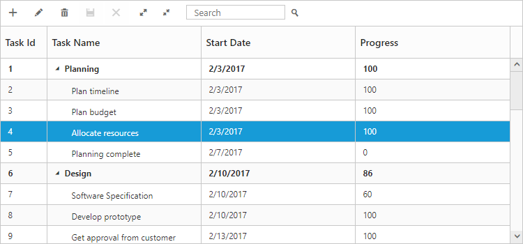
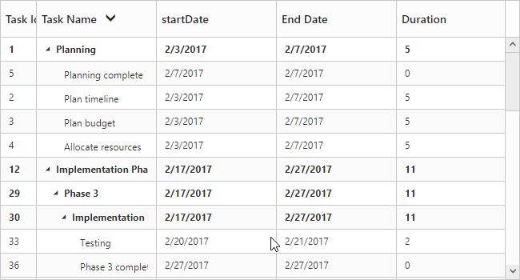
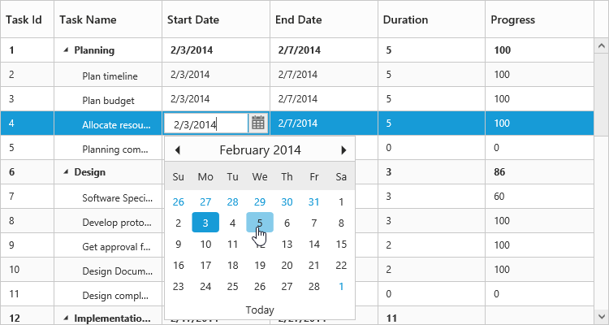
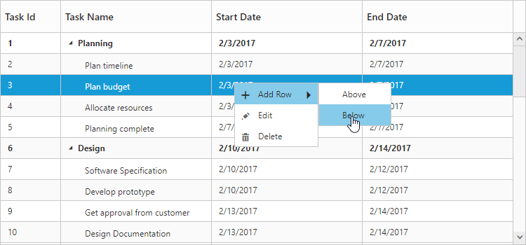
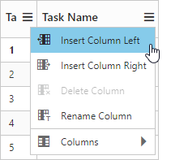

# Getting Started

## Create your first TreeGrid in ASP.NET

This section explains briefly about the control structure and how to create a TreeGrid

1. First create a new ASP.NET Web Forms project; please refer the [ASP-Getting Started documentation](https://help.syncfusion.com/aspnet/getting-started) to create new project and add necessary DLL’s and script files.

2. Create a data source in aspx.cs of default file, we can bind data source to TreeGrid using `DataSource` property.

3. Add the following code example in the default.aspx file to create a TreeGrid control.





<form id="form1" runat="server">
	 <ej:TreeGrid runat="server" ID="TreeGridControlDefault" ChildMapping="Children" TreeColumnIndex="1">
		<columns>
		    <ej:TreeGridColumn HeaderText="Task Id" Field="TaskId" Width="45" />
			<ej:TreeGridColumn HeaderText="Task Name" Field="TaskName" />
			<ej:TreeGridColumn HeaderText="Start Date" Field="StartDate" />
			<ej:TreeGridColumn HeaderText="End Date" Field="EndDate" />
			<ej:TreeGridColumn HeaderText="Duration" Field="Duration" />
		</columns>            
	</ej:TreeGrid>
</form>		





protected void Page_Load(object sender, EventArgs e)
{
    TaskDetailsCollection TasksCollection = new TaskDetailsCollection();
    this.TreeGridControlDefault.DataSource = TasksCollection.GetData();
    this.TreeGridControlDefault.DataBind();
}

public class TaskDetailsCollection
{    
    public List<BusinessObject> GetData()
        {
            List<BusinessObject> dataCollection = new List<BusinessObject>();

            BusinessObject Record1 = new BusinessObject()
            {
                TaskId = 1,
                TaskName = "Planning",
                StartDate = "02/03/2017",
                Duration = 5,
                Children = new List<BusinessObject>(),
            };

            BusinessObject Child1 = new BusinessObject()
            {
                TaskId = 2,
                TaskName = "Plan timeline",
                StartDate = "02/03/2017",
                Duration = 5
            };

            BusinessObject Child2 = new BusinessObject()
            {
                TaskId = 3,
                TaskName = "Plan budget",
                StartDate = "02/03/2017",
                Duration = 5
            };

            BusinessObject Child3 = new BusinessObject()
            {
                TaskId = 4,
                TaskName = "Allocate resources",
                StartDate = "02/03/2017",
                Duration = 5
            };

            BusinessObject Child4 = new BusinessObject()
            {
                TaskId = 5,
                TaskName = "Planning complete",
                StartDate = "02/07/2017",
                Duration = 0
            };

            Record1.Children.Add(Child1);
            Record1.Children.Add(Child2);
            Record1.Children.Add(Child3);
            Record1.Children.Add(Child4);

            BusinessObject Record2 = new BusinessObject()
            {
                TaskId = 6,
                TaskName = "Design",
                StartDate = "02/10/2017",
                Duration = 3,
                Children = new List<BusinessObject>(),
            };

            BusinessObject Child5 = new BusinessObject()
            {
                TaskId = 7,
                TaskName = "Software Specification",
                StartDate = "02/10/2017",
                Duration = 3
            };

            BusinessObject Child6 = new BusinessObject()
            {
                TaskId = 8,
                TaskName = "Develop prototype",
                StartDate = "02/10/2017",
                Duration = 3
            };

            BusinessObject Child7 = new BusinessObject()
            {
                TaskId = 9,
                TaskName = "Get approval from customer",
                StartDate = "02/13/2017",
                Duration = 2
            };

            BusinessObject Child8 = new BusinessObject()
            {

                TaskId = 10,
                TaskName = "Design complete",
                StartDate = "02/14/2017",
                Duration = 0
            };

            Record2.Children.Add(Child5);
            Record2.Children.Add(Child6);
            Record2.Children.Add(Child7);
            Record2.Children.Add(Child8);
            dataCollection.Add(Record1);
            dataCollection.Add(Record2);
            return dataCollection;
        }
}
 public class BusinessObject
        {
            public int TaskId { get; set; }
            public string TaskName { get; set; }
            public string StartDate { get; set; }
            public int Duration { get; set; }
            public List<BusinessObject> Children { get; set; }
        }    


  

Simple TreeGrid
{:.caption}

## Enable Toolbar

TreeGrid control contains the toolbar options to Add, Edit, Delete, Cancel, Update, Search, ExpandAll and CollapseAll operations, you can enable the toolbar by using `ToolbarSettings` property.



<ej:TreeGrid runat="server" ID="TreeGridContainer" >
    <ToolbarSettings ShowToolbar="true" ToolbarItems="add,edit,delete,update,cancel,expandAll,collapseAll,search" />
</ej:TreeGrid>



The following screen shot displays a Toolbar in TreeGrid.

Toolbar in TreeGrid
{:.caption}

N> Add, Edit, Delete options are enabled by `AllowEditing`, `AllowAdding`, `AllowDeleting` in the `EditSettings`.

[Click](toolbar) here to refer more details for TreeGrid ToolbarSettings.

## Enable Sorting

The TreeGrid control contains sorting functionality to arrange the data in **ascending** or **descending** order based on a particular column.

### Multicolumn Sorting

You can enable the multicolumn sorting in TreeGrid by setting `AllowMultiSorting` as `true` .You can sort multiple columns in TreeGrid by selecting the desired column header when holding the **CTRL** key.



<ej:TreeGrid runat="server" ID="TreeGridContainer" AllowSorting="true" AllowMultiSorting="true">
</ej:TreeGrid>
  


[Click](sorting) here to refer more details for TreeGrid Sorting.

## Enable Editing

You can enable editing in TreeGrid by using `EditSettings` property and it is illustrated in the following code example.



<ej:TreeGrid runat="server" ID="TreeGridContainer">
    <EditSettings AllowEditing="true" AllowAdding="true" AllowDeleting="true" EditMode="CellEditing" />
</ej:TreeGrid>



[Click](editing) here to refer more details for TreeGrid Editing.

## Enable Context Menu

The **Context menu** in TreeGrid control is used to manipulate (add, edit and delete) the TreeGrid rows. 
In TreeGrid, context menu can be enabled by `ContextMenuSettings` property. The `ContextMenuSettings` property contains two inner properties `ShowContextMenu` and `ContextMenuItems`.



<ej:TreeGrid runat="server" ID="TreeGridContainer">
    <ContextMenuSettings ShowContextMenu="true" ContextMenuItems="add,edit,delete" />
</ej:TreeGrid>



The following screenshot displays the context menu in TreeGrid control.

TreeGrid with context menu
{:.caption}

[Click](context-menu) here to refer more details for TreeGrid context menu.

## Enable Column Menu

You can enable the column menu in TreeGrid, by setting the `ShowColumnChooser` as `true`.



<ej:TreeGrid runat="server" ID="TreeGridContainer" ShowColumnChooser="true" AllowSorting="true" AllowMultiSorting="true">
</ej:TreeGrid>               



The following screenshot displays the column chooser in TreeGrid control.

TreeGrid with column chooser
{:.caption}

## Define dimension of TreeGrid

By default TreeGrid control was rendered with `100%` width and `450px` height, we can define the dimension of TreeGrid control by using `SizeSettings` property. TreeGrid control width and height can be defined by either `Height` and `Width` properties or by defining inline style in TreeGrid container element. The below code example shows how to define width and height for TreeGrid control.



<ej:TreeGrid runat="server" ID="TreeGridContainer">
<SizeSettings Width="700px" Height="350px" />
</ej:TreeGrid>



N> 1.TreeGrid control will automatically update the width and height value based on container element on window resize action, this can be enabled by setting `IsResponsive` property as `true` for this `Height` and `Width` value will be defined in percentage.
N> 2.We can also render TreeGrid with auto height by setting `SizeSettings.Height` as `auto`.