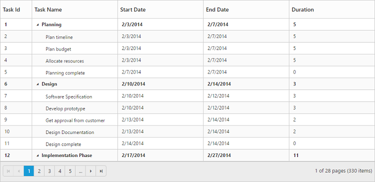
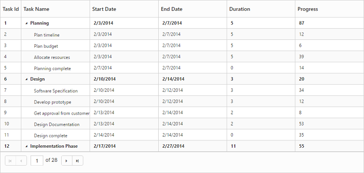

# Paging

The TreeGrid control provides support for displaying records in paginated view. Paging can be enabled in TreeGrid by setting the `AllowPaging` property as `true`.

The below code snippet explains enabling paging in TreeGrid.


 
<ej:TreeGrid ID="TreeGridControlPagerTemplate" AllowPaging="true">            
         //...     
</ej:TreeGrid>



The output of the TreeGrid with paging enabled is displayed below

## Paging settings

The paging in TreeGrid can be customized by using the `PageSettings` property.

* **PageSize** - Using this property we can limit the number of records to be displayed per page.
* **PageSizeMode** - By setting this property as `Root` we can limit the number of root nodes or the 0th level records to be displayed per page . 
When the `PageSizeMode` property is set as `Root` the number of records to be displayed per page which is defined in the the `PageSize` property will be considered only for the root nodes or the 0th level records.
* **PageCount** - It is used to display the page number to be displayed in the pager.
* **CurrentPage** - This property is used to set the active page to be displayed initially.
* **TotalRecordsCount** - This property is used to limit the total number of records from the data source to be displayed in TreeGrid.
 The following code example explains the properties in pageSettings. 



<ej:TreeGrid ID="TreeGridControlPagingAPI" AllowPaging="true">   
       <PageSettings PageCount="5" PageSize="12" PageSizeMode="All"  CurrentPage="3" TotalRecordsCount="50" /> 
</ej:TreeGrid>



You can also find the demo for settings in paging [here](http://asp.syncfusion.com/demos/web/treegrid/treegridpagingapi.aspx)

## Pager Template

It is possible to customize the default pager in TreeGrid by using the `PageSettings.Template` property.
The below code snippet explains how to customize the default pager with template


 




    #currentPage {
        background-color: white;
    }

    .e-currentPageContainer {
        border-bottom: 1px solid #e0e0e0!important;
    }

    .e-pagercontainer .e-icon {
        display: inline-block;
        height: 8px;
    }

    .e-pager .e-pagercontainer {
        margin: 0px;
        margin-left: 6px;
    }




<ej:TreeGrid ID="TreeGridControlPagerTemplate" AllowPaging="true">            
    <PageSettings Template="#Template" />       
</ej:TreeGrid>





//Code for navigating to the page 
$("#currentPage").keydown(function(e) {
    var obj = $("#TreeGridContainer").data("ejTreeGrid");
    var val = parseInt($("#currentPage").val());
    if (e.keyCode == 13) {
        if (val > obj.model.pageSettings.totalPages)
            val = obj.model.pageSettings.totalPages;
        if (val <= 0)
            val = 1;
        obj.gotoPage(val);
        return false;
    }
});



You can also find the demo for TreeGrid with pager template [here](http://asp.syncfusion.com/demos/web/treegrid/treegridpagertemplate.aspx)

The below image displays TreeGrid with paging template.

It is possible to navigate to a specific page with a custom action instead of clicking pager button by using the [`gotoPage`]( /api/js/ejtreegrid#methods:gotopage "gotoPage") method.

The below code snippet explains how to navigate to 3rd page in TreeGrid by using `gotoPage` method





## Paging - Touch Option

With paging and responsive mode enabled in TreeGrid, it is possible to change the current page using swipe action.



 <ej:TreeGrid ID="TreeGridControlPagerTemplate" AllowPaging="true" IsResponsive="true">       
 </ej:TreeGrid>

