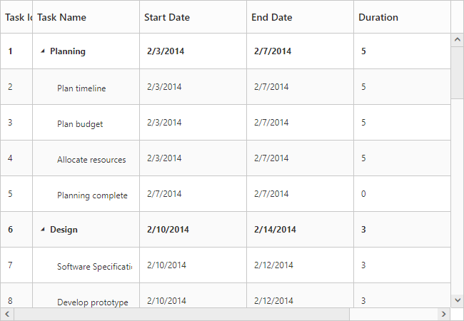
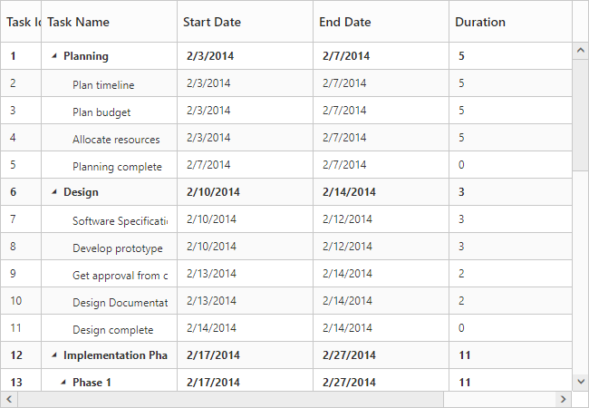
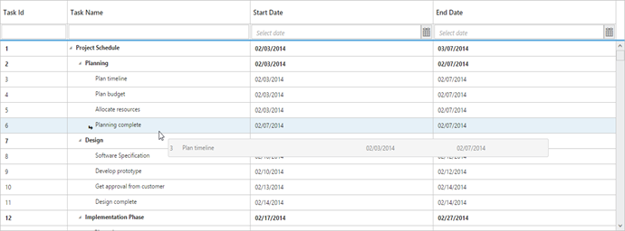
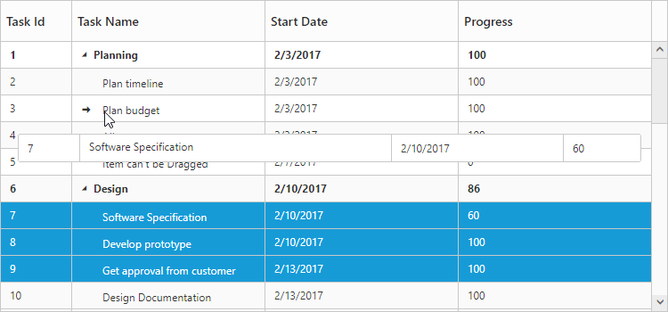
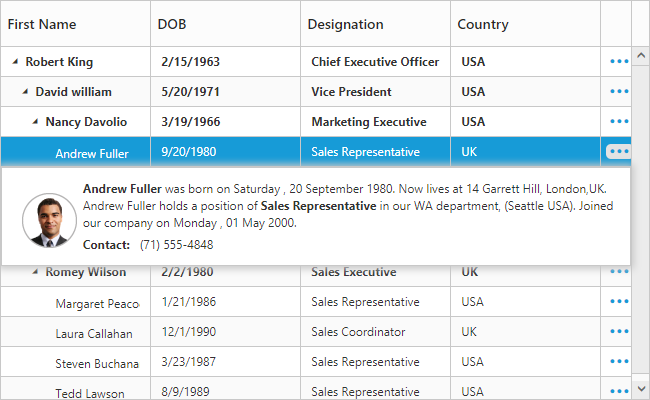
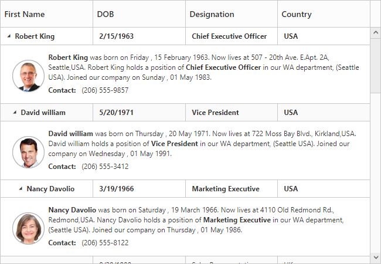
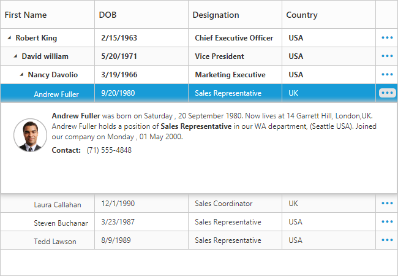
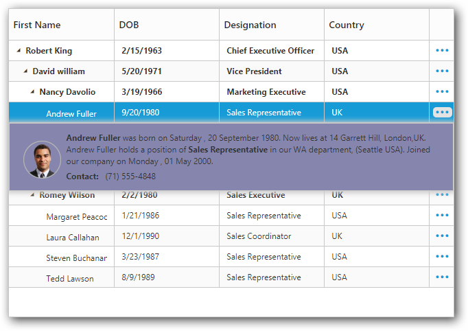
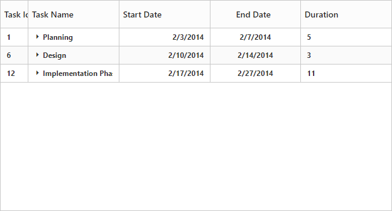
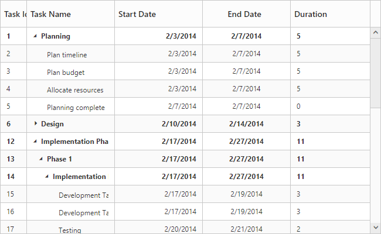

# Rows

The TreeGrid rows displays the information of each row from the bounded data source.

## Row Template

Row template is used to customize the TreeGrid rows based on requirements. In TreeGrid, RowTemplateID and AltRowTemplateID properties are used for customizing the row.

* **RowTemplateId** is used to customize all the rows in TreeGrid. For this property, ID of the row template is to be provided.

* **AltRowTemplateId**  is used to customize the alternative rows in TreeGrid. For this property, ID of the alternative row template is to be provided.




<ej:TreeGrid runat="server" ID="TreeGridControlRowTemplate" ChildMapping="Children" RowTemplateId="rowTemplateScript" AltRowTemplateId="altRowTemplateScript">

  <columns>

     <ej:TreeGridColumn HeaderText="Employee ID" Field="EmployeeID" Width="180" />

     <ej:TreeGridColumn HeaderText="Employee Name" Field="Name" />

     <ej:TreeGridColumn HeaderText="Employee picture" Field="Address" />

      ej:TreeGridColumn HeaderText="DOB" Field="DOB" />

  </columns>            

  <EditSettings AllowEditing="true" EditMode="cellEditing"/>   

</ej:TreeGrid>





public class TemplateData

{

   public string Name { get; set; }

   public string FullName { get; set; }

   public string Designation { get; set; }

   public string EmployeeID { get; set; }

   public string Address { get; set; }

   public string Contact { get; set; }

   public string Country { get; set; }

   public string DOB { get; set; }

   public List<TemplateData> Children { get; set; }

} 

protected void Page_Load(object sender, EventArgs e)

{

  RowTemplateData TaskCollection = new RowTemplateData();

  this.TreeGridControlRowTemplate.DataSource = TaskCollection.GetData();

  this.TreeGridControlRowTemplate.DataBind();

} 

public class RowTemplateData

{

  public List<TemplateData> GetData()

  {

      List<TemplateData> data = new List<TemplateData>();

      data.Add(new TemplateData()

      {

        Name = "Robert King",

        FullName = "Robert King",

        Designation = "Chief Executive Officer",

        EmployeeID = "EMP001",

        Address = "507 - 20th Ave. E.Apt. 2A, Seattle",

        Contact = "(206) 555-9857",

        Country = "USA",

        DOB = "2/15/1963",

      });

      data[0].Children = new List<TemplateData>();

      data[0].Children.Add(new TemplateData()

      {

         Name = "David Williamson",

         FullName = "David Williamson",

         Designation = "Vice President",

         EmployeeID = "EMP004",

         Address = "722 Moss Bay Blvd., Kirkland",

         Country = "USA",

         Contact = "(206) 555-3412",

         DOB = "5/20/1971",

       });

           // ...

           // ...

    return data;

  }

 }
 



The output of TreeGrid with Row Template is as follows.

[Click](https://asp.syncfusion.com/demos/web/treegrid/treegridrowtemplate.aspx) here to view online sample for TreeGrid Row Template.

N> In TreeGrid, the given row template is parsed for default row functionality like row selection, alt row and other default row customization. Using `ParseRowTemplate` property we can disable the row template parsing. If we disable that property, TreeGrid is rendered with given row template.

## Row Height

The `RowHeight` property is used to change the height of row in TreeGrid, default value of this property is 30.
The following code example explains how to change the row height in TreeGrid



<ej:TreeGrid ID="TreeGridContainer" RowHeight=50>
</ej:TreeGrid>



The above screenshot shows TreeGrid render with row height of 50.
{:.caption}

## Alternate row styling

Alternate row style is used to enable the different background color for every alternate row. The `EnableAltRow` property is used to enable the alternate row style in TreeGrid, default value of this property is true.

The following code explains about enabling the alternate row style in TreeGrid



<ej:TreeGrid ID="TreeGridContainer" EnableAltRow=50>
</ej:TreeGrid>



The above screenshot shows TreeGrid with alternate row style.
{:.caption}

## Row Drag and Drop

It is possible to dynamically re-arrange the rows in the TreeGrid control by using the `AllowDragAndDrop` property. Using this property row drag option can be enabled or disabled. Rows can be inserted above, below or as a sibling or as a child to the existing row with the help of this feature. A default tooltip is rendered while dragging the TreeGrid row and this tooltip can be customized by the `DragTooltip` property. This property has inner properties such as `ShowTooltip`, `TooltipItems` and `TooltipTemplate`.

The `ShowTooltip` property is used to enable or disable the tooltip and the default value of this property is `false`

The following code explains about enabling the row drag and drop with the default tooltip in the TreeGrid.



<ej:TreeGrid runat="server" ID="TreeGridControlDragAndDrop" … AllowDragAndDrop="true">	 //...

     <columns>

            <ej:TreeGridColumn HeaderText="Task Id" Field="TaskID" />

            <ej:TreeGridColumn HeaderText="Task Name" Field="TaskName" />//…

     </columns>

     <DragTooltip ShowTooltip="true"/>

     //...

</ej:TreeGrid>



The following screenshot depicts a row drag and drop in the TreeGrid.

 

## Customizing Drag tooltip

The default drag tooltip in TreeGrid can be customized by using `TooltipTemplate` property. We can provide JsRender template or HTML formatted string as the value for this property.

The following code shows how to render row drag tooltip with JsRender template.



<ej:TreeGrid runat="server" ID="TreeGridControlDragAndDrop" … AllowDragAndDrop="true">

    //...

   <DragTooltip ShowTooltip="true" TooltipItems="TaskID,TaskName,StartDate,EndDate" />

    // ...

</ej:TreeGrid>



The TooltipTemplate property renders the template tooltip for row drag and drop in the TreeGrid control by using the JsRender template. You can provide either the id value of the script element or the script element to the property.

The following code shows how to render row drag tooltip with tooltip template.



<ej:TreeGrid runat="server" ID="TreeGridControlDragAndDrop" AllowDragAndDrop="true">

   	   //...         

       <DragTooltip ShowTooltip="true" TooltipTemplate="#customtooltip" />

       // ...

</ej:TreeGrid>

<asp:Content ID="Content2" runat="server" ContentPlaceHolderID="ScriptSection"> 

     

</asp:Content>



  
 
## Multiple row drag and drop
		
TreeGrid provides support for multiple row reordering with mouse drag and drop interaction. The selected rows can be dropped above and below as siblings or as child records similar to single row reordering.
In TreeGrid we can enable the multiple drag and drop by setting `SelectionSettings.SelectionType` as `Multiple` or  `Checkbox` and also we should enable the `AllowDragAndDrop` property.

Please find the code example below to enable multiple drag and drop in TreeGrid.



 <ej:TreeGrid runat="server" ID="TreeGridControlDragAndDrop" AllowDragAndDrop="true"> 
           //..
           <SelectionSettings SelectionType= "Multiple" />
          //..
      </ej:TreeGrid>



We can also customize row drag and drop actions by using below properties

* canDrag – It is used to enable/disable the row drag action for draggedRecords collection in `RowDragStart` client side event.

* canDrop – It is used to enable/disable the row drop action for draggedRecords collection in `RowDropActionBegin` client side event. 

[Click](https://asp.syncfusion.com/demos/web/treegrid/treegridrowdraganddrop.aspx) here to view the demo sample for multiple drag and drop action.

## Details row

Details row is used to provide a additional information about each row of TreeGrid. You can specify the detail row JsRender template id or HTML element as string to `DetailsTemplate` property. However you need to enable the details template by setting `ShowDetailsRow` property as `true`.

The following code example shows how to enable details tow in TreeGrid.



<ej:TreeGrid ID="TreeGridContainer" DetailsTemplate="descriptionTemplate">
</ej:TreeGrid>


The above screenshot shows details row in TreeGrid.
{:.caption}

The visibility of the details view of a record can also be toggled with any custom actions by using the method `ShowHideDetailsRow`.

[Click](https://asp.syncfusion.com/demos/web/treegrid/treegridrowdetails.aspx) here to view the demo sample for details row template.

### Disable details row info column

On enabling details template, details row info column will be added in TreeGrid. It is used for show or hide the detail row of respective row. 

You can disable that column while enabling details template using `ShowDetailsRowInfoColumn` property. If you disable details row info column, then the details row will render next to the respective row.

The following code example shows how to hide detail info column in TreeGrid. 



<ej:TreeGrid ID="TreeGridContainer" DetailsTemplate="descriptionTemplate" ShowDetailsRowInfoColumn="false">
</ej:TreeGrid>



The above screenshot shows details row rendered next to the respective row.
{:.caption}

### Defining row height for detail template

In TreeGrid, it is provide a support to change the detail template height using `DetailsRowHeight` property.

The following code example shows how to set details row height in TreeGrid. 



<ej:TreeGrid ID="TreeGridContainer" DetailsTemplate="descriptionTemplate" DetailsRowHeight="150">
</ej:TreeGrid>



The above screenshot shows details row rendered with height of `150px`.
{:.caption}

### Customize detail row

In TreeGrid, while rendering the details row the `DetailsDataBound` event will be triggered. Using this event we can customize the detail template for specific row.

The below code example shows how to customize details row for specific row.



<ej:TreeGrid ID="TreeGridContainer" DetailsDataBound="detailsDataBound" DetailsTemplate="descriptionTemplate">
</ej:TreeGrid>

<asp:ScriptManager ID="ScriptManager" runat="server" />



The above screenshot shows details row customization for specific row. 
{:.caption}

While opening and closing the details row, the `DetailsShown` and `DetailsHidden` events are triggered. Using this event we can prevent the details row show and hide action for specific row.

The below code example shows how to prevent details row show action for specific row.



<ej:TreeGrid ID="TreeGridContainer" DetailsShown="detailsShown" DetailsTemplate="descriptionTemplate">
</ej:TreeGrid>

<asp:ScriptManager ID="ScriptManager" runat="server" />



## Expand/Collapse Row

In TreeGrid, parent rows are expanded/collapsed by using expand/collapse icons, expand all/collapse all toolbar items and by using the [`expandCollapseRow`](https://help.syncfusion.com/api/js/ejtreegrid#methods:expandcollapserow "expandCollapseRow") method. By default all records in TreeGrid will be rendered in expanded state.

### Collapse parent records at initial load

It is possible to display all the records in collapsed state by setting `EnableCollapseAll` property as `true`. 

The following code example shows how to use this property.



<ej:TreeGrid ID="TreeGridContainer" EnableCollapseAll="true">
</ej:TreeGrid>



The above screenshot shows TreeGrid render with collapsed state.
{:.caption}

###  Define expand/collapse state of every record

In TreeGrid, it is possible to render records either in collapsed state or in expanded state, and this can done by mapping the expand state to the records from the data source by using `ExpandStateMapping` property.

The following code example shows how to use this property.




<ej:TreeGrid ID="TreeGridContainer" ExpandStateMapping="expandState">
</ej:TreeGrid>





public partial class TreeGridDefault : System.Web.UI.Page
    {
        protected void Page_Load(object sender, EventArgs e)
        {
            TreeGridDefaultData TaskCollection = new TreeGridDefaultData();
            this.TreeGridControlDefault.DataSource = TaskCollection.GetData();
            this.TreeGridControlDefault.DataBind();
        }
     }
        public class TreeGridDefaultData
        {
            public static List<DefaultData> GetData()
            {
                List<DefaultData> list = new List<DefaultData>();
                list.Add(new DefaultData()
                {
                    Id = 6,
                    Name = "Design",
                    ExpandState = false,
                    Children = (new List<DefaultData>()
                    {
                        new DefaultData()
                        {
                            Id = 7,
                            Name = "Software Specification",
                            ExpandState = false,
                        },
                        //..
                    })
                });
                
                return list;
            }
        }       
    }





The below screenshot shows the output of above code example..

### Expand/Collapse all the rows dynamically

All the rows in TreeGrid will be expanded/collapsed by clicking `ExpandAll` and `CollapseAll` toolbar items or by using [`expandAll`](/api/js/ejtreegrid#methods:expandall "expandAll()") and [`collapseAll`](/api/js/ejtreegrid#methods:collapseall "collapseAll()") methods. We can invoke this methods 

dynamically on any action like external button click. 

The below code example shows how to use this methods.



<button id="expandAll">Expand All</button>
<button id="collapseAll">Collapse All</button>

<ej:TreeGrid ID="TreeGridContainer">
<ToolbarSettings ShowToolbar="true" ToolbarItems="expandAll,collapseAll" />
</ej:TreeGrid>

<asp:ScriptManager ID="ScriptManager" runat="server" />



### Dynamically expand/Collapse the specific level row

The TreeGrid control provides the support to dynamically expand/collapse the specific level of rows by using [`expandAtLevel`](/api/js/ejtreegrid#methods:expandatlevel "expandAtLevel(index)") and [`collapseAtLevel`](/api/js/ejtreegrid#methods:collapseatlevel "collapseAtLevel(index)") methods. This methods are used to expand/collapse the rows which are in specific level.

The below code example shows how to use this methods.



<button id="expandAtLevel">Expand At Level</button>
<button id="collapseAtLevel">Collapse At Level</button>

<ej:TreeGrid ID="TreeGridContainer">
</ej:TreeGrid>

<asp:ScriptManager ID="ScriptManager" runat="server" />



### Customize expand/collapse action

In TreeGrid, while expanding the parent row `Expanding` and `Expanded` event will be triggered with current expanding row detail. Similarly `Collapsing` and `Collapsed` event will be triggered while collapsing the parent row. Using this event and its arguments we can customize the expand/collapse action.

The following code example shows how to prevent the particular row from expand/collapse action using `Expanding` and `Collapsing` event.



<ej:TreeGrid ID="TreeGridContainer" DetailsTemplate="descriptionTemplate" Collapsing="collapsing" Expanding="expanding">
</ej:TreeGrid>

<asp:ScriptManager ID="ScriptManager" runat="server" />

