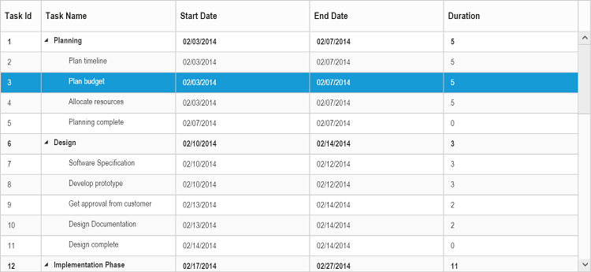
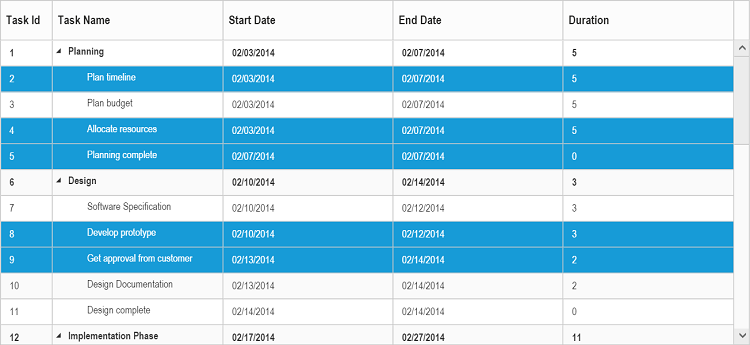
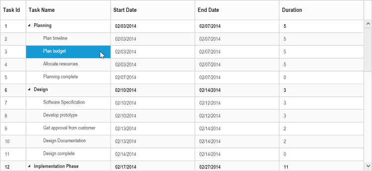
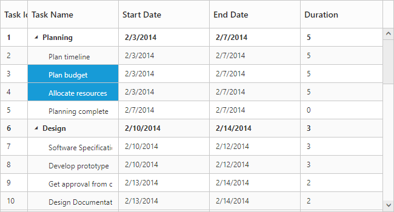
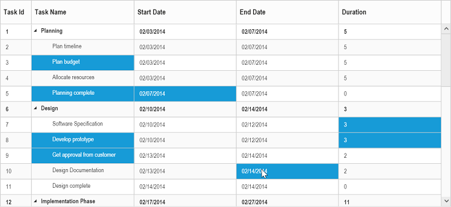
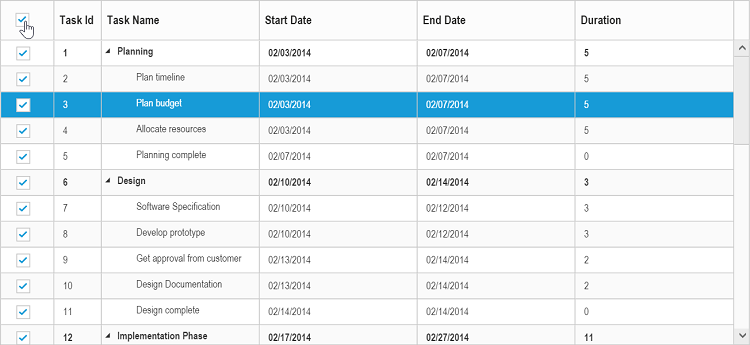
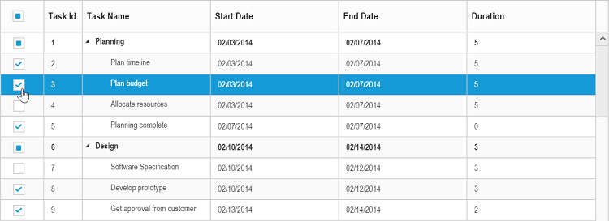
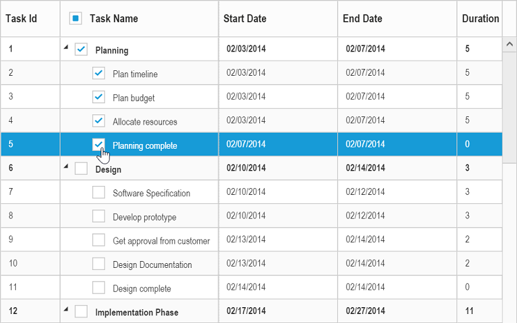
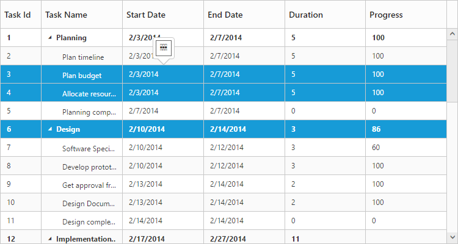

# Selection

The TreeGrid control provides support for row and cell selections using `SelectionSettings` property. 

## Row selection

You can enable or disable the row selection in TreeGrid, using the `AllowSelection` property. By default row selection is enabled in TreeGrid.
The following code example shows, how to disable the row selection in TreeGrid.



<ej:TreeGrid ID="TreeGridContainer" AllowSelection="true">
</ej:TreeGrid>



The output of the TreeGrid with row selection is as follows.

### Selecting a row at initial load

You can select a row at initial load by setting the index of the row to the `SelectedRowIndex` property.

Find the following code for selecting a row at initial load.



<ej:TreeGrid ID="TreeGridContainer" SelectedRowIndex="3">
</ej:TreeGrid>



### Multiple row selection

It is also possible to select multiple rows by setting the `SelectionType` as `Multiple`. You can select more than one row by holding down **CTRL** key and to click on the rows. 
The following code example explains how to enable multiple selection in TreeGrid.



<ej:TreeGrid ID="TreeGridContainer" SelectedRowIndex="3">
        <SelectionSettings SelectionType="Multiple" SelectionMode="Row" />
</ej:TreeGrid>



The output of the TreeGrid with multiple row selection is as follows.

### Selecting a row programmatically 

You can select a row programmatically by setting the row index value to the `SelectedRowIndex` property. 
The following code shows on how to select a row programmatically with button click action.

    
        
<button id="selectRow">SelectRow</button>      

<ej:TreeGrid ID="TreeGridContainer">
</ej:TreeGrid>

<asp:ScriptManager ID="ScriptManager" runat="server" />



### Customize row selection action

While selecting a row in TreeGrid, `RowSelecting` and `RowSelected` event will be triggered. Row selecting event will be triggered on initialization of row selection action. In `RowSelecting` event we can get the previously selected row and current selecting row’s information, using this information we can prevent selection of particular row. The `RowSelected` event will be triggered on completion of row selection action, in this event we can get the current selected row’s information. 

The following code example shows how to prevent the selection of particular row using `RowSelecting` event.



<ej:TreeGrid ID="TreeGridContainer" RowSelecting="rowSelecting">
</ej:TreeGrid>

<asp:ScriptManager ID="ScriptManager" runat="server" />



## Get record details

In TreeGrid, It is possible to get the record detail when **click** and **dblClick** the row using `RecordClick` and `RecordDoubleClick` event, using this method we can get the record details even `AllowSelection` is `false`.

The below code example show, how to get record details when **click** the row.



<ej:TreeGrid ID="TreeGridContainer" RecordClick="recordClick">
</ej:TreeGrid>

<asp:ScriptManager ID="ScriptManager" runat="server" />



## Cell selection

You can select cells in TreeGrid by setting the `SelectionMode` property as `Cell`. 
And you can able to get the selected cell information using the `SelectedCellIndexes` property from the TreeGrid object. 
The `SelectedCellIndexes` is an object collection, which has the `CellIndex` and `RowIndex` information of the selected cells.

Find the code example below to enable the cell selection in TreeGrid.



<ej:TreeGrid ID="TreeGridContainer" >
        <SelectionSettings SelectionMode="Cell" />
</ej:TreeGrid>



The output of the TreeGrid with cell selection is as follows.

It is possible to get the list of HTML elements of the selected cells at run-time using the [`getSelectedCells`](https://help.syncfusion.com/api/js/ejtreegrid#methods:getselectedcells "getSelectedCells") method.

### Select cells dynamically

You can select the cells programmatically using the [`selectCells`](/api/js/ejtreegrid#methods:selectcells "selectCells(indexes,preservePreviousSelectedCell)") public method. Find the code example below for details.



<button id="selectCells">Select Cells</button>

<ej:TreeGrid ID="TreeGridContainer" >
        <SelectionSettings SelectionMode="Cell" SelectionType="Multiple"/>
</ej:TreeGrid>

<asp:ScriptManager ID="ScriptManager" runat="server" />

$("#selectCells").click(function () {
         var treegridObj = $("#TreeGridContainer").ejTreeGrid("instance");
         var cellIndex = [{
            rowIndex: 2,
            cellIndex: 1
        }, {
            rowIndex: 3,
            cellIndex: 1
        }];       
        treegridObj.selectCells(cellIndex);    
     })



### Disabling cell selection for specific column

It is possible to disable cell selection for a specific column by setting `AllowCellSelection` as `false` in the column definition.

The below code snippet explains how to disable cell selection for specific column in TreeGrid



<ej:TreeGrid ID="TreeGridContainer" ShowColumnChooser="true">
<Columns>
    <ej:TreeGridColumn Field="TaskId" AllowCellSelection="false" ></ej:TreeGridColumn>



### Multiple cell selection

You can also select multiple cell by setting the `SelectionType` property as `Multiple`. 
Multiple selection can be done by holding the **CTRL** key and to click the required cells. 
The following code example shows you to select multiple cells.



<ej:TreeGrid ID="TreeGridContainer" >
        <SelectionSettings SelectionMode="Cell" SelectionType="Multiple"/>
</ej:TreeGrid>



The output of the TreeGrid with multiple cell selection is as follows.

### Customize cell selection action

While selecting a cell in TreeGrid, `CellSelecting` and `CellSelected` event will be triggered. Cell selecting event will be triggered on initialization of cell selection action. In `CellSelecting` event we can get the current selecting cell information, using this information we can prevent selection of particular cell in particular row. The `CellSelected` event will be triggered on completion of cell selection action, in this event we can get the current selected cell's information. 

The following code example shows how to prevent the selection of particular cell using `CellSelecting` event.



<ej:TreeGrid ID="TreeGridContainer" CellSelecting="cellSelecting">
</ej:TreeGrid>

<asp:ScriptManager ID="ScriptManager" runat="server" />



## Checkbox selection

TreeGrid supports checkbox selection and to enable the checkbox selection, you need to set the `SelectionType` property to `Checkbox` and the `SelectionMode` property as `Row`. By default, checkbox column will be displayed as the left most column, on enabling the checkbox selection in TreeGrid.

### Column header checkbox

It is possible to select/unselect all the TreeGrid rows using column header checkbox. To enable this you need to set the `EnableSelectAll` property as `true`. The following code snippet explains how to enable the column header checkbox.



<ej:TreeGrid ID="TreeGridContainer" >
        <SelectionSettings SelectionMode="Row" SelectionType="Checkbox" EnableSelectAll="true"/>
</ej:TreeGrid>



The output of the TreeGrid with checkbox enabled in column header.

### Hierarchy selection
It is possible to select the rows hierarchically using checkboxes in TreeGrid by enabling the `EnableHierarchySelection` property.
In this selection the hierarchy between the records will be retained, where the child records will get selected on selecting its parent record’s checkbox and parent record checkbox will get selected on checking all of its child items. 

Following code snippet explains on enabling hierarchy selection in TreeGrid.



<ej:TreeGrid ID="TreeGridContainer" >
        <SelectionSettings SelectionMode="Row" SelectionType="Checkbox" EnableHierarchySelection="true"/>
</ej:TreeGrid>



The output of the TreeGrid with hierarchy selection enabled.

### Checkbox column

It is possible to change the default index of the checkbox column and we can display the checkboxes in any of the existing column. And to enable the checkbox in any of the column, we need to set `Columns.ShowCheckbox` property as true in the column object.



<ej:TreeGrid ID="TreeGridContainer" >
        <SelectionSettings SelectionMode="Row" SelectionType="Checkbox" EnableHierarchySelection="true"/>
<Columns>
    <ej:TreeGridColumn Field="taskName" HeaderText= "Task Name" ShowCheckbox="true"></ej:TreeGridColumn>
</Columns>
</ej:TreeGrid>



The output of the TreeGrid with checkbox enabled in task name column.

The index of the checkbox column can be changed at run-time using the [`updateCheckboxColumn`](https://help.syncfusion.com/api/js/ejtreegrid#methods:updatecheckboxcolumn "updateCheckboxColumn") method. The index of the column in which the checkbox should be displayed is passed as the method parameter.

## MultiSelection – Touch Option

It is possible to select cells using touch action in TreeGrid. TreeGrid provides support for both single selection and multiple cell selection using touch action. For multiple cell selection, when we tap on a cell a helper icon will be displayed using that we can select multiple cells.

The following code example describes how to enable multiple selection in TreeGrid.



<ej:TreeGrid ID="TreeGridContainer">
        <SelectionSettings SelectionType="Multiple"/>
</ej:TreeGrid>



The following output is displayed the result of multiple selection in touch device environment.

## Clear selection using method

It is possible to clear the selection in TreeGrid at run-time using the [`clearSelection`](/api/js/ejtreegrid#methods:clearselection "clearSelection") method.

The specific row will be deselected when the row index is passed as the method parameter. If the index is not passed, then all the selected rows in TreeGrid will be deselected.



<button id="clearSelection">Clear Selection</button>

<ej:TreeGrid ID="TreeGridContainer">
</ej:TreeGrid>
      
<asp:ScriptManager ID="ScriptManager" runat="server" />

$("#clearSelection").click(function () {
         var treegridObj = $("#TreeGridContainer").data("ejTreeGrid");
             treegridObj.clearSelection(2);   
     })

