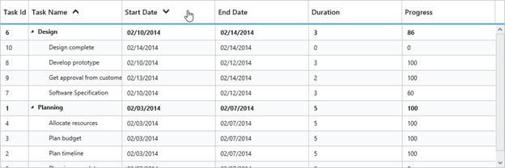

# Sorting

The TreeGrid control has built-in support for Sorting one or more columns.

### Sorting Columns

TreeGrid allows the items to be sorted in ascending or descending order based on the selected column by enabling the AllowSorting option in TreeGrid control. The following code example shows you how to enable Sorting in TreeGrid control.

The following code example shows you how to enable Sorting in TreeGrid control.


<ej:TreeGrid runat="server" ID="TreeGridControlSorting"
             AllowSorting="true">
</ej:TreeGrid>



### Multicolumn sorting

TreeGrid allows you to sort multiple columns by clicking the desired column headers while holding the **CTRL** key. The following code example shows you how to enable Multicolumn sorting in TreeGrid control.



   <ej:TreeGrid runat="server" ID="TreeGridControlSorting"
             AllowSorting="true"
             AllowMultiSorting="true">
    </ej:TreeGrid>



The following screenshot shows the output of Multicolumn sorting in TreeGrid control.

  

## Disable sorting for specific column

It is possible to disable sorting for a specific column by setting `AllowSorting` as `false` in the column definition.

The below code snippet demonstrates this.



<ej:TreeGrid runat="server" ID="TreeGridControlSorting"
             AllowSorting="true">
    <Columns>
    <ej:TreeGridColumn Field="taskName" HeaderText="Task Name" AllowSorting="true"></ej:TreeGridColumn>
    </Columns>
    </ej:TreeGrid> 
   


## Sort column at initial load

In TreeGrid, It is possible to render the control with sorted columns, this can be achieve by `SortedColumns` property and it was defined with `Field` and `Direction` properties.

The following code shows how to add sorted column in TreeGrid.



<ej:TreeGrid runat="server" ID="TreeGridControlSorting"
             AllowSorting="true">
    <SortedColumns >
        <ej:TreeGridSortedColumn Direction="Descending" Field="taskName" />
    </SortedColumns>
</ej:TreeGrid>
   


The above screenshot shows TreeGrid rendered with descending order of **Task Name** column.
{:.caption}

