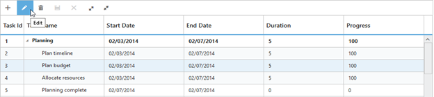
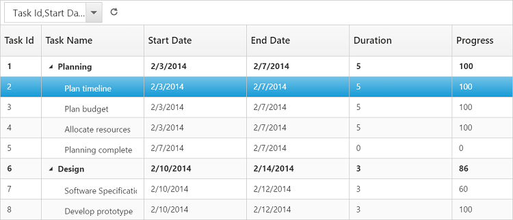

# Toolbar

In TreeGrid we can show/hide the Toolbar by using [`toolbarSettings.showToolbar`](https://help.syncfusion.com/api/js/ejtreegrid#members:toolbarsettings-showtoolbar "showToolbar") property.We can add default toolbar items by [`toolbarSettings.toolbarItems`](https://help.syncfusion.com/api/js/ejtreegrid#members:toolbarsettings-toolbaritems "toolbarItems"). User can also create a custom toolbar items by using [`toolbarSettings.customToolbarItems`](https://help.syncfusion.com/api/js/ejtreegrid#members:toolbarsettings-customToolbarItems "customToolbarItems").

## Default Toolbar Items
Using TreeGrid default toolbar items we can perform below operations.

* **Add**- To add new task.

* **Edit**-To edit a selected task.

* **Delete**- To delete a selected task.
		   
* **Cancel**- To cancel the edited changes in a task.
		   
* **Update**- To save the edited changes in a task.
		   
* **ExpandAll**- To expand all the TreeGrid rows.
		   
* **CollapseAll**- To collapse all the TreeGrid rows.
		   
* **PdfExport**- To export TreeGrid in PDF format.
		   
* **ExcelExport**- To export TreeGrid in Excel format.

We can enable TreeGrid toolbar by using below code example:

     <ej:TreeGrid runat="server" ID="TreeGridControlEditing">         
            <ToolbarSettings ShowToolbar="true" ToolbarItems="add,edit,delete,update,cancel,expandAll,collapseAll,pdfExport,excelExport" />
     </ej:TreeGrid>

The following screenshot displays the toolbar option in TreeGrid control.

N> To perform add,edit,delete,cancel,update using Toolbar items we need to enable add/edit/delete using [`editSettings`](https://help.syncfusion.com/api/js/ejtreegrid#members:editsettings "editSettings").
  
## Custom Toolbar Items

CustomToolbarItems allows us to insert custom icons and custom template in TreeGrid toolbar. By using below properties we can customize TreeGrid toolbar as per our requirement.

* **text**- To insert the custom icons in toolbar using CSS class name selector.

* **templateID**-To insert the custom icons in toolbar using script templates. Using this property we can bind HTML elements and other EJ controls to TreeGrid toolbar.

* **tooltipText**-Displays tooltip text for the custom icons. 

To insert EJ Controls in TreeGrid toolbar we need to initiate the control in [`create`](https://help.syncfusion.com/api/js/ejtreegrid#events:create "create") client side event.In [`toolbarClick`](https://help.syncfusion.com/api/js/ejtreegrid#events:toolbarclick "toolbarclick") client side event we can bind actions to the custom toolbar items.


   <ej:TreeGrid runat="server" ID="ToolbarTemplate" ToolbarClick="toolbarClick" Create="create">     
            <ToolbarSettings ShowToolbar="true">
                <CustomToolbarItems>
                   <ej:TreeGridCustomToolbarItem TemplateID="#ColumnVisibility" TooltipText="Column Visibility"  />
                   <ej:TreeGridCustomToolbarItem Text="Reset"  TooltipText="Reset"  />       
                </CustomToolbarItems>              
            </ToolbarSettings>
        </ej:TreeGrid>         
    
    
     
	

   

[Click](https://asp.syncfusion.com/demos/web/treegrid/treegridtoolbartemplate.aspx) here to view the demo sample for custom toolbar item
