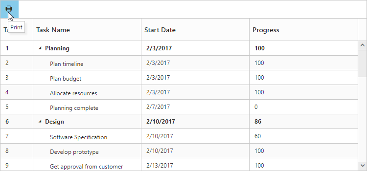

# TreeGrid Printing

TreeGrid provides support to print the contents. To print the TreeGrid the print toolbar item must be added to [ToolbarSettings.ToolbarItems](/api/js/ejgantt#members:toolbarsettings-toolbaritems) property. The below code example shows how to enable print in TreeGrid.


 
<ej:TreeGrid runat="server" ID="TreeGrid">
    <ToolbarSettings ShowToolbar="true" ToolbarItems="Print"></ToolbarSettings>
</ej:TreeGrid>



The below screen shot shows TreeGrid with printing enabled.

The print preview window will be opened by clicking on this toolbar icon. 

## Print Mode

It is possible to set the printMode in [PageSettings](/api/js/ejgantt#members:pagesettings) property, to give printing preference, as to print current page alone or all the pages in case of paging enabled in TreeGrid. The following code example explains this.


 
<ej:TreeGrid runat="server" ID="TreeGrid" AllowPaging="true">
     <PageSettings PrintMode="CurrentPage" /> 
     <ToolbarSettings ShowToolbar="true" ToolbarItems="print"></ToolbarSettings>
</ej:TreeGrid>



In this case only the visible records in the current page will be send to printing.

## BeforePrint Event 

`BeforePrint` event will be triggered once after printing initiated in TreeGrid. This event contains the treegrid element which is going to be printing. The following code explains this.


 
<ej:TreeGrid runat="server" ID="TreeGrid" BeforePrint="beforePrint">
    <ToolbarSettings ShowToolbar="true" ToolbarItems="Print"></ToolbarSettings>
</ej:TreeGrid>



[Click](https://asp.syncfusion.com/demos/web/treegrid/treegridprinting.aspx) here to view the online demo sample Printing.
