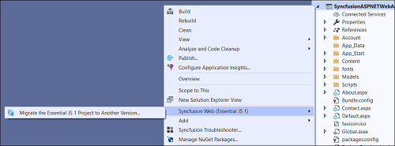
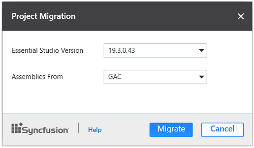

# Upgrading Syncfusion ASP.NET components to latest version

The Syncfusion ASP.NET migration add-in for Visual Studio allows you to migrate an existing Syncfusion ASP.NET application from one version of Essential Studio version to another version. This reduces the amount of manual work required when migrating the Syncfusion version.

To migrate you’re existing Syncfusion ASP.NET application, follow the steps below.

> Before use, the Syncfusion ASP.NET Web Forms Project Migration, check whether the **ASP.NET Web Forms Extensions - Syncfusion** installed or not in Visual Studio Extension Manager by clicking on the Tools -> Extensions and Updates -> Installed for Visual Studio 2017 or lower and for Visual Studio 2019 by clicking on the Extensions -> Manage Extensions -> Installed. Also, check whether the corresponding Essential Studio version build installed or not. If the Essential Studio version is not same for both the Extension and build, then the Project Migration will not be shown.

1. To launch Migration Wizard, select one of the following options:

   **Option 1**   
   Click **Syncfusion Menu** and choose **Essential Studio for ASP.NET Web Forms (EJ1) > Migrate Project…** in **Visual Studio**.

   

   N> From Visual Studio 2019, Syncfusion menu is available under Extensions in Visual Studio menu.

   **Option 2**  
   Right-click the **Syncfusion ASP.NET Application** from Solution Explorer and select **Syncfusion Web (Essential JS 1)**. Choose **Migrate the Essential JS 1 Project to Another version…**

   

2. The Project Migration window appears. You can choose the required Essential Studio version that is installed in the machine.

   

3. Click the Migrate Button. The Syncfusion Reference Assemblies, Scripts, and CSS, Web. Config entries in the project are updated to the corresponding version.

4. If you installed the trial setup or NuGet packages from nuget.org you must register the Syncfusion license key to your project since Syncfusion introduced the licensing system from 2018 Volume 2 (v16.2.0.41) Essential Studio release. Navigate to the [help topic](https://help.syncfusion.com/common/essential-studio/licensing/license-key#how-to-generate-syncfusion-license-key) to generate and register the Syncfusion license key to your project. Refer to this [blog](https://blog.syncfusion.com/post/Whats-New-in-2018-Volume-2-Licensing-Changes-in-the-1620x-Version-of-Essential-Studio.aspx?_ga=2.11237684.1233358434.1587355730-230058891.1567654773) post for understanding the licensing changes introduced in Essential Studio.