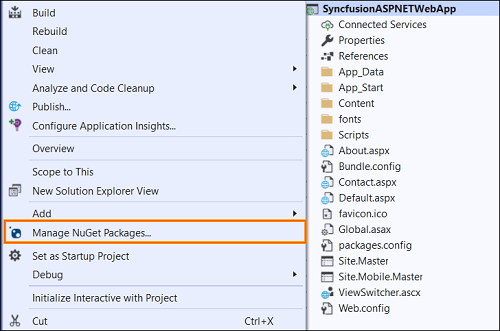
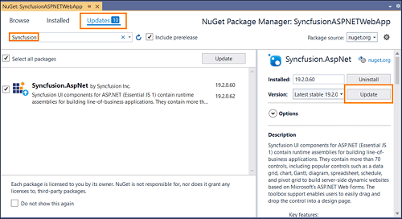
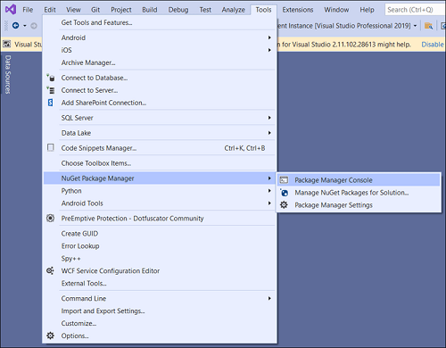
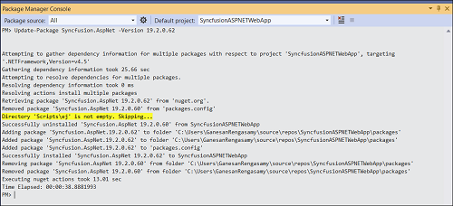

# Upgrading Syncfusion ASP.NET Web Forms NuGet packages to a latest version

Every three months, Syncfusion releases new volumes with interesting new features. For this volume, there will be a weekly NuGet release and one service pack. Syncfusion ASP.NET Web Forms NuGet packages are released on a weekly basis to address critical issue fixes in volume releases.

From any Syncfusion ASP.NET Web Forms NuGet version you have installed; you can update to our most recent version.

## Upgrade NuGet packages through Package Manager UI

The **NuGet Package Manager UI** allows you to search, install, uninstall, and update Syncfusion ASP.NET Web Forms NuGet packages in your projects and solutions. You can find and upgrade the Syncfusion ASP.NET Web Forms NuGet packages to the most recent version or to specific version in the ASP.NET Web Forms solution or project and this process is easy with the steps below:

1. Right-click on the ASP.NET Web Forms project or solution in the Solution Explorer tab, and choose **Manage NuGet Packages...**

   
   
   As an alternative, after opening the ASP.NET Web Forms application in Visual Studio, go to the **Tools** menu and after hovering **NuGet Package Manager**, select **Manage NuGet Packages for Solution...**

2. The Manage NuGet Packages window will open. Navigate to the Updates tab, then search for the Syncfusion ASP.NET Web Forms  NuGet packages using a term like "Syncfusion" and select the appropriate Syncfusion ASP.NET Web Forms  NuGet package for your application.

   N> The [nuget.org](https://api.nuget.org/v3/index.json) package source is selected by default in the Package source drop-down. If your Visual Studio does not have nuget.org configured, follow the instructions in the [Microsoft documents](https://docs.microsoft.com/en-us/nuget/tools/package-manager-ui#package-sources) to set up the nuget.org feed URL.

3. By default, the package selected with latest version. You can select the required version and click the Update button and accept the license terms. The package will be upgraded to selected version in your ASP.NET Web Forms application.

   

## Upgrade NuGet packages through Package Manager Console

The **Package Manager Console** saves NuGet packages upgrade time since you don't have to search for the package you want to update, and you can just type the command to update the appropriate Syncfusion ASP.NET Web Forms NuGet package. Follow the steps below to upgrade the installed Syncfusion NuGet packages using the Package Manager Console in your ASP.NET Web Forms application.

1. To show the Package Manager Console, open your ASP.NET Web Forms application in Visual Studio and navigate to **Tools** in the Visual Studio menu and after hovering **NuGet Package Manager**, select **Package Manager Console**.

   

2.	The **Package Manager Console** will be shown at the bottom of the screen. You can install the Syncfusion ASP.NET Web Forms NuGet packages by enter the following NuGet update commands.

   ***Update specified Syncfusion ASP.NET Web Forms NuGet package***

   The below command will update the Syncfusion ASP.NET Web Forms NuGet package in the default ASP.NET Web Forms project of the application.

   ```Update-Package <Package Name>```
   **For example:** Update-Package Syncfusion.AspNet

   ***Update specified Syncfusion ASP.NET Web Forms NuGet package in specified ASP.NET Web Forms project***

   The below command will update the Syncfusion ASP.NET Web Forms NuGet package in the given ASP.NET Web Forms project alone.

   ```Update-Package <Package Name> -ProjectName <Project Name>```
   **For example:** Update-Package Syncfusion.AspNet -ProjectName SyncfusionASPNETWebApp


3. By default, the package will be installed with latest version. You can give the required version with the -Version term like below to install the Syncfusion ASP.NET Web Forms NuGet packages in the appropriate version.

   ```Update-Package Syncfusion.AspNet -Version 19.2.0.62```

   

4. The NuGet package manager will update the Syncfusion ASP.NET Web Forms NuGet package as well as the dependencies it has.