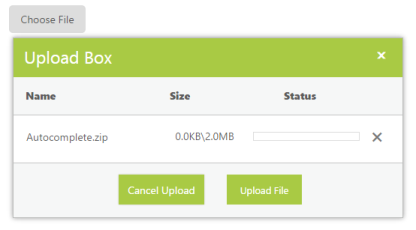
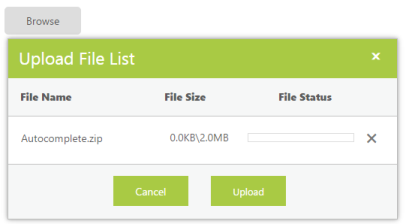
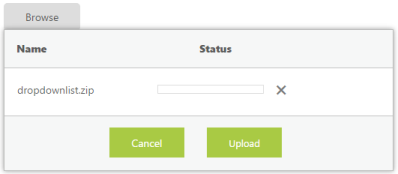
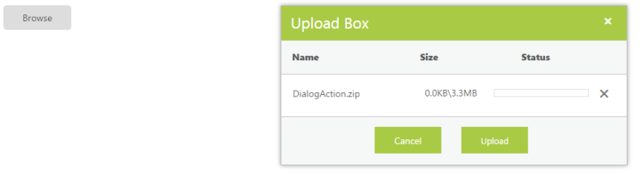
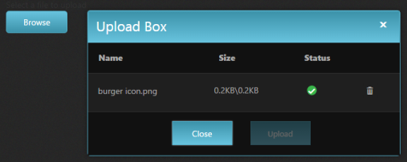
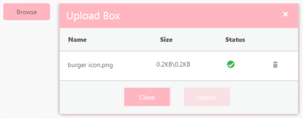

# Appearance and styling 

The UploadBox control provides support to customize the dialog box text and button text. 

## Customizing Button Text

The following table contains the sub properties available under the UploadboxButtonText property. To customize the text, pass the alternate text with the corresponding sub properties. 

<table>
<tr>
<th>
Names</th><th>
Description</th><th>
Data Type</th></tr>
<tr>
<td>
Browse</td><td>
Sets the alternative text for browse button. </td><td>
String</td></tr>
<tr>
<td>
Upload</td><td>
Sets the alternative text for upload button. </td><td>
String</td></tr>
<tr>
<td>
Cancel</td><td>
Sets the alternative text for cancel button. </td><td>
String</td></tr>
</table>

The following steps explain the configuration of the ButtonText property in the UploadBox. 

In the ASPX page, add the UploadBox element and configure the texts in code behind.



<ej:UploadBox ID="Uploadbox" runat="server"  SaveUrl="SaveFiles.ashx" RemoveUrl="RemoveFiles.ashx">

    <UploadBoxButtonText Browse="Choose File" Cancel="Cancel Upload" Upload="Upload File" />

</ej:UploadBox>



N> The SaveUrl and RemoveUrl are the same as above (see Save File Action and Remove File Action section).

The following screenshot displays the output UploadBox with customized button text.

## Customizing Upload Dialog

The following table contains the sub properties available under the UploadBoxDialogText property. To customize the text, pass the alternate text with the corresponding sub properties 

<table>
<tr>
<th>
Names</th><th>
Description</th></tr>
<tr>
<td>
Title</td><td>
Sets the alternative text for Title of UploadBox dialog. </td></tr>
<tr>
<td>
Name</td><td>
Sets the alternative text for Name column.  </td></tr>
<tr>
<td>
Size</td><td>
Sets the alternative text for Size column. </td></tr>
<tr>
<td>
Status</td><td>
Sets the alternative text for status column.</td></tr>
</table>

The following steps explain the configuration of the DialogText property in UploadBox. 

In the ASPX page, add the UploadBox element and configure the DialogText in code behind.



<ej:UploadBox ID="Uploadbox" runat="server"  SaveUrl="SaveFiles.ashx" RemoveUrl="RemoveFiles.ashx">

   <UploadBoxDialogText Title="Upload File List" Name= "File Name" Size="File Size" Status= "File Status" />

</ej:UploadBox>



N> The SaveUrl and RemoveUrl are the same as above (see Save File Action and Remove File Action section).

The following screenshot displays the output.

## Show or Hide File details 

You have an option to show or hide file details in the uploaded file list dialog. By using this property, the uploaded file dialog does not display the file details once selected. To enable this, set the ShowFileDetails to false. By default, its value is set to true. The data type is Boolean.

The following steps explains the configuration of the ShowFileDetails property in the UploadBox.

In the ASPX page, add the UploadBox element and set the ShowFileDetails property to true.



<ej:UploadBox ID="Uploadbox" runat="server" ShowFileDetails="true"  SaveUrl="SaveFiles.ashx" RemoveUrl="RemoveFiles.ashx" ></ej:UploadBox>



N> The SaveUrl and RemoveUrl are the same as above (see Save File Action and Remove File Action section).
 
The following screenshot displays the output.

## Customize the file details 

You have an option to customize the default file details in the uploaded file list dialog. By using this, you can configure the CustomFileDetails to modify the file upload dialog.

The following steps explains the configuration of the CustomFileDetails in the UploadBox.

In the ASPX page, add the UploadBox element and set the CustomFileDetails to customize the dialog.



<ej:UploadBox ID="Uploadbox" runat="server" SaveUrl="SaveFiles.ashx" RemoveUrl="RemoveFiles.ashx" >

    <CustomFileDetails Title="false" Name="true" Action="true" Status="true" Size="false" />

</ej:UploadBox>



 Note: The SaveUrl and RemoveUrl are the same as above (see Save File Action and Remove File Action section).

The following screenshot displays the output.

## Customize the Upload file Dialog actions and position 

You have an option to customize the uploaded file dialog actions. By using the DialogAction property, you can configure the file upload dialog box behaviors with CloseOnComplete, content and drag attribute values.  By using the DialogPosition, you can customize the X and Y coordinate on where the dialog must appear

The following steps explains the configuration of DialogAction and DialogPosition in UploadBox.

In the ASPX page, add the UploadBox element and set the DialogAction and DialogPosition to customize the dialog.



<ej:UploadBox ID="Uploadbox" runat="server" SaveUrl="SaveFiles.ashx" RemoveUrl="RemoveFiles.ashx" >

    <DialogAction CloseOnComplete="true" Drag="false" />

    <DialogPosition XValue="300px" YValue="150px" />

</ej:UploadBox>



N> The SaveUrl and RemoveUrl are the same as above (see Save File Action and Remove File Action section).

The following screenshot displays the output. Here the dialog behaves as Modal and cannot be dragged or repositioned and closes when upload is complete

## Look and Feel

### Theme

The UploadBox control’s style and appearance are controlled based on CSS classes. In order to apply styles to the UploadBox control, you can refer to two files, ej.widgets.core.min.css and ej.theme.min.css. When the file, ej.widgets.all.min.css is referred, it is not necessary to include the files ej.widgets.core.min.css and ej.theme.min.css in your project, as ej.widgets.all.min.css is the combination of both these files. 

By default, there are 13-theme supports available for the UploadBox control namely,

* Default-theme
* Flat-azure-dark
* Fat-lime
* Flat-lime-dark
* Flat-saffron
* Flat-saffron-dark
* Gradient-azure
* Gradient-azure-dark
* Gradient-lime
* Gradient-lime-dark
* Gradient-saffron
* Gradient-saffron-dark
* Bootstrap-theme

Add the following code to your Master &ASPX page to initialize the Uploadbox with gradient-azure-dark theme. 



<head>

<link href="Content/ej/gradient-azure-dark/ej.web.all.min.css" rel="stylesheet" />

</head>

<ej:UploadBox ID="Upload1" runat="server" SaveUrl="saveFiles.ashx" RemoveUrl="removeFiles.ashx"></ej:UploadBox>



Run the code to get the following output.

### CSS Class

CSS class customizes the UploadBox control’s appearance. Define a CSS class as per the requirement and assign the class name to CssClass property. The data type is string. 

<table>
<tr>
<th>
Class/Element names</th><th>
Description</th></tr>
<tr>
<td>
.uploadbox</td><td>
Base class that is added to the UploadBox wrapper div element where the custom CSS class will also be added.</td></tr>
<tr>
<td>
.e-select</td><td>
Div element that holds the upload control’s browse button.</td></tr>
<tr>
<td>
.e-dialog</td><td>
Class that is used for upload files dialog.</td></tr>
<tr>
<td>
.e-file-upload</td><td>
The div wrapper class upload buttons in the dialog box.</td></tr>
<tr>
<td>
.e-uploadbtn, .e-uploadclosebtn</td><td>
Button classes for customizing the upload and cancel buttons in the upload files dialog.</td></tr>
</table>
The following steps explain the configuration of the CssClass property in the UploadBox. 

In the ASPX page, add the UploadBox element.



<ej:UploadBox ID="Uploadbox" runat="server" SaveUrl="SaveFiles.ashx" RemoveUrl="RemoveFiles.ashx" CssClass="light-pink"></ej:UploadBox>



In CSS, configure Custom Styles for the UploadBox. Here custom CSS is defined to modify the Browse button text, color, and hover color.



    .light-pink.e-uploadbox.e-widget,

        .light-pink.e-uploadbox.e-dialog.e-widget .e-header,

        .light-pink.e-uploadbox .e-uploadbtn.e-select,

        .light-pink.e-uploadbox .e-uploadclosebtn.e-select,

        .light-pink.e-upload-box.e-drag-wrapper .e-uploadbtn.e-select,

        .light-pink.e-upload-box.e-drag-wrapper .e-uploadclosebtn.e-select {

            background: lightpink;

            border-color: pink;

        }

       .light-pink.e-uploadbox .e-ul li:nth-child(even) .e-file-list .e-action-perform:hover,

       .light-pink.e-uploadbox .e-ul li:nth-child(odd) .e-file-list .e-action-perform:hover,

       .light-pink.e-upload-box.e-drag-wrapper .e-ul li:nth-child(even) .e-file-list .e-action-perform:hover,

       .light-pink.e-upload-box.e-drag-wrapper .e-ul li:nth-child(odd) .e-file-list .e-action-perform:hover,

       .light-pink.e-uploadbox.e-widget:hover,

       .light-pink.e-uploadbox .e-uploadbtn.e-select:hover,

       .light-pink.e-uploadbox .e-uploadclosebtn.e-select:hover,

       .light-pink.e-upload-box.e-drag-wrapper .e-uploadbtn.e-select:hover,

       .light-pink.e-upload-box.e-drag-wrapper .e-uploadclosebtn.e-select:hover,            

       .light-pink.e-dialog .e-dialog-icon:hover {

                background: pink;

                border-color: pink;

       }



N> The SaveUrl and RemoveUrl are the same as above (see Save File Action and Remove File Action section).

The following screenshot displays the output.

