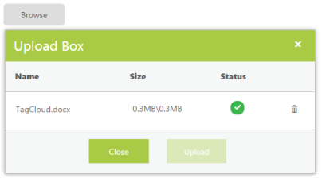
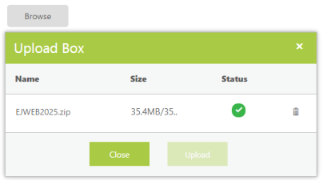
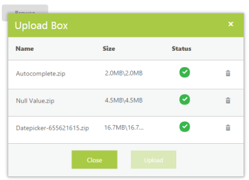

# File Size 

## Maximum File Size for the UploadBox

In the UploadBox control, you can browse files with the size going up to gigabytes. You can restrict the files from being browsed by using the FileSize property. When you do not use this property, it takes the default size, 31457280B, that is, 31MB. When this size exceeds, then you cannot browse the file. 

In the ASPX page, add the UploadBox element with the customized file size by using the FileSize property.



<ej:UploadBox ID="Uploadbox2" runat="server" FileSize="1048576" SaveUrl="SaveFiles.ashx" RemoveUrl="RemoveFiles.ashx" ClientSideOnError="error"></ej:UploadBox>



In the ClientSideOnError event display, an alert message is displayed when the file size exceeds.



function error(e, ui) {

  alert(e.error);

}



N> The SaveUrl and RemoveUrl are the same as above (see Save File Action and Remove File Action section).

The following screenshot displays the UploadBox control with customized file size.

You can browse and upload the files within the FileSize.

 

You cannot browse and upload the files with exceeded FileSize.

 

## Maximum File Upload Size in IIS

By default, the IIS web server allows limited file size to be uploaded to the web server. The default maximum length of the content in a request supported by IIS is around 28.6 MB. So, files up to 28.6MB can be uploaded without any other additional configurations in IIS.

## To upload the files above 28.6 MB when hosted in IIS

In order to allow larger file size uploads, such as above 28.6MB, you can override it by modifying the maxRequestLength attribute in the web application’s configuration file, web.config. The property, maxRequestLength indicates the maximum file upload size of 28.6MB, supported by ASP.NET. You cannot upload the files when the FileSize property is below the maxRequestLength value.

To upload files above 28.6MB, it is enough to have the maxRequestLength when the application is run directly from the developer environment. While deploying it to the IIS server, set the maxAllowedContentLength value under the system.web server tag in the web.config, so that file limit is applied on hosting the website in the server. The default maximum length of the content in a request supported by IIS is around 28.6 MB or 30000000bytes.

<table>
<tr>
<th>
Use-Case Description</th><th>
Type</th><th>
Maximum request size</th><th>
Details</th></tr>
<tr>
<td>
{{ '[maxRequestLength](https://msdn.microsoft.com/en-us/library/system.web.configuration.httpruntimesection.maxrequestlength.aspx)' | markdownify }}</td><td>
Property</td><td>
28.6 MB</td><td>
Maximum request size supported by ASP.NET.</td></tr>
<tr>
<td>
{{ '[maxAllowedContentLength](https://msdn.microsoft.com/en-us/library/ms689462(v=vs.90).aspx)' | markdownify }}</td><td>
Property</td><td>
28.6 MB</td><td>
maxAllowedContentLength specifies the maximum length of content in a request supported by IIS.</td></tr>
</table>

 You can add the following code to your web.config file in order to set that value to 100 MB



<configuration>

    <system.web>

        <httpruntime maxRequestLength="102400" /> <!--//kilobytes-->

    </system.web>

</configuration>



N>  maxRequestLength is measured in kilobytes.



<system.webServer>

    <security>

        <requestFiltering>

            <requestLimits maxAllowedContentLength="104857600" /> <!--//bytes-->

        </requestFiltering>

    </security>

</system.webServer>



N> maxAllowedContentLength is measured in bytes.

N> * When you configure both maxAllowedContentLength and maxRequestLength attributes, then maxAllowedContentLength can be run. 
N>
N> * When the upload file’s size exceeds maxAllowedContentLength, you get a 404.13 error page.
N>
N> * When the upload file’s size exceeds maxRequestLength value, you get an exception “System.Web.HttpException: Maximum request length exceeded”.
N>
N> * The ASP.NET method of maxRequestLength is greater than or equal to the IIS method of limiting the request length (maxAllowedContentLength).

